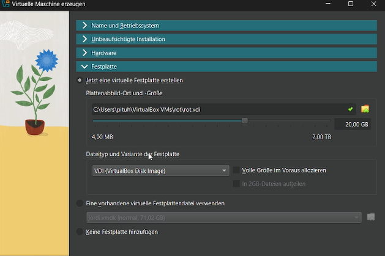
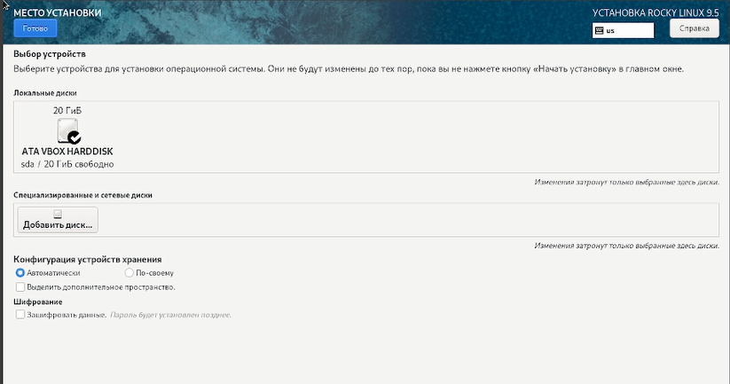

---
## Front matter
lang: ru-RU
title: Лабораторная работа №1
subtitle: Установка и конфигурация операционной системы на виртуальную машину
author:
  - Буллет Т. А.
institute:
  - Российский университет дружбы народов, Москва, Россия
date: 14 февраля 2025

## i18n babel
babel-lang: russian
babel-otherlangs: english

## Formatting pdf
toc: false
toc-title: Содержание
slide_level: 2
aspectratio: 169
section-titles: true
theme: metropolis
header-includes:
 - \metroset{progressbar=frametitle,sectionpage=progressbar,numbering=fraction}
---

# Информация

## Докладчик

:::::::::::::: {.columns align=center}
::: {.column width="70%"}

  * Буллер Татьяна Александровна
  * студент направления Бизнес-информатика
  * Российский университет дружбы народов

:::
::: {.column width="30%"}

:::
::::::::::::::

# Вводная часть

## Объект и предмет исследования

- Операционная система linux, дисрибутив Rocky
- Среда виртуализации VirtualBox

## Цели и задачи

- Приобретение практических навыков установки операционной системы на виртуальную машину
- Приобретение навыков настройки минимально необходимых для дальнейшей работы сервисов

## Материалы и методы

- Процессор `pandoc` для входного формата Markdown
- Среда виртуализации VirtualBox

# Выполнение лабораторной работы

## Предварительная настройка

Для создания виртуальной машины была использована среда виртуализации  VirtualBox. После выбора в меню "Машина - Создать" было введено имя машины, папка в системе, где будут храниться файлы машины, и файл образа операционной системы. 

{#fig:001 width=40%}

## Предварительная настройка

Затем были введены имя пользователя и хоста (при непосредственной настройке системы эти пункты были заменены)

{#fig:002 width=40%}

## Предварительная настройка

Далее были выделены ресурсы системы, с которыми машина сможет работать: ядра процессора, операционная и физическая память.

{#fig:003 width=40%}

## Предварительная настройка

{#fig:004 width=40%}

## Установка системы

После инициализации образа была начата настройка непосредственно ОС Rocky Linux. Первый из этапов настройки - выбор раскладки клавиатуры.

{#fig:005 width=40%}

## Установка системы

Дальнейшая настройка состояла из настройки пользователя и суперпользователя, выбора приложений, которые впоследствии будут доустановлены на систему, конфигурации места на жестком диске и сетевого интерфейса.

{#fig:006 width=40%}

## Установка системы

Настройка суперпользователя состоит из выбора пароля для него и двух дополнительных опций: разрешения входа по SSH и блокировки учетной записи.

{#fig:007 width=40%}

## Установка системы

Настройка пользователя состоит из выбора имени, логина и пароля для пользователя, а также двух дополнительных опций: назначения пользователя администратором и требования пароля для учетной записи.

{#fig:008 width=40%}

## Установка системы

При настройке места хранения можно добавить сетевые диски, настроить шифрование данных и сконфигурировать устройство хранения операционной системы по-своему. Я оставлю настройки по умолчанию.

{#fig:009 width=40%}

## Установка системы

Выбор программ предлагает настроить базовое окружение и при необходимости выбрать дополнительные компоненты, которые будут установлены вместе с системой.

{#fig:010 width=40%}

## Завершение установки

После завершения установки рассмотрим детали процесса запуска системы с помощью комбинации команд dmesg и grep. Видим, что версия установленной системы - 5.14.0, процессор 2304 МГц, доступная память - 20 ГБ, процессор  i7-11800H, гипервизор - KVM.

{#fig:011 width=40%}

## Завершение установки

В процессе установки системы не было произведено переименования хоста, поэтому сделаем это сейчас командой hostnamectl и проверим правильность ее исполнения, вызвав ее без дополнительных флагов и аргументов.

{#fig:012 width=40%}

# Выводы

Приобретены практические навыки установки операционной системы на виртуальную машину и настройки минимально необходимых для дальнейшей работы сервисов.

