---
## Front matter
title: "Отчет по лабораторной работе №1"
subtitle: "Установка и конфигурация операционной системы на виртуальную машину"
author: "Татьяна Александровна Буллер"

## Generic otions
lang: ru-RU
toc-title: "Содержание"

## Bibliography
bibliography: bib/cite.bib
csl: pandoc/csl/gost-r-7-0-5-2008-numeric.csl

## Pdf output format
toc: true # Table of contents
toc-depth: 2
lof: true # List of figures
lot: false # List of tables
fontsize: 12pt
linestretch: 1.5
papersize: a4
documentclass: scrreprt
## I18n polyglossia
polyglossia-lang:
  name: russian
  options:
	- spelling=modern
	- babelshorthands=true
polyglossia-otherlangs:
  name: english
## I18n babel
babel-lang: russian
babel-otherlangs: english
## Fonts
mainfont: IBM Plex Serif
romanfont: IBM Plex Serif
sansfont: IBM Plex Sans
monofont: IBM Plex Mono
mathfont: STIX Two Math
mainfontoptions: Ligatures=Common,Ligatures=TeX,Scale=0.94
romanfontoptions: Ligatures=Common,Ligatures=TeX,Scale=0.94
sansfontoptions: Ligatures=Common,Ligatures=TeX,Scale=MatchLowercase,Scale=0.94
monofontoptions: Scale=MatchLowercase,Scale=0.94,FakeStretch=0.9
mathfontoptions:
## Biblatex
biblatex: true
biblio-style: "gost-numeric"
biblatexoptions:
  - parentracker=true
  - backend=biber
  - hyperref=auto
  - language=auto
  - autolang=other*
  - citestyle=gost-numeric
## Pandoc-crossref LaTeX customization
figureTitle: "Рис."
tableTitle: "Таблица"
listingTitle: "Листинг"
lofTitle: "Список иллюстраций"
lotTitle: "Список таблиц"
lolTitle: "Листинги"
## Misc options
indent: true
header-includes:
  - \usepackage{indentfirst}
  - \usepackage{float} # keep figures where there are in the text
  - \floatplacement{figure}{H} # keep figures where there are in the text
---

# Цель работы

Целью данной работы является приобретение практических навыков
установки операционной системы на виртуальную машину, настройки ми-
нимально необходимых для дальнейшей работы сервисов.

# Выполнение лабораторной работы

## Предварительная настройка

Для создания виртуальной машины была использована среда виртуализации  VirtualBox. После выбора в меню "Машина - Создать" было введено имя машины, папка в системе, где будут храниться файлы машины, и файл образа операционной системы. 

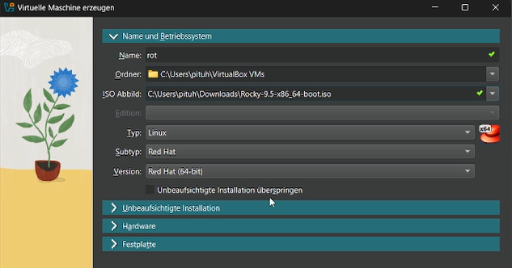{#fig:001 width=70%}

Затем были введены имя пользователя и хоста (при непосредственной настройке системы эти пункты были заменены)

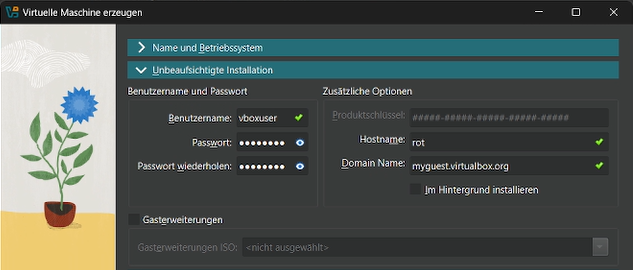{#fig:002 width=70%}

Далее были выделены ресурсы системы, с которыми машина сможет работать: ядра процессора, операционная и физическая память.

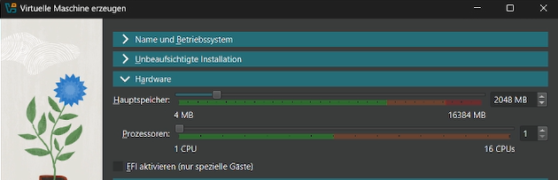{#fig:003 width=70%}

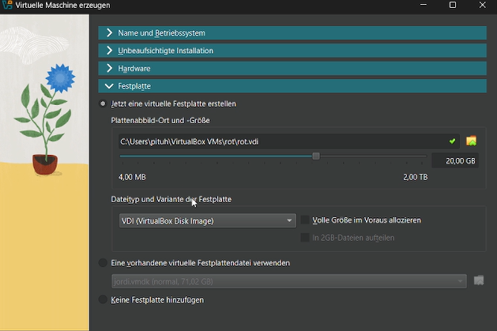{#fig:004 width=70%}

## Установка системы

После инициализации образа была начата настройка непосредственно ОС Rocky Linux. Первый из этапов настройки - выбор раскладки клавиатуры.

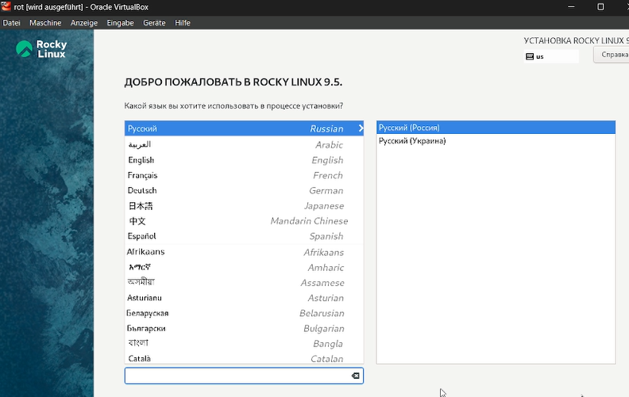{#fig:005 width=70%}

Дальнейшая настройка состояла из настройки пользователя и суперпользователя, выбора приложений, которые впоследствии будут доустановлены на систему, конфигурации места на жестком диске и сетевого интерфейса.

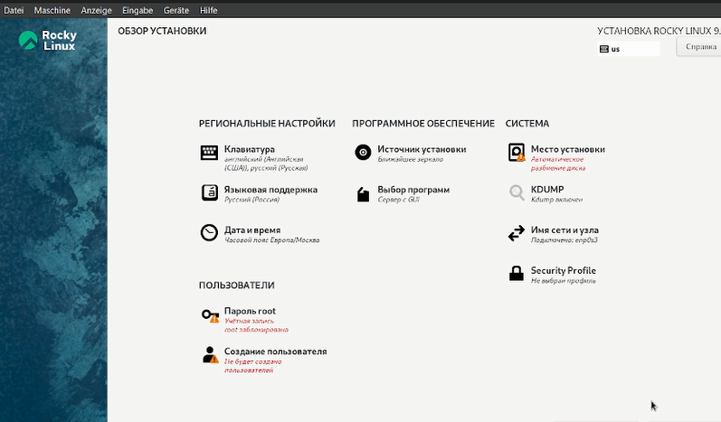{#fig:006 width=70%}

Настройка суперпользователя состоит из выбора пароля для него и двух дополнительных опций: разрешения входа по SSH и блокировки учетной записи.

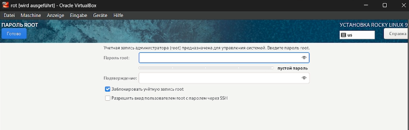{#fig:007 width=70%}

Настройка пользователя состоит из выбора имени, логина и пароля для пользователя, а также двух дополнительных опций: назначения пользователя администратором и требования пароля для учетной записи.

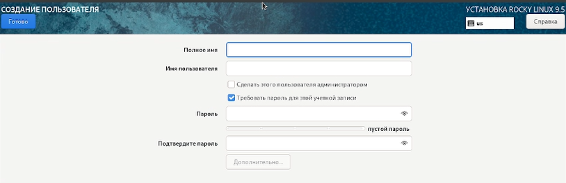{#fig:008 width=70%}

При настройке места хранения можно добавить сетевые диски, настроить шифрование данных и сконфигурировать устройство хранения операционной системы по-своему. Я оставлю настройки по умолчанию.

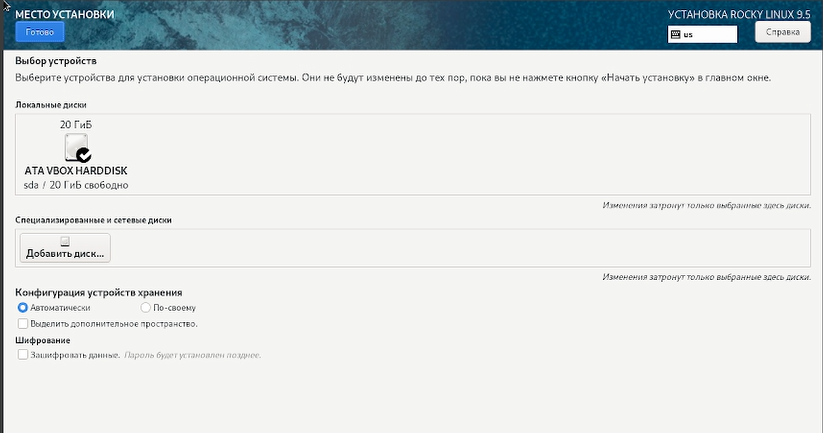{#fig:009 width=70%}

Выбор программ предлагает настроить базовое окружение и при необходимости выбрать дополнительные компоненты, которые будут установлены вместе с системой.

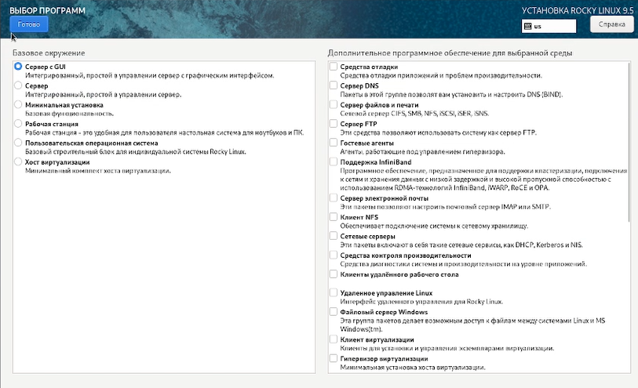{#fig:010 width=70%}

## Завершение установки

После завершения установки рассмотрим детали процесса запуска системы с помощью комбинации команд dmesg и grep. Видим, что версия установленной системы - 5.14.0, процессор 2304 МГц, доступная память - 20 ГБ, процессор  i7-11800H, гипервизор - KVM.

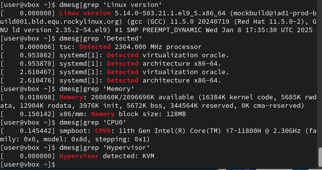{#fig:011 width=70%}

В процессе установки системы не было произведено переименования хоста, поэтому сделаем это сейчас командой hostnamectl и проверим правильность ее исполнения, вызвав ее без дополнительных флагов и аргументов.

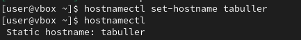{#fig:012 width=70%}

# Выводы

Приобретены практические навыки установки операционной системы на виртуальную машину и настройки минимально необходимых для дальнейшей работы сервисов.
