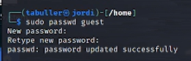
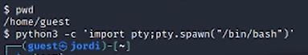
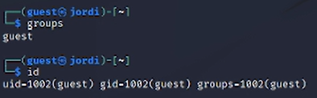
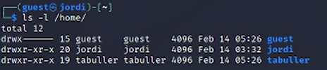
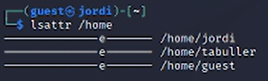
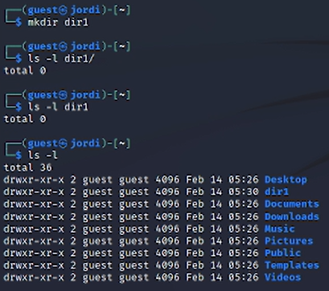
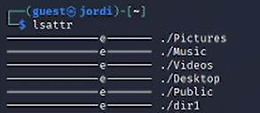
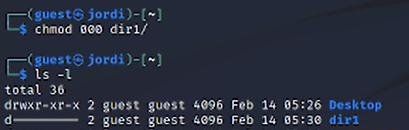

---
## Front matter
lang: ru-RU
title: Лабораторная работа №2
subtitle: Дискреционное разграничение прав в Linux. Основные атрибуты
author:
  - Буллет Т. А.
institute:
  - Российский университет дружбы народов, Москва, Россия
date: 14 февраля 2025

## i18n babel
babel-lang: russian
babel-otherlangs: english

## Formatting pdf
toc: false
toc-title: Содержание
slide_level: 2
aspectratio: 169
section-titles: true
theme: metropolis
header-includes:
 - \metroset{progressbar=frametitle,sectionpage=progressbar,numbering=fraction}
---

# Информация

## Докладчик

:::::::::::::: {.columns align=center}
::: {.column width="70%"}

  * Буллер Татьяна Александровна
  * студент направления Бизнес-информатика
  * Российский университет дружбы народов

:::
::: {.column width="30%"}

:::
::::::::::::::

# Вводная часть

## Объект и предмет исследования

- Операционная система linux, дисрибутив Rocky
- Среда виртуализации VirtualBox

## Цели и задачи

- Получение практических навыков работы в консоли с атрибутами файлов, 
- закрепление теоретических основ дискреционного разграничения доступа в современных системах с открытым кодом на базе ОС Linux

## Материалы и методы

- Процессор `pandoc` для входного формата Markdown
- Среда виртуализации VirtualBox

# Выполнение лабораторной работы

## Создание пользователей

Для создания пользоваталей используем команду useradd с опцией -m, чтобы вместе с пользователем создать его домашнюю директорию и в дальнейшем иметь возможность зайти на рабочий стол под этой учетной записью.

{#fig:001 width=70%}

## Создание пользователей

Далее задаем пароль для пользователя, который необходимо подтвердить, введя повторно.

{#fig:002 width=70%}

## Вход в систему от имени созданного пользователя

С помощью команды su guest получаем неинтерактивную оболочку пользователя и переводим ее в интерактивную: в таком виде с ней удобнее работать. Команда pwd помогает определить, что в данный момент мы находимся в домашней директории созданного ранее пользователя.

{#fig:003 width=70%}

## Вход в систему от имени созданного пользователя

Команда whoami выводит в терминал имя пользователя, от имени которого она была запущена. В нашем случае - guest.

{#fig:004 width=70%}

## Пользователь в системе

Узнать, в каких группах состоит пользователь, можно двумя способами: командой id (выводит idпользователя и его имя, id группы пользователя и ее названия, а также id и названия прочих групп, куда входит данный пользователь) либо командой groups. Последняя, в отличие от первой, выводит на экран только названия групп.

{#fig:005 width=70%}

## Пользователь в системе

Запросив содержимое файла /etc/passwd командой cat, мы можем видеть всех пользователей машины, их uid и gid. Для созданного пользователя uid и gid совпадают: 1002.

{#fig:006 width=70%}

## Пользователь в системе

Командой ls -l /home/ определим существующие в системе домашние директории пользователей. Видим, что их три: guest, созданный по ходу выполнения лабораторной работы, tabuller - основной пользователь для выполнения лабораторных работ и jordi. Кто он и зачем существует - дело десятое. jordi.
В каждой из директорий владелец имеет право на чтение, запись и исполнение. В директориях tabuller и jordi право на чтение и исполнение файлов также имеют участники группы и остальные пользователи машины.

{#fig:007 width=70%}

## Пользователь в системе

С помощью lsattr можем увидеть, что у каждой из домашних директорий установлен атрибут е. 

{#fig:008 width=70%}

## Права директорий и файлов

В домашней директории пользователя guest создадим директорию dir1. Можно увидеть, что сразу после создания директория выдает все права владельцу и права на чтение и исполнение членам группы и прочим пользователям.

{#fig:009 width=70%}

## Права директорий и файлов

По умолчанию также у всех директорий внутри домашней установлен атрибут е: то же самое, что мы видели и в директории /home

{#fig:010 width=70%}

## Права директорий и файлов

Снимем все права с созданной нами директории. Можем видеть, что вывод команды ls -l теперь показывает только то, что перед нами директория. Никто не имеет права ни на чтение, ни на запись, ни на исполнение файлов. Владелец в том числе.

{#fig:011 width=70%}

## Права директорий и файлов

При попытке создать файл внутри директории и перенаправить в него вывод команды эхо сталкиваемся с ошибкой: на эту директорию у пользователя больше нет прав.

{#fig:012 width=70%}

## Права директорий и файлов

При попытке прочитать содержимое директории тоже ничего не увидим: права на чтение сняты вместе со всеми остальными.

{#fig:013 width=70%}

## Права директорий и файлов

На основе полученной информации была заполнена таблица о правах доступа владельца.

# Выводы

Получены практические навыки работы в консоли с атрибутами файлов, закреплены теоретические основы дискреционного разграничения доступа в современных системах с открытым кодом на базе ОС Linux

