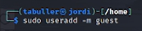
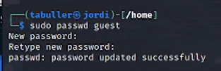
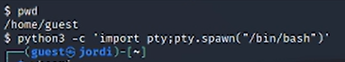
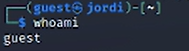
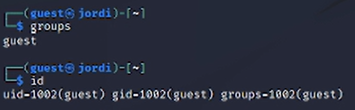
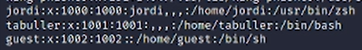
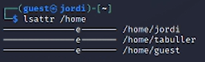
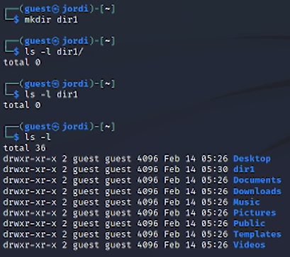
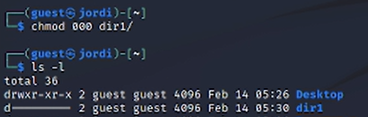

---
## Front matter
title: "Отчет по лабораторной работе №2"
subtitle: "Дискреционное разграничение прав в Linux. Основные атрибуты"
author: "Татьяна Александровна Буллер"

## Generic otions
lang: ru-RU
toc-title: "Содержание"

## Bibliography
bibliography: bib/cite.bib
csl: pandoc/csl/gost-r-7-0-5-2008-numeric.csl

## Pdf output format
toc: true # Table of contents
toc-depth: 2
lof: true # List of figures
lot: true # List of tables
fontsize: 12pt
linestretch: 1.5
papersize: a4
documentclass: scrreprt
## I18n polyglossia
polyglossia-lang:
  name: russian
  options:
	- spelling=modern
	- babelshorthands=true
polyglossia-otherlangs:
  name: english
## I18n babel
babel-lang: russian
babel-otherlangs: english
## Fonts
mainfont: IBM Plex Serif
romanfont: IBM Plex Serif
sansfont: IBM Plex Sans
monofont: IBM Plex Mono
mathfont: STIX Two Math
mainfontoptions: Ligatures=Common,Ligatures=TeX,Scale=0.94
romanfontoptions: Ligatures=Common,Ligatures=TeX,Scale=0.94
sansfontoptions: Ligatures=Common,Ligatures=TeX,Scale=MatchLowercase,Scale=0.94
monofontoptions: Scale=MatchLowercase,Scale=0.94,FakeStretch=0.9
mathfontoptions:
## Biblatex
biblatex: true
biblio-style: "gost-numeric"
biblatexoptions:
  - parentracker=true
  - backend=biber
  - hyperref=auto
  - language=auto
  - autolang=other*
  - citestyle=gost-numeric
## Pandoc-crossref LaTeX customization
figureTitle: "Рис."
tableTitle: "Таблица"
listingTitle: "Листинг"
lofTitle: "Список иллюстраций"
lotTitle: "Список таблиц"
lolTitle: "Листинги"
## Misc options
indent: true
header-includes:
  - \usepackage{indentfirst}
  - \usepackage{float} # keep figures where there are in the text
  - \floatplacement{figure}{H} # keep figures where there are in the text
---

# Цель работы

Получение практических навыков работы в консоли с атрибутами файлов, закрепление теоретических основ дискреционного разграничения доступа в современных системах с открытым кодом на базе ОС Linux

# Выполнение лабораторной работы

## Создание пользователей

Для создания пользоваталей используем команду useradd с опцией -m, чтобы вместе с пользователем создать его домашнюю директорию и в дальнейшем иметь возможность зайти на рабочий стол под этой учетной записью.

{#fig:001 width=70%}

Далее задаем пароль для пользователя, который необходимо подтвердить, введя повторно.

{#fig:002 width=70%}

## Вход в систему от имени созданного пользователя

С помощью команды su guest получаем неинтерактивную оболочку пользователя и переводим ее в интерактивную: в таком виде с ней удобнее работать. Команда pwd помогает определить, что в данный момент мы находимся в домашней директории созданного ранее пользователя.

{#fig:003 width=70%}

Команда whoami выводит в терминал имя пользователя, от имени которого она была запущена. В нашем случае - guest.

{#fig:004 width=70%}

## Пользователь в системе

Узнать, в каких группах состоит пользователь, можно двумя способами: командой id (выводит idпользователя и его имя, id группы пользователя и ее названия, а также id и названия прочих групп, куда входит данный пользователь) либо командой groups. Последняя, в отличие от первой, выводит на экран только названия групп.

{#fig:005 width=70%}

Запросив содержимое файла /etc/passwd командой cat, мы можем видеть всех пользователей машины, их uid и gid. Для созданного пользователя uid и gid совпадают: 1002.

{#fig:006 width=70%}

Командой ls -l /home/ определим существующие в системе домашние директории пользователей. Видим, что их три: guest, созданный по ходу выполнения лабораторной работы, tabuller - основной пользователь для выполнения лабораторных работ и jordi. Кто он и зачем существует - дело десятое. jordi.
В каждой из директорий владелец имеет право на чтение, запись и исполнение. В директориях tabuller и jordi право на чтение и исполнение файлов также имеют участники группы и остальные пользователи машины.

{#fig:007 width=70%}

С помощью lsattr можем увидеть, что у каждой из домашних директорий установлен атрибут е. 

{#fig:008 width=70%}

## Права директорий и файлов

В домашней директории пользователя guest создадим директорию dir1. Можно увидеть, что сразу после создания директория выдает все права владельцу и права на чтение и исполнение членам группы и прочим пользователям.

{#fig:009 width=70%}

По умолчанию также у всех директорий внутри домашней установлен атрибут е: то же самое, что мы видели и в директории /home

{#fig:010 width=70%}

Снимем все права с созданной нами директории. Можем видеть, что вывод команды ls -l теперь показывает только то, что перед нами директория. Никто не имеет права ни на чтение, ни на запись, ни на исполнение файлов. Владелец в том числе.

{#fig:011 width=70%}

При попытке создать файл внутри директории и перенаправить в него вывод команды эхо сталкиваемся с ошибкой: на эту директорию у пользователя больше нет прав.

{#fig:012 width=70%}

При попытке прочитать содержимое директории тоже ничего не увидим: права на чтение сняты вместе со всеми остальными.

{#fig:013 width=70%}

Заполним таблицу о правах доступа владельца на основе полученной информации:

: Права на каталог и файл в нем {#tbl:std-dir}

| Права директории | Права файла | Создание файла | Удаление файла | Запись в файл | Чтение файла | Смена директории | Просмотр файлов в директории | Переименование файла | Смена атрибутов файла |
|----------|----------|----------|----------|----------|----------|----------|----------|----------|
| 000    | 000  | -   | -    | -   | -   | -    | -   | -   | -   |
| 100    | 000  | -   | -    | -   | -   | +    | -   | -   | -   |
| 200    | 000  | +   | +    | -   | -   | -    | -   | +   | -   |
| 300    | 000  | +   | +    | -   | -   | +    | -   | +   | -   |
| 400    | 000  | -   | -    | -   | -   | +    | -   | -   | -   |
| 500    | 000  | +   | +    | -   | -   | +    | -   | +   | -   |
| 600    | 000  | +   | +    | -   | -   | -    | +   | +   | -   |
| 700    | 000  | +   | +    | -   | -   | +    | +   | -   | -   |
| 100    | 200  | -   | -    | +   | -   | +    | -   | -   | -   |
| 200    | 200  | +   | +    | +   | -   | -    | -   | +   | -   |
| 300    | 200  | +   | +    | +   | -   | +    | -   | +   | -   |
| 400    | 200  | -   | -    | +   | -   | +    | +   | -   | +   |
| 500    | 200  | +   | +    | +   | -   | -    | +   | -   | +   |
| 600    | 200  | +   | +    | +   | -   | -    | +   | +   | +   |
| 700    | 200  | +   | +    | +   | -   | +    | +   | +   | +   |
| 100    | 400  | -   | -    | -   | -   | +    | -   | -   | -   |
| 200    | 400  | +   | +    | -   | -   | -    | -   | +   | -   |
| 300    | 400  | +   | +    | -   | -   | +    | -   | +   | -   |
| 400    | 400  | -   | -    | -   | +   | +    | -   | -   | -   |
| 500    | 400  | +   | +    | -   | +   | +    | -   | +   | -   |
| 600    | 400  | +   | +    | -   | +   | -    | +   | +   | -   |
| 700    | 400  | +   | +    | -   | +   | +    | +   | -   | -   |
| 100    | 700  | -   | -    | -   | -   | +    | -   | -   | -   |
| 200    | 700  | +   | +    | +   | +   | -    | -   | +   | -   |
| 300    | 700  | +   | +    | +   | +   | +    | -   | +   | -   |
| 400    | 700  | -   | -    | +   | +   | +    | -   | -   | -   |
| 500    | 700  | -   | -    | +   | +   | +    | +   | -   | +   |
| 600    | 700  | +   | +    | +   | -   | +    | +   | +   | +   |
| 700    | 700  | +   | +    | +   | +   | +    | +   | +   | +   |

# Выводы

Получены практические навыки работы в консоли с атрибутами файлов, закреплены теоретические основы дискреционного разграничения доступа в современных системах с открытым кодом на базе ОС Linux
