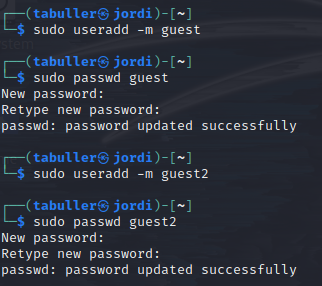
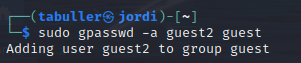
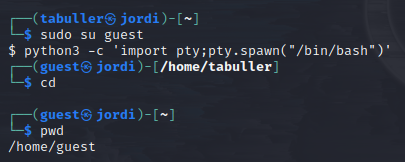
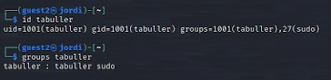
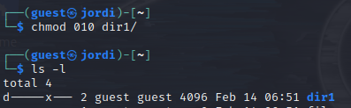

---
## Front matter
title: "Отчет по лабораторной работе №3"
subtitle: "Дискреционное разграничение прав в Linux. Два пользователя"
author: "Татьяна Александровна Буллер"

## Generic otions
lang: ru-RU
toc-title: "Содержание"

## Bibliography
bibliography: bib/cite.bib
csl: pandoc/csl/gost-r-7-0-5-0208-numeric.csl

## Pdf output format
toc: true # Table of contents
toc-depth: 2
lof: true # List of figures
lot: true # List of tables
fontsize: 12pt
linestretch: 1.5
papersize: a4
documentclass: scrreprt
## I18n polyglossia
polyglossia-lang:
  name: russian
  options:
	- spelling=modern
	- babelshorthands=true
polyglossia-otherlangs:
  name: english
## I18n babel
babel-lang: russian
babel-otherlangs: english
## Fonts
mainfont: IBM Plex Serif
romanfont: IBM Plex Serif
sansfont: IBM Plex Sans
monofont: IBM Plex Mono
mathfont: STIX Two Math
mainfontoptions: Ligatures=Common,Ligatures=TeX,Scale=0.94
romanfontoptions: Ligatures=Common,Ligatures=TeX,Scale=0.94
sansfontoptions: Ligatures=Common,Ligatures=TeX,Scale=MatchLowercase,Scale=0.94
monofontoptions: Scale=MatchLowercase,Scale=0.94,FakeStretch=0.9
mathfontoptions:
## Biblatex
biblatex: true
biblio-style: "gost-numeric"
biblatexoptions:
  - parentracker=true
  - backend=biber
  - hyperref=auto
  - language=auto
  - autolang=other*
  - citestyle=gost-numeric
## Pandoc-crossref LaTeX customization
figureTitle: "Рис."
tableTitle: "Таблица"
listingTitle: "Листинг"
lofTitle: "Список иллюстраций"
lotTitle: "Список таблиц"
lolTitle: "Листинги"
## Misc options
indent: true
header-includes:
  - \usepackage{indentfirst}
  - \usepackage{float} # keep figures where there are in the text
  - \floatplacement{figure}{H} # keep figures where there are in the text
---

# Цель работы

Получение практических навыков работы в консоли с атрибутами файлов для групп пользователей.

# Выполнение лабораторной работы

## Создание пользователей

Для создания пользоваталей используем команду useradd с опцией -m, чтобы вместе с пользователем создать его домашнюю директорию и в дальнейшем иметь возможность зайти на рабочий стол под этой учетной записью.
Далее задаем пароль для пользователя, который необходимо подтвердить, введя повторно.

{#fig:001 width=70%}

Добавим пользователя guest2 в группу пользователя guest:

{#fig:002 width=70%}

## Вход в систему от имени созданного пользователя

С помощью команды su guest получаем неинтерактивную оболочку пользователя и переводим ее в интерактивную: в таком виде с ней удобнее работать. Команда pwd помогает определить, что в данный момент мы находимся в домашней директории созданного ранее пользователя.

{#fig:003 width=70%}

С помощью команды id выясним группы основного пользователя (tabuller). Видим, что кроме собственной группы этот пользователь также добавлен в группу суперпользователей sudo (27). Похожую информацию мы можем получить из вывода файла /etc/group.

{#fig:004 width=70%}

{#fig:005 width=70%}

## Пользователь в системе

Изменим права на директорию, созданную ранее, на 010. Это значит, что теперь только члены группы владельца файла (но не он сам) имеют право на запуск файлов.

{#fig:006 width=70%}

Далее, меняя атрибуты директории и файла в ней заполним таблицу. Сравнивая ее с таблицей из предыдущей лабораторной работы мы можем наблюдать значительное сходство. Необходимо, однако, учитывать, что до этого мы говорили о доступности файлов и директорий только для владельца, теперь же говорим о доступности только для группы владельца (исключая его самого).

: Права на каталог и файл в нем {#tbl:std-dir}

| Права директории | Права файла | Создание файла | Удаление файла | Запись в файл | Чтение файла | Смена директории | Просмотр файлов в директории | Переименование файла | Смена атрибутов файла |
|----------|----------|----------|----------|----------|----------|----------|----------|----------|
| 000    | 000  | -   | -    | -   | -   | -    | -   | -   | -   |
| 010    | 000  | -   | -    | -   | -   | +    | -   | -   | -   |
| 020    | 000  | +   | +    | -   | -   | -    | -   | +   | -   |
| 030    | 000  | +   | +    | -   | -   | +    | -   | +   | -   |
| 040    | 000  | -   | -    | -   | -   | +    | -   | -   | -   |
| 050    | 000  | +   | +    | -   | -   | +    | -   | +   | -   |
| 060    | 000  | +   | +    | -   | -   | -    | +   | +   | -   |
| 070    | 000  | +   | +    | -   | -   | +    | +   | -   | -   |
| 010    | 020  | -   | -    | +   | -   | +    | -   | -   | -   |
| 020    | 020  | +   | +    | +   | -   | -    | -   | +   | -   |
| 030    | 020  | +   | +    | +   | -   | +    | -   | +   | -   |
| 040    | 020  | -   | -    | +   | -   | +    | +   | -   | +   |
| 050    | 020  | +   | +    | +   | -   | -    | +   | -   | +   |
| 060    | 020  | +   | +    | +   | -   | -    | +   | +   | +   |
| 070    | 020  | +   | +    | +   | -   | +    | +   | +   | +   |
| 010    | 040  | -   | -    | -   | -   | +    | -   | -   | -   |
| 020    | 040  | +   | +    | -   | -   | -    | -   | +   | -   |
| 030    | 040  | +   | +    | -   | -   | +    | -   | +   | -   |
| 040    | 040  | -   | -    | -   | +   | +    | -   | -   | -   |
| 050    | 040  | +   | +    | -   | +   | +    | -   | +   | -   |
| 060    | 040  | +   | +    | -   | +   | -    | +   | +   | -   |
| 070    | 040  | +   | +    | -   | +   | +    | +   | -   | -   |
| 010    | 070  | -   | -    | -   | -   | +    | -   | -   | -   |
| 020    | 070  | +   | +    | +   | +   | -    | -   | +   | -   |
| 030    | 070  | +   | +    | +   | +   | +    | -   | +   | -   |
| 040    | 070  | -   | -    | +   | +   | +    | -   | -   | -   |
| 050    | 070  | -   | -    | +   | +   | +    | +   | -   | +   |
| 060    | 070  | +   | +    | +   | -   | +    | +   | +   | +   |
| 070    | 070  | +   | +    | +   | +   | +    | +   | +   | +   |

# Выводы

Получены практические навыки работы в консоли с атрибутами файлов для групп пользователей.
