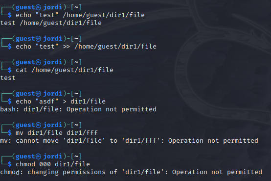

---
## Front matter
lang: ru-RU
title: Лабораторная работа №4
subtitle: Дискреционное разграничение прав в Linux. Расширенные атрибуты
author:
  - Буллет Т. А.
institute:
  - Российский университет дружбы народов, Москва, Россия
date: 15 февраля 2025

## i18n babel
babel-lang: russian
babel-otherlangs: english

## Formatting pdf
toc: false
toc-title: Содержание
slide_level: 2
aspectratio: 169
section-titles: true
theme: metropolis
header-includes:
 - \metroset{progressbar=frametitle,sectionpage=progressbar,numbering=fraction}
---

# Информация

## Докладчик

:::::::::::::: {.columns align=center}
::: {.column width="70%"}

  * Буллер Татьяна Александровна
  * студент направления Бизнес-информатика
  * Российский университет дружбы народов

:::
::: {.column width="30%"}

:::
::::::::::::::

# Вводная часть

## Объект и предмет исследования

- Операционная система linux, дисрибутив Rocky
- Среда виртуализации VirtualBox

## Цели и задачи

- Получение практических навыков работы в консоли с расширенными атрибутами файлов.

## Материалы и методы

- Процессор `pandoc` для входного формата Markdown
- Среда виртуализации VirtualBox

# Выполнение лабораторной работы

## Предварительная настройка

От имени созданного ранее пользователя командой lsattr просмотрим атрибуты файла file, находящегося в директории dir1. Видим, что файлу присвоен только один аттрибут: e.

{#fig:001 width=70%}

## Предварительная настройка

Установим командой chmod 600 на файл права, позволяющие только владельцу читать и записывать данные в файл (но не исполнять).
При попытке изменить атрибут у файла от имени того же пользователя получим ошибку: операция не разрешена.

{#fig:002 width=70%}

## Предварительная настройка

При этом, воспользовавшись учетной записью пользователя из группы sudo, мы без проблем выполним эту операцию.

{#fig:003 width=70%}

## Предварительная настройка

От имени пользователя guest проверим правильность установки атрибутов все той же командой lsattr. Видим, что появился дополнительный атрибут а, предыдущий тоже остался на месте.

{#fig:004 width=70%}

## Работа с измененными атрибутами

При попытке выполнить команду  'echo "test" /home/guest/dir1/file1' мы получим объединение строк test и /home/guest/dir1/file1, но не дозапись слова test в выбранный файл. Для того, чтобы перенаправить вывод команды echo в файл, необходимо использовать > (перезапись) или >> (дозапись).
С измененными атрибутами дозапись в файл и его чтение можно осуществить без проблем, при этом перезапись и переименование и изменение прав недоступны.

{#fig:005 width=40%}

## Работа с измененными атрибутами

Командой chattr -a снимем с файла атрибут, установленный ранее. Теперь уже перезапись файла и его переименование становятся доступны.

{#fig:006 width=70%}

## Работа с измененными атрибутами

Заменим атрибут 'а' атрибутом 'i'. Мы все еще можем прочитать файл в директории, однако перезапись, дозапись и переименование уже становятся недоступны. В этом "режиме" файл становится неуязвим: не может быть изменён, удалён или переименован. 

{#fig:007 width=40%}

# Выводы

В результате выполнения работы были повышены  навыки использования интерфейса командой строки (CLI), освоено на примерах то, как используются основные и расширенные атрибуты при разграничении доступа. Связана теория дискреционного разделения доступа с её реализацией на практике в ОС Linux. Опробовано действие на практике расширенных атрибутов «а» и «i».

