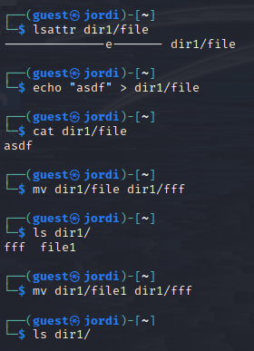

---
## Front matter
title: "Отчет по лабораторной работе №4"
subtitle: "Дискреционное разграничение прав в Linux. Расширенные атрибуты"
author: "Татьяна Александровна Буллер"

## Generic otions
lang: ru-RU
toc-title: "Содержание"

## Bibliography
bibliography: bib/cite.bib
csl: pandoc/csl/gost-r-7-0-5-2008-numeric.csl

## Pdf output format
toc: true # Table of contents
toc-depth: 2
lof: true # List of figures
lot: false # List of tables
fontsize: 12pt
linestretch: 1.5
papersize: a4
documentclass: scrreprt
## I18n polyglossia
polyglossia-lang:
  name: russian
  options:
	- spelling=modern
	- babelshorthands=true
polyglossia-otherlangs:
  name: english
## I18n babel
babel-lang: russian
babel-otherlangs: english
## Fonts
mainfont: IBM Plex Serif
romanfont: IBM Plex Serif
sansfont: IBM Plex Sans
monofont: IBM Plex Mono
mathfont: STIX Two Math
mainfontoptions: Ligatures=Common,Ligatures=TeX,Scale=0.94
romanfontoptions: Ligatures=Common,Ligatures=TeX,Scale=0.94
sansfontoptions: Ligatures=Common,Ligatures=TeX,Scale=MatchLowercase,Scale=0.94
monofontoptions: Scale=MatchLowercase,Scale=0.94,FakeStretch=0.9
mathfontoptions:
## Biblatex
biblatex: true
biblio-style: "gost-numeric"
biblatexoptions:
  - parentracker=true
  - backend=biber
  - hyperref=auto
  - language=auto
  - autolang=other*
  - citestyle=gost-numeric
## Pandoc-crossref LaTeX customization
figureTitle: "Рис."
tableTitle: "Таблица"
listingTitle: "Листинг"
lofTitle: "Список иллюстраций"
lotTitle: "Список таблиц"
lolTitle: "Листинги"
## Misc options
indent: true
header-includes:
  - \usepackage{indentfirst}
  - \usepackage{float} # keep figures where there are in the text
  - \floatplacement{figure}{H} # keep figures where there are in the text
---

# Цель работы

Целью данной работы является получение практических навыков работы в консоли с расширенными атрибутами файлов.

# Выполнение лабораторной работы

## Предварительная настройка

От имени созданного ранее пользователя командой lsattr просмотрим атрибуты файла file, находящегося в директории dir1. Видим, что файлу присвоен только один аттрибут: e.

{#fig:001 width=70%}

Установим командой chmod 600 на файл права, позволяющие только владельцу читать и записывать данные в файл (но не исполнять).
При попытке изменить атрибут у файла от имени того же пользователя получим ошибку: операция не разрешена.

{#fig:002 width=70%}

При этом, воспользовавшись учетной записью пользователя из группы sudo, мы без проблем выполним эту операцию.

{#fig:003 width=70%}

От имени пользователя guest проверим правильность установки атрибутов все той же командой lsattr. Видим, что появился дополнительный атрибут а, предыдущий тоже остался на месте.

{#fig:004 width=70%}

## Работа с измененными атрибутами

При попытке выполнить команду  'echo "test" /home/guest/dir1/file1' мы получим объединение строк test и /home/guest/dir1/file1, но не дозапись слова test в выбранный файл. Для того, чтобы перенаправить вывод команды echo в файл, необходимо использовать > (перезапись) или >> (дозапись).
С измененными атрибутами дозапись в файл и его чтение можно осуществить без проблем, при этом перезапись и переименование и изменение прав недоступны.

{#fig:005 width=70%}

Командой chattr -a снимем с файла атрибут, установленный ранее. Теперь уже перезапись файла и его переименование становятся доступны.

{#fig:006 width=70%}

Заменим атрибут 'а' атрибутом 'i'. Мы все еще можем прочитать файл в директории, однако перезапись, дозапись и переименование уже становятся недоступны. В этом "режиме" файл становится неуязвим: не может быть изменён, удалён или переименован. 

{#fig:007 width=70%}

# Выводы

В результате выполнения работы были повышены  навыки использования интерфейса командой строки (CLI), освоено на примерах то, как используются основные и расширенные атрибуты при разграничении доступа. Связана теория дискреционного разделения доступа с её реализацией на практике в ОС Linux. Опробовано действие на практике расширенных атрибутов «а» и «i».
