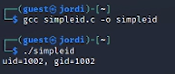
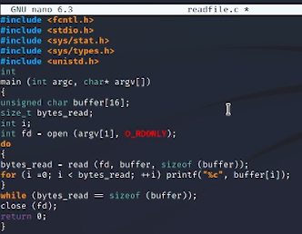
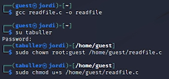
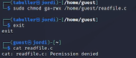
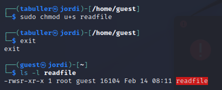
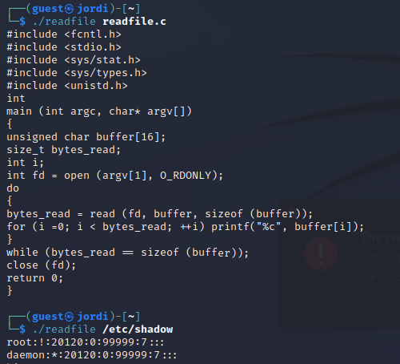
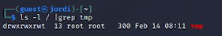
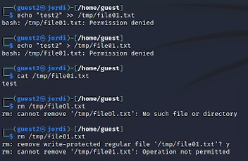
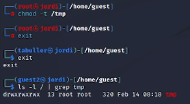

---
## Front matter
title: "Отчет по лабораторной работе №5"
subtitle: "Дискреционное разграничение прав в Linux. Исследование влияния дополнительных атрибутов"
author: "Татьяна Александровна Буллер"

## Generic otions
lang: ru-RU
toc-title: "Содержание"

## Bibliography
bibliography: bib/cite.bib
csl: pandoc/csl/gost-r-7-0-5-2008-numeric.csl

## Pdf output format
toc: true # Table of contents
toc-depth: 2
lof: true # List of figures
lot: false # List of tables
fontsize: 12pt
linestretch: 1.5
papersize: a4
documentclass: scrreprt
## I18n polyglossia
polyglossia-lang:
  name: russian
  options:
	- spelling=modern
	- babelshorthands=true
polyglossia-otherlangs:
  name: english
## I18n babel
babel-lang: russian
babel-otherlangs: english
## Fonts
mainfont: IBM Plex Serif
romanfont: IBM Plex Serif
sansfont: IBM Plex Sans
monofont: IBM Plex Mono
mathfont: STIX Two Math
mainfontoptions: Ligatures=Common,Ligatures=TeX,Scale=0.94
romanfontoptions: Ligatures=Common,Ligatures=TeX,Scale=0.94
sansfontoptions: Ligatures=Common,Ligatures=TeX,Scale=MatchLowercase,Scale=0.94
monofontoptions: Scale=MatchLowercase,Scale=0.94,FakeStretch=0.9
mathfontoptions:
## Biblatex
biblatex: true
biblio-style: "gost-numeric"
biblatexoptions:
  - parentracker=true
  - backend=biber
  - hyperref=auto
  - language=auto
  - autolang=other*
  - citestyle=gost-numeric
## Pandoc-crossref LaTeX customization
figureTitle: "Рис."
tableTitle: "Таблица"
listingTitle: "Листинг"
lofTitle: "Список иллюстраций"
lotTitle: "Список таблиц"
lolTitle: "Листинги"
## Misc options
indent: true
header-includes:
  - \usepackage{indentfirst}
  - \usepackage{float} # keep figures where there are in the text
  - \floatplacement{figure}{H} # keep figures where there are in the text
---

# Цель работы

Изучение механизмов изменения идентификаторов, применения
SetUID- и Sticky-битов. Получение практических навыков работы в консоли с дополнительными атрибутами. Рассмотрение работы механизма смены идентификатора процессов пользователей, а также влияние бита Sticky на запись и удаление файлов.

# Выполнение лабораторной работы

## Компилирование программ

Создадим программу simpleid.c. Эта программа с помощью функций geteuid и getegid получает uid и gid пользователя соответственно, после чего выводит их на экран.

{#fig:001 width=70%}

Скомпилировав программу, получим вывод, в значениях совпадающий с выводом команды id.

{#fig:002 width=70%}

{#fig:003 width=70%}

После этого усложним программу, как показано на скриншоте:

{#fig:004 width=70%}

Теперь вывод дополнен и все еще совпадает с выводом id.

{#fig:005 width=70%}

## Исследование SUID-бита

Следующим шагом от имени суперпользователя назначим владельцам файла программы суперпользователя и добавим ей SUID-бит.

{#fig:006 width=70%}

{#fig:007 width=70%}

Теперь при запуске этой программы видим, что она выводит e_uid: идентификатор пользователя, от имени которого она была запущена; real_uid - идентификатор пользователя, от имени которого она исполняется.

{#fig:008 width=70%}

Создадим еще одну программу: аналог cat readfile, которая будет получать содержимое файла, название которого передано ей в аргументе, и выводить его на экран.  

{#fig:009 width=70%}

Скомпилируем ее, передадим файл кода во владение суперпользователю и добавим SUID-бит, после чего заберем у всех остальных пользователей все права на него. Видим, что теперь пользователь guest не может прочитать содержимое.

{#fig:010 width=70%}

{#fig:011 width=70%}

Следующим шагом изменим права на программу, которая была скомпилирована по коду readfile.c. Добавим тот же SUID-бит и передадим во владение суперпользователю. Вилим, что теперь название программы подсвечено красным.

{#fig:012 width=70%}

{#fig:013 width=70%}

Теперь при попытке прочитать readfile.c с помощью скомпилированной им программы мы получаем содержимое файла. Это происходит потому, что программа исполняется от имени суперпользователя и наделена всеми теми же правами, что и root. Она в том числе может прочитать и системный файл /etc/shadow, в котором по умолчанию хранится список пользователей и их хэшированные пароли.

{#fig:014 width=70%}

## Исследование Sticky-бита

Просмотрев в корневой директории системы права поддиректорий, видим, что на директории tmp установлен бит t. Полезно отметить также, что писать и читать эту директорию может кто угодно.

{#fig:015 width=70%}

Далее создадим в этой директории файл file01. Изначально права на него позволяют пользователям кроме владельца только читать его, владельцу - записывать и читать. Добавим для остальных пользователей права на запись.

{#fig:016 width=70%}

Переключившись на пользователя guest2, однако, мы все еще не можем сделать с этим файлом ничего, кроме прочтения, потому что пользователь guest2 входит в группу пользователя guest, а группе не были добавлены права на запись. Файл, кроме прочего, "защищен" Sticky-битом, установленным на директории.

{#fig:017 width=70%}

От имени суперпользователя снимем Sticky-бит и снова проверим права на директорию tmp: символ t пропал.

{#fig:018 width=70%}

Теперь уже, все еще не являясь владельцем файла, мы можем его переименовывать и удалять.

{#fig:019 width=70%}

# Выводы

Изучены механизмы изменения идентификаторов, применения SetUID- и Sticky-битов. Получены практические навыки работы в консоли с дополнительными атрибутами. Рассмотрена работа механизма смены идентификатора процессов пользователей, а также влияние бита Sticky на запись и удаление файлов.
