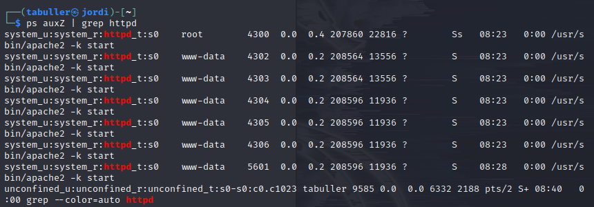
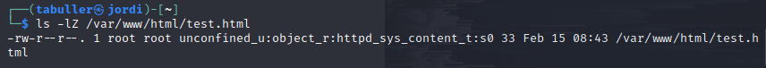
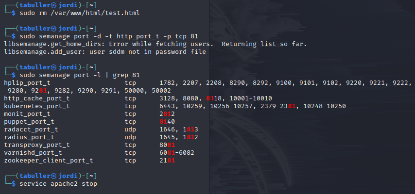

---
## Front matter
lang: ru-RU
title: Лабораторная работа №6
subtitle: Мандатное разграничение прав в Linux
author:
  - Буллет Т. А.
institute:
  - Российский университет дружбы народов, Москва, Россия
date: 15 февраля 2025

## i18n babel
babel-lang: russian
babel-otherlangs: english

## Formatting pdf
toc: false
toc-title: Содержание
slide_level: 2
aspectratio: 169
section-titles: true
theme: metropolis
header-includes:
 - \metroset{progressbar=frametitle,sectionpage=progressbar,numbering=fraction}
---

# Информация

## Докладчик

:::::::::::::: {.columns align=center}
::: {.column width="70%"}

  * Буллер Татьяна Александровна
  * студент направления Бизнес-информатика
  * Российский университет дружбы народов

:::
::: {.column width="30%"}

:::
::::::::::::::

# Вводная часть

## Объект и предмет исследования

- Операционная система linux, дисрибутив Kali
- Среда виртуализации VirtualBox
- Технология мандатного разграничения прав SELinux

## Цели и задачи

- Развить навыки администрирования ОС Linux. 
- Получить первое практическое знакомство с технологией SELinux1. 
- Проверить работу SELinx на практике совместно с веб-сервером Apache.

## Материалы и методы

- Процессор `pandoc` для входного формата Markdown
- Среда виртуализации VirtualBox
- SELinux
- Apache2

# Выполнение лабораторной работы

Войдем в систему с полученными учётными данными и убедимся, что SELinux работает в режиме enforcing политики targeted с помощью команд getenforce и sestatus.

{#fig:001 width=40%}

Предварительно запустив сервис apache2, проверим, работает ли httpd. 

{#fig:002 width=40%}

## Выполнение лабораторной работы

Далее с помощью команды 'ps auxZ | grep httpd' определим контекст безопасности веб-сервера Apache. Строка unconfined говорит о том, что никакие дополнительные ограничения не установлены.

{#fig:003 width=40%}

## Выполнение лабораторной работы

Посмотрим текущее состояние переключателей SELinux для Apache с помощью команды sestatus '-b | grep httpd'. Видим настройки по умолчанию: все переключатели разрешений для  httpd в режиме off.

{#fig:004 width=40%}

## Выполнение лабораторной работы

Команда seinfo позволяет просмотреть статистику по политике. Видим 3983 типа, 9 пользователей и 15 ролей.

{#fig:005 width=40%}

## Выполнение лабораторной работы

Командой ls -lZ определим типы файлов, находящихся в директории /var/www и то же самое для /var/www/html. Видим, что для всех файлов и поддиректорий установлены права, позволяющие только владельцу (суперпользователю) осуществлять запись в них, потому дальнейшую работу необходимо будет вести через sudo.

{#fig:006 width=40%}

## Выполнение лабораторной работы

От имени суперпользователя пишем в директории /var/www/html короткий файл test.html, при компиляции которого на экран будет выведено только слово test. Этот файл должен быть доступен по адресу 127.0.0.1/test.html, так как на машине запущен сервис apache. Перейдя по адресу и не указывая имя файла мы встретим приветственную страницу apache (it works!), далее, уточнив имя файла test.html, увидим вывод созданного нами файла.

{#fig:007 width=40%}

## Выполнение лабораторной работы

В контексте созданного файла, который проверим снова командой ls -lZ, встречаем строку unconfined_u - свободный пользователь, роль object_r используемая по умолчанию для файлов на «постоянных» носителях и на сетевых файловых системах, и тип httpd_sys_content_t, позволяющий процессу httpd получить доступ к этому файлу.

{#fig:008 width=40%}

## Выполнение лабораторной работы

Теперь командой  chcon -t samba_share_t /var/www/html/test.html изменим контекст файла. Теперь процесс samba может получить доступ к файлу, а httpd - нет, поэтому при повторной попытке получить файл через браузер мы столкнемся с ошибкой. Соответствующее предупреждение можем видеть и в системных логах.

{#fig:009 width=40%}

{#fig:010 width=40%}

## Выполнение лабораторной работы

Перезапустим веб-сервер на прослушивание TCP порта 81 вместо 80, стоящего по умолчанию. Для этого в файле /etc/apache/port.conf заменим строчку Listen 80 на Listen 81.  При попытке перезапустить сервер после внесенных изменений, однако, снова столкнемся с ошибкой, потому что в конфигурацию SELinux соответствующие разрешения и изменения внесены не были.

{#fig:011 width=40%}

## Выполнение лабораторной работы

Следующим шагом выполним semanage port -a -t http_port_t -р tcp 81. Эта команда внесет порт 81 в список доступных для сервиса httpd, в чем далее мы можем убедиться командой semanage port -l | grep 81. При попытке теперь запустить веб-сервер ошибок не возникнет.

{#fig:012 width=40%}

## Выполнение лабораторной работы

В завершение работы вернем систему к настройкам по умолчанию: удалим созданный файл и добавленные контексты, а также выключим сервис apache. 

{#fig:013 width=40%}

# Выводы

Получено первое практическое знакомство с технологией SELinux. Проверена работу SELinx на практике совместно с веб-сервером Apache.
