---
## Front matter
title: "Отчет по лабораторной работе №6"
subtitle: "Мандатное разграничение прав в Linux"
author: "Татьяна Александровна Буллер"

## Generic otions
lang: ru-RU
toc-title: "Содержание"

## Bibliography
bibliography: bib/cite.bib
csl: pandoc/csl/gost-r-7-0-5-2008-numeric.csl

## Pdf output format
toc: true # Table of contents
toc-depth: 2
lof: true # List of figures
lot: false # List of tables
fontsize: 12pt
linestretch: 1.5
papersize: a4
documentclass: scrreprt
## I18n polyglossia
polyglossia-lang:
  name: russian
  options:
	- spelling=modern
	- babelshorthands=true
polyglossia-otherlangs:
  name: english
## I18n babel
babel-lang: russian
babel-otherlangs: english
## Fonts
mainfont: IBM Plex Serif
romanfont: IBM Plex Serif
sansfont: IBM Plex Sans
monofont: IBM Plex Mono
mathfont: STIX Two Math
mainfontoptions: Ligatures=Common,Ligatures=TeX,Scale=0.94
romanfontoptions: Ligatures=Common,Ligatures=TeX,Scale=0.94
sansfontoptions: Ligatures=Common,Ligatures=TeX,Scale=MatchLowercase,Scale=0.94
monofontoptions: Scale=MatchLowercase,Scale=0.94,FakeStretch=0.9
mathfontoptions:
## Biblatex
biblatex: true
biblio-style: "gost-numeric"
biblatexoptions:
  - parentracker=true
  - backend=biber
  - hyperref=auto
  - language=auto
  - autolang=other*
  - citestyle=gost-numeric
## Pandoc-crossref LaTeX customization
figureTitle: "Рис."
tableTitle: "Таблица"
listingTitle: "Листинг"
lofTitle: "Список иллюстраций"
lotTitle: "Список таблиц"
lolTitle: "Листинги"
## Misc options
indent: true
header-includes:
  - \usepackage{indentfirst}
  - \usepackage{float} # keep figures where there are in the text
  - \floatplacement{figure}{H} # keep figures where there are in the text
---

# Цель работы

Развить навыки администрирования ОС Linux. Получить первое практическое знакомство с технологией SELinux1. Проверить работу SELinx на практике совместно с веб-сервером Apache.

# Выполнение лабораторной работы

Войдем в систему с полученными учётными данными и убедимся, что SELinux работает в режиме enforcing политики targeted с помощью команд getenforce и sestatus.

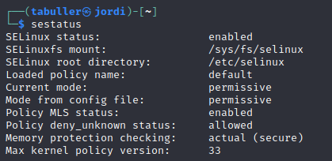{#fig:001 width=70%}

Предварительно запустив сервис apache2, проверим, работает ли httpd. 

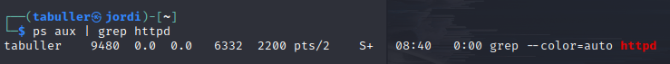{#fig:002 width=70%}

Далее с помощью команды 'ps auxZ | grep httpd' определим контекст безопасности веб-сервера Apache. Строка unconfined говорит о том, что никакие дополнительные ограничения не установлены.

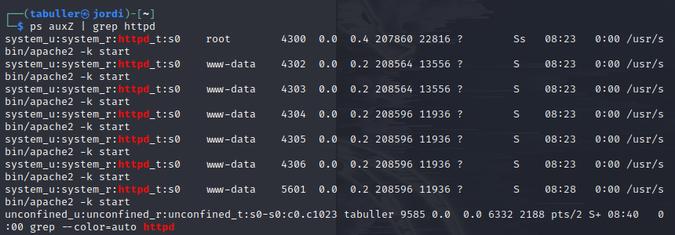{#fig:003 width=70%}

Посмотрим текущее состояние переключателей SELinux для Apache с помощью команды sestatus '-b | grep httpd'. Видим настройки по умолчанию: все переключатели разрешений для  httpd в режиме off.

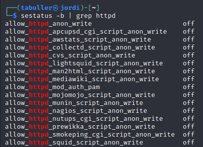{#fig:004 width=70%}

Команда seinfo позволяет просмотреть статистику по политике. Видим 3983 типа, 9 пользователей и 15 ролей.

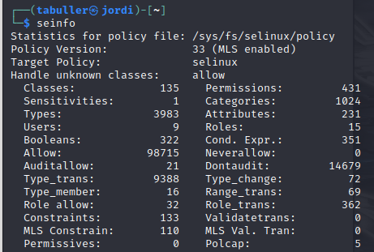{#fig:005 width=70%}

Командой ls -lZ определим типы файлов, находящихся в директории /var/www и то же самое для /var/www/html. Видим, что для всех файлов и поддиректорий установлены права, позволяющие только владельцу (суперпользователю) осуществлять запись в них, потому дальнейшую работу необходимо будет вести через sudo.

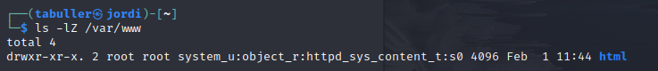{#fig:006 width=70%}

От имени суперпользователя пишем в директории /var/www/html короткий файл test.html, при компиляции которого на экран будет выведено только слово test. Этот файл должен быть доступен по адресу 127.0.0.1/test.html, так как на машине запущен сервис apache. Перейдя по адресу и не указывая имя файла мы встретим приветственную страницу apache (it works!), далее, уточнив имя файла test.html, увидим вывод созданного нами файла.

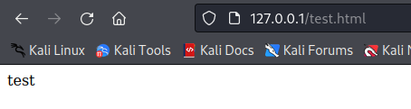{#fig:007 width=70%}

В контексте созданного файла, который проверим снова командой ls -lZ, встречаем строку unconfined_u - свободный пользователь, роль object_r используемая по умолчанию для файлов на «постоянных» носителях и на сетевых файловых системах, и тип httpd_sys_content_t, позволяющий процессу httpd получить доступ к этому файлу.

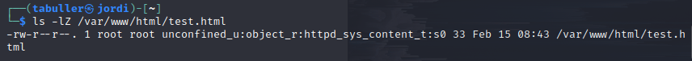{#fig:008 width=70%}

Теперь командой  chcon -t samba_share_t /var/www/html/test.html изменим контекст файла. Теперь процесс samba может получить доступ к файлу, а httpd - нет, поэтому при повторной попытке получить файл через браузер мы столкнемся с ошибкой. Соответствующее предупреждение можем видеть и в системных логах.

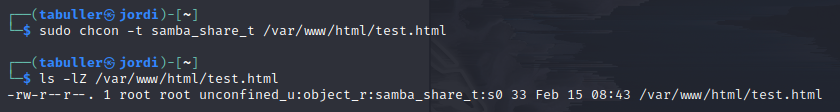{#fig:009 width=70%}

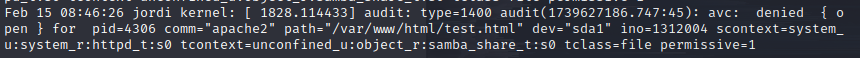{#fig:010 width=70%}

Перезапустим веб-сервер на прослушивание TCP порта 81 вместо 80, стоящего по умолчанию. Для этого в файле /etc/apache/port.conf заменим строчку Listen 80 на Listen 81.  При попытке перезапустить сервер после внесенных изменений, однако, снова столкнемся с ошибкой, потому что в конфигурацию SELinux соответствующие разрешения и изменения внесены не были.

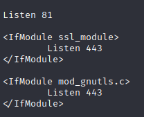{#fig:011 width=70%}

Следующим шагом выполним semanage port -a -t http_port_t -р tcp 81. Эта команда внесет порт 81 в список доступных для сервиса httpd, в чем далее мы можем убедиться командой semanage port -l | grep 81. При попытке теперь запустить веб-сервер ошибок не возникнет.

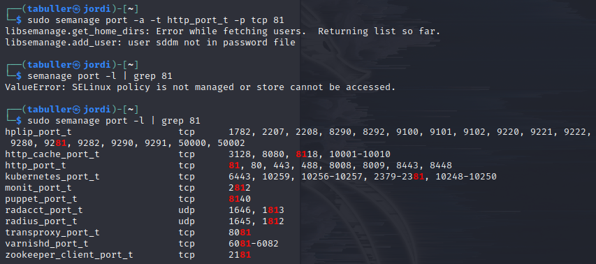{#fig:012 width=70%}

В завершение работы вернем систему к настройкам по умолчанию: удалим созданный файл и добавленные контексты, а также выключим сервис apache. 

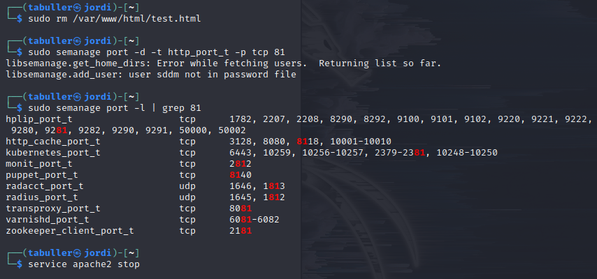{#fig:013 width=70%}

# Выводы

Получено первое практическое знакомство с технологией SELinux. Проверена работу SELinx на практике совместно с веб-сервером Apache.
