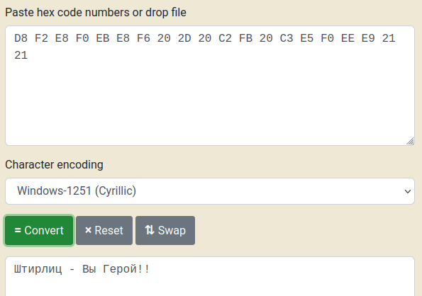
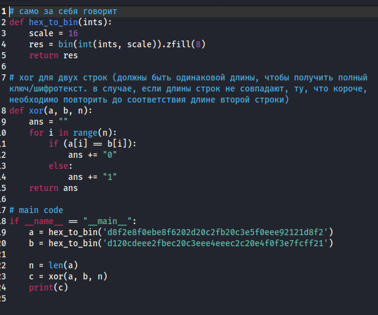
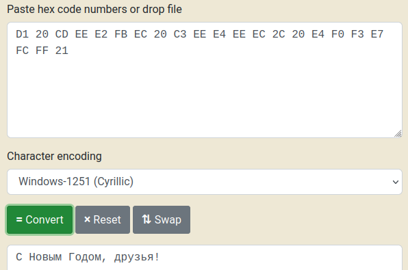

---
## Front matter
title: "Отчет по лабораторной работе №7"
subtitle: "Элементы криптографии. Однократное гаммирование"
author: "Татьяна Александровна Буллер"

## Generic otions
lang: ru-RU
toc-title: "Содержание"

## Bibliography
bibliography: bib/cite.bib
csl: pandoc/csl/gost-r-7-0-5-2008-numeric.csl

## Pdf output format
toc: true # Table of contents
toc-depth: 2
lof: true # List of figures
lot: false # List of tables
fontsize: 12pt
linestretch: 1.5
papersize: a4
documentclass: scrreprt
## I18n polyglossia
polyglossia-lang:
  name: russian
  options:
	- spelling=modern
	- babelshorthands=true
polyglossia-otherlangs:
  name: english
## I18n babel
babel-lang: russian
babel-otherlangs: english
## Fonts
mainfont: IBM Plex Serif
romanfont: IBM Plex Serif
sansfont: IBM Plex Sans
monofont: IBM Plex Mono
mathfont: STIX Two Math
mainfontoptions: Ligatures=Common,Ligatures=TeX,Scale=0.94
romanfontoptions: Ligatures=Common,Ligatures=TeX,Scale=0.94
sansfontoptions: Ligatures=Common,Ligatures=TeX,Scale=MatchLowercase,Scale=0.94
monofontoptions: Scale=MatchLowercase,Scale=0.94,FakeStretch=0.9
mathfontoptions:
## Biblatex
biblatex: true
biblio-style: "gost-numeric"
biblatexoptions:
  - parentracker=true
  - backend=biber
  - hyperref=auto
  - language=auto
  - autolang=other*
  - citestyle=gost-numeric
## Pandoc-crossref LaTeX customization
figureTitle: "Рис."
tableTitle: "Таблица"
listingTitle: "Листинг"
lofTitle: "Список иллюстраций"
lotTitle: "Список таблиц"
lolTitle: "Листинги"
## Misc options
indent: true
header-includes:
  - \usepackage{indentfirst}
  - \usepackage{float} # keep figures where there are in the text
  - \floatplacement{figure}{H} # keep figures where there are in the text
---

# Цель работы

Освоить на практике применение режима однократного гаммирования.

# Выполнение лабораторной работы

## Определение кодировки шифротекста

Сообщение "D8 F2 E8 F0 EB E8 F6 20 2D 20 C2 FB 20 C3 E5 F0 EE E9 21 21" написано на русском языке, однако при переводе его из hex в текст стандартных кодировок ASCII/UTF-8 результат не совпадал с тем, какой был задан условием задания. Путем перебора кодировок было выяснено, что сообщение было написано в кодировке Windows-1251. 

{#fig:001 width=70%}

## Программа дешифрования по известному открытому тексту

Далее необходимо было написать код, с помощью которого можно было бы дешифровать сообщение. Метод шифрования XOR крайне уязвим к атакам по известному открытому тексту, поэтому, зная сообщение на выходе, мы без труда можем получить ключ, которым нужно было зашифровать строку, чтобы его получить. Для этого нужно обернуть операцию.
Переведем известные нам строки шифра и открытого текста ("С Новым Годом, друзья!" в кодировке Windows-1251) в hex. Для того, чтобы далее провести с ними операции XOR, нужно перевести эти строки далее в бинарный формат. После сравним строки посимвольно и запишем результат: если символ в позиции n строки А совпадает с символом в той же позиции в строке Б, то в результат дописывается 0, иначе - 1. Необходимо отметить, что для корректной работы кода и получения полного ключа строки должны совпадать по длине. В случае, если какая-то из них короче другой, она повторяется до того, как длины совпадут.

{#fig:002 width=70%}

Программа выдает ключ в формате двоичного числа, который при необходимости далее можно перевести в шестнадцатиричный формат. Использовав полученный ключ вместо шифротекста, мы получим другой двоичный вывод. Переведя его в текст и расшифровав в кодировке Windows-1251 получим сообщение, ключ к которому и хотели найти, что говорит о том, что код сработал корректно.

{#fig:003 width=70%}

# Выводы

Было освоено на практике применение режима однократного гаммирования, написана программа, переводящая строки из шестнадцатиричного формата в двочиный и проводящая между ними XOR-операцию посимвольно.
