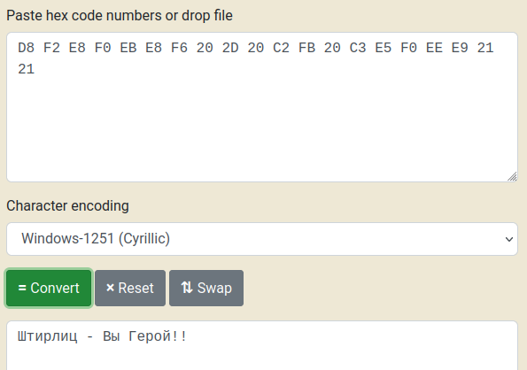
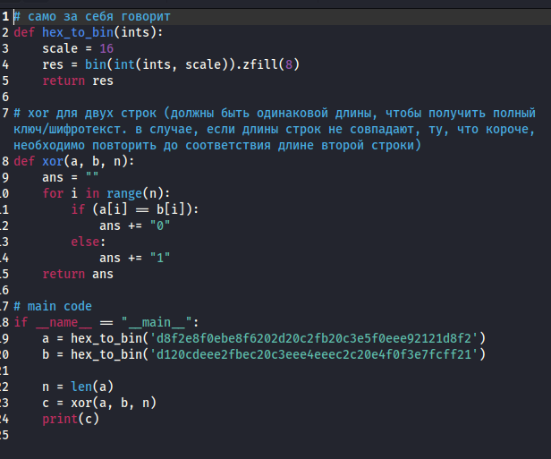
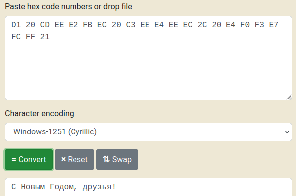

---
## Front matter
title: "Отчет по лабораторной работе №7"
subtitle: "Элементы криптографии. Однократное гаммирование"
author: "Татьяна Александровна Буллер"

## Generic otions
lang: ru-RU
toc-title: "Содержание"

## Bibliography
bibliography: bib/cite.bib
csl: pandoc/csl/gost-r-7-0-5-2008-numeric.csl

## Pdf output format
toc: true # Table of contents
toc-depth: 2
lof: true # List of figures
lot: false # List of tables
fontsize: 12pt
linestretch: 1.5
papersize: a4
documentclass: scrreprt
## I18n polyglossia
polyglossia-lang:
  name: russian
  options:
	- spelling=modern
	- babelshorthands=true
polyglossia-otherlangs:
  name: english
## I18n babel
babel-lang: russian
babel-otherlangs: english
## Fonts
mainfont: IBM Plex Serif
romanfont: IBM Plex Serif
sansfont: IBM Plex Sans
monofont: IBM Plex Mono
mathfont: STIX Two Math
mainfontoptions: Ligatures=Common,Ligatures=TeX,Scale=0.94
romanfontoptions: Ligatures=Common,Ligatures=TeX,Scale=0.94
sansfontoptions: Ligatures=Common,Ligatures=TeX,Scale=MatchLowercase,Scale=0.94
monofontoptions: Scale=MatchLowercase,Scale=0.94,FakeStretch=0.9
mathfontoptions:
## Biblatex
biblatex: true
biblio-style: "gost-numeric"
biblatexoptions:
  - parentracker=true
  - backend=biber
  - hyperref=auto
  - language=auto
  - autolang=other*
  - citestyle=gost-numeric
## Pandoc-crossref LaTeX customization
figureTitle: "Рис."
tableTitle: "Таблица"
listingTitle: "Листинг"
lofTitle: "Список иллюстраций"
lotTitle: "Список таблиц"
lolTitle: "Листинги"
## Misc options
indent: true
header-includes:
  - \usepackage{indentfirst}
  - \usepackage{float} # keep figures where there are in the text
  - \floatplacement{figure}{H} # keep figures where there are in the text
---

# Цель работы

Освоить на практике применение режима однократного гаммирования.

# Выполнение лабораторной работы

## Определение кодировки шифротекста

Сообщение "D8 F2 E8 F0 EB E8 F6 20 2D 20 C2 FB 20 C3 E5 F0 EE E9 21 21" написано на русском языке, однако при переводе его из hex в текст стандартных кодировок ASCII/UTF-8 результат не совпадал с тем, какой был задан условием задания. Путем перебора кодировок было выяснено, что сообщение было написано в кодировке Windows-1251. 

{#fig:001 width=70%}

## Программа дешифрования по известному открытому тексту

Далее необходимо было написать код, с помощью которого можно было бы дешифровать сообщение. Метод шифрования XOR крайне уязвим к атакам по известному открытому тексту, поэтому, зная сообщение на выходе, мы без труда можем получить ключ, которым нужно было зашифровать строку, чтобы его получить. Для этого нужно обернуть операцию.
Переведем известные нам строки шифра и открытого текста ("С Новым Годом, друзья!" в кодировке Windows-1251) в hex. Для того, чтобы далее провести с ними операции XOR, нужно перевести эти строки далее в бинарный формат. После сравним строки посимвольно и запишем результат: если символ в позиции n строки А совпадает с символом в той же позиции в строке Б, то в результат дописывается 0, иначе - 1. Необходимо отметить, что для корректной работы кода и получения полного ключа строки должны совпадать по длине. В случае, если какая-то из них короче другой, она повторяется до того, как длины совпадут.

{#fig:002 width=70%}

Программа выдает ключ в формате двоичного числа, который при необходимости далее можно перевести в шестнадцатиричный формат. Использовав полученный ключ вместо шифротекста, мы получим другой двоичный вывод. Переведя его в текст и расшифровав в кодировке Windows-1251 получим сообщение, ключ к которому и хотели найти, что говорит о том, что код сработал корректно.

{#fig:003 width=70%}

# Листинг программы

```python

# само за себя говорит
def hex_to_bin(ints):
    scale = 16
    res = bin(int(ints, scale)).zfill(8) 
    return res

# xor для двух строк (должны быть одинаковой длины, чтобы получить полный ключ/шифротекст. в случае, если длины строк не совпадают, ту, что короче, необходимо повторить до соответствия длине второй строки)
def xor(a, b, n):
    ans = ""
    for i in range(n):
        if (a[i] == b[i]): 
            ans += "0"
        else: 
            ans += "1"
    return ans 
 
# main code
if __name__ == "__main__":
    a = hex_to_bin('d8f2e8f0ebe8f6202d20c2fb20c3e5f0eee92121d8f2')
    b = hex_to_bin('d120cdeee2fbec20c3eee4eeec2c20e4f0f3e7fcff21')

    n = len(a)
    c = xor(a, b, n)
    print(c)
```

# Ответы на контрольные вопросы

1. Поясните смысл однократного гаммирования. 

Однократное гаммирование - метод ширфрования, гаммирующий каждый символ исходного текста с соответствующим символом ключа ровно один раз.

2. Перечислите недостатки однократного гаммирования. 

- Безопасность шифра целиком и полностью построена на безопасности сгенерированного ключа.
- Уязвимость к атакам по известному открытому тексту.
- Использование одного и того же ключа для разных сообщений позволяет атакующему без труда получить ключ.

3. Перечислите преимущества однократного гаммирования. 

- Высокая криптостойкость при адекватной генерации ключа.
- Простота реализации алгоритма.

4. Почему длина открытого текста должна совпадать с длиной ключа? 

Каждый символ открытого текста гаммируется с соответствующим символом ключа. Ключ может быть длиннее открытого текста (тогда текст будет закодирован частью ключа) либо короче (тогда ключ необходимо будет повторить до соответствия длите текста), но каждому символу исходного текста должен быть в соответствие символ ключа.

5. Какая операция используется в режиме однократного гаммирования, назовите её особенности? 

Однократное гаммирование использует XOR, сравнивающу. двоичные значения символов открытого текста и ключа для получения шифротекста. Если символы разнятся между собой (0 и 1, 1 и 0), то битом шифротекста становится 1, иначе - 0.

6. Как по открытому тексту и ключу получить шифротекст? 

Каждый символ открытого текста гаммируется с соответствующим символом ключа с использованием XOR.
 
7. Как по открытому тексту и шифротексту получить ключ? 

Предположим, что у нас есть часть открытого текста: мы знаем, что некоторая комбинация символов встречается в открытом тексте, но не знаем, где именно.
Повторим эту комбинацию символов до тех пор, пока она не будет соответствовать длине шифротекста. При выполнении операции XOR с зашифрованным текстом и повторяющейся известной строкой, если известная нам строка длиннее изначально использованного ключа, мы получим  повторяющуюся строку ключа, равную длине известной нам комбинации символов, в сообщении, расшифрованном с помощью зацикленной части известного открытого текста. Продлив эту строку до соответствия длине текста, получаем использованный ключ.

8. В чем заключаются необходимые и достаточные условия абсолютной стойкости шифра 

- Ключи должны быть случайными, сгенерированными надежно и одноразово используемыми.
- Длина ключа не меньше длины открытого текста, иначе шифр крайне уязвим к атаке по известному открытому тексту (ключ повторяется).
- Используется нестандартная кодировка, усложняющая расшифровку сообщения автоматическими анализаторами вроде xortool.
- Ключи хранятся и передаются надежным способом.

# Выводы

Было освоено на практике применение режима однократного гаммирования, написана программа, переводящая строки из шестнадцатиричного формата в двочиный и проводящая между ними XOR-операцию посимвольно.
