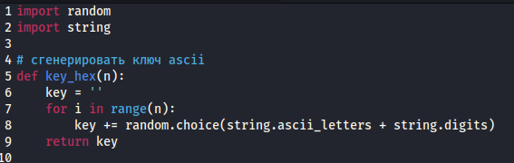
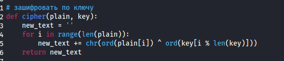
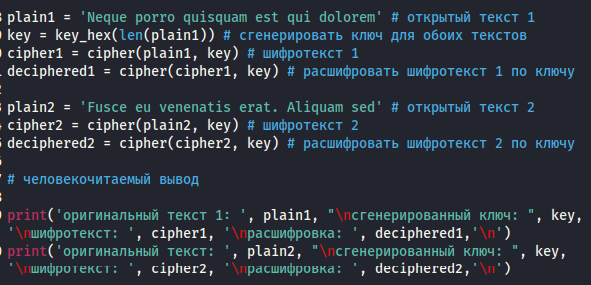
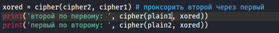
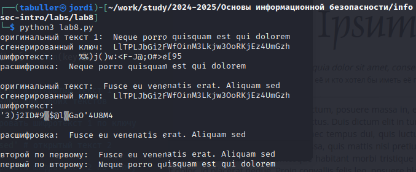

---
## Front matter
lang: ru-RU
title: Лабораторная работа №8
subtitle: Элементы криптографии. Шифрование (кодирование) различных исходных текстов одним ключом
author:
  - Буллет Т. А.
institute:
  - Российский университет дружбы народов, Москва, Россия
date: 16 февраля 2025

## i18n babel
babel-lang: russian
babel-otherlangs: english

## Formatting pdf
toc: false
toc-title: Содержание
slide_level: 2
aspectratio: 169
section-titles: true
theme: metropolis
header-includes:
 - \metroset{progressbar=frametitle,sectionpage=progressbar,numbering=fraction}
---

# Информация

## Докладчик

:::::::::::::: {.columns align=center}
::: {.column width="70%"}

  * Буллер Татьяна Александровна
  * студент направления Бизнес-информатика
  * Российский университет дружбы народов

:::
::: {.column width="30%"}

:::
::::::::::::::

# Вводная часть

## Объект и предмет исследования

- Метод шифрования XOR
- Среда виртуализации VirtualBox

## Цели и задачи

- Освоить на практике применение режима однократного гаммирования
на примере кодирования различных исходных текстов одним ключом.

## Материалы и методы

- Процессор `pandoc` для входного формата Markdown
- Среда виртуализации VirtualBox
- Язык программирования Python

# Выполнение лабораторной работы

## Генерация ключа

В отличие от предыдущей работы, закодированные сообщения пользователь может выбрать сам. Поэтому для упрощения реализации возьмем стандартную кодировку ASCII, известную без дополнительных включений всем языкам программирования.
Для обоих шифротекстов необходимо сгенерировать ключ. Помним, что для обеспечения шифру адекватной криптостойкости, длина ключа должна быть не менее длины шифротекста. Напишем функцию, которая по переданной ей длине текста сгенерирует для него случайную строку ключа шифрования:

{#fig:001 width=40%}

## Функция операции XOR для двух строк

Далее необходимо было написать код, с помощью которого можно было бы зашифровать сообщение. Для этого напишем простую функцию, которая в цикле по каждому символу исходного текста и соответствующему символу ключа сгенерирует символ нового текста.

{#fig:002 width=40%}

## Тело программы

В теле программы зададим две строки открытого текста одинаковой длины (plain1 и plain2), взяв за текст стандартную рыбу Lorem Ipsum. По одному из текстов (в представленном примере - по первому) сгенерируем ключ с помощью написанной ранее функции, затем продемонстрируем шифрование строки этим ключом и дешифрование полученных шифротекстов.

{#fig:003 width=40%}

## Расшифровать один текст через второй

В случае, когда мы имеем два сообщения одинаковой длины и известно, что они были зашифрованы одним ключом, мы можем расшифровать одно сообщение через второе. Для этого проведем простую операцию: XOR для двух шифротекстов. Это позволит получить ключ шифрования, который мог бы быть использован, чтобы операцией XOR на одном из открытых текстов получить второй. Владея одним из открытых текстов и этим ключом, мы можем получить второй открытый текст.

{#fig:004 width=40%}

## Вывод программы

Человекочитаемый вывод программы состоит из трех частей: операции над первым текстом (сам открытый текст, сгенерированный ключ, шифротекст и открытый текст, полученный от шифротекста и ключа), аналогичные операции для второго текста и получение открытых сообщений по двум шифротекстам и одному открытому.

{#fig:005 width=40%}

# Выводы

Было освоено на практике применение режима однократного гаммирования на примере кодирования различных исходных текстов одним ключом, написана программа, шифрующая две строки одним случайно сгенерированным ключом и дешифрующая шифротексты обратно по одному открытому тексту и двум шифрам.
