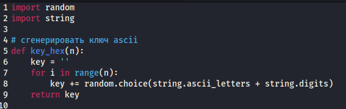
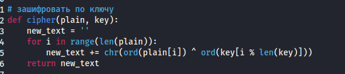
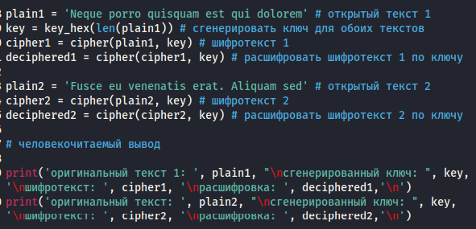
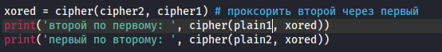
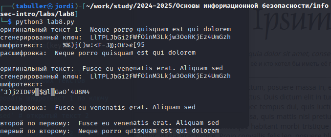

---
## Front matter
title: "Отчет по лабораторной работе №8"
subtitle: "Элементы криптографии. Шифрование (кодирование) различных исходных текстов одним ключом"
author: "Татьяна Александровна Буллер"

## Generic otions
lang: ru-RU
toc-title: "Содержание"

## Bibliography
bibliography: bib/cite.bib
csl: pandoc/csl/gost-r-7-0-5-2008-numeric.csl

## Pdf output format
toc: true # Table of contents
toc-depth: 2
lof: true # List of figures
lot: false # List of tables
fontsize: 12pt
linestretch: 1.5
papersize: a4
documentclass: scrreprt
## I18n polyglossia
polyglossia-lang:
  name: russian
  options:
	- spelling=modern
	- babelshorthands=true
polyglossia-otherlangs:
  name: english
## I18n babel
babel-lang: russian
babel-otherlangs: english
## Fonts
mainfont: IBM Plex Serif
romanfont: IBM Plex Serif
sansfont: IBM Plex Sans
monofont: IBM Plex Mono
mathfont: STIX Two Math
mainfontoptions: Ligatures=Common,Ligatures=TeX,Scale=0.94
romanfontoptions: Ligatures=Common,Ligatures=TeX,Scale=0.94
sansfontoptions: Ligatures=Common,Ligatures=TeX,Scale=MatchLowercase,Scale=0.94
monofontoptions: Scale=MatchLowercase,Scale=0.94,FakeStretch=0.9
mathfontoptions:
## Biblatex
biblatex: true
biblio-style: "gost-numeric"
biblatexoptions:
  - parentracker=true
  - backend=biber
  - hyperref=auto
  - language=auto
  - autolang=other*
  - citestyle=gost-numeric
## Pandoc-crossref LaTeX customization
figureTitle: "Рис."
tableTitle: "Таблица"
listingTitle: "Листинг"
lofTitle: "Список иллюстраций"
lotTitle: "Список таблиц"
lolTitle: "Листинги"
## Misc options
indent: true
header-includes:
  - \usepackage{indentfirst}
  - \usepackage{float} # keep figures where there are in the text
  - \floatplacement{figure}{H} # keep figures where there are in the text
---

# Цель работы

Освоить на практике применение режима однократного гаммирования
на примере кодирования различных исходных текстов одним ключом.

# Выполнение лабораторной работы

## Генерация ключа

В отличие от предыдущей работы, закодированные сообщения пользователь может выбрать сам. Поэтому для упрощения реализации возьмем стандартную кодировку ASCII, известную без дополнительных включений всем языкам программирования.
Для обоих шифротекстов необходимо сгенерировать ключ. Помним, что для обеспечения шифру адекватной криптостойкости, длина ключа должна быть не менее длины шифротекста. Напишем функцию, которая по переданной ей длине текста сгенерирует для него случайную строку ключа шифрования:

{#fig:001 width=70%}

## Функция операции XOR для двух строк

Далее необходимо было написать код, с помощью которого можно было бы зашифровать сообщение. Для этого напишем простую функцию, которая в цикле по каждому символу исходного текста и соответствующему символу ключа сгенерирует символ нового текста.

{#fig:002 width=70%}

## Тело программы

В теле программы зададим две строки открытого текста одинаковой длины (plain1 и plain2), взяв за текст стандартную рыбу Lorem Ipsum. По одному из текстов (в представленном примере - по первому) сгенерируем ключ с помощью написанной ранее функции, затем продемонстрируем шифрование строки этим ключом и дешифрование полученных шифротекстов.

{#fig:003 width=70%}

## Расшифровать один текст через второй

В случае, когда мы имеем два сообщения одинаковой длины и известно, что они были зашифрованы одним ключом, мы можем расшифровать одно сообщение через второе. Для этого проведем простую операцию: XOR для двух шифротекстов. Это позволит получить ключ шифрования, который мог бы быть использован, чтобы операцией XOR на одном из открытых текстов получить второй. Владея одним из открытых текстов и этим ключом, мы можем получить второй открытый текст.

{#fig:004 width=70%}

## Вывод программы

Человекочитаемый вывод программы состоит из трех частей: операции над первым текстом (сам открытый текст, сгенерированный ключ, шифротекст и открытый текст, полученный от шифротекста и ключа), аналогичные операции для второго текста и получение открытых сообщений по двум шифротекстам и одному открытому.

{#fig:005 width=70%}

# Листинг программы

```python

import random
import string

# сгенерировать ключ ascii
def key_hex(n):
    key = ''
    for i in range(n):
        key += random.choice(string.ascii_letters + string.digits) 
    return key

# зашифровать по ключу
def cipher(plain, key):
    new_text = ''
    for i in range(len(plain)): 
        new_text += chr(ord(plain[i]) ^ ord(key[i % len(key)]))
    return new_text

plain1 = 'Neque porro quisquam est qui dolorem' # открытый текст 1
key = key_hex(len(plain1)) # сгенерировать ключ для обоих текстов
cipher1 = cipher(plain1, key) # шифротекст 1
deciphered1 = cipher(cipher1, key) # расшифровать шифротекст 1 по ключу

plain2 = 'Fusce eu venenatis erat. Aliquam sed' # открытый текст 2
cipher2 = cipher(plain2, key) # шифротекст 2
deciphered2 = cipher(cipher2, key) # расшифровать шифротекст 2 по ключу

# человекочитаемый вывод

print('оригинальный текст 1: ', plain1, "\nсгенерированный ключ: ", key, '\nшифротекст: ', cipher1, '\nрасшифровка: ', deciphered1,'\n')
print('оригинальный текст: ', plain2, "\nсгенерированный ключ: ", key, '\nшифротекст: ', cipher2, '\nрасшифровка: ', deciphered2,'\n')

xored = cipher(cipher2, cipher1) # проксорить второй через первый
print('второй по первому: ', cipher(plain1, xored))
print('первый по второму: ', cipher(plain2, xored))
```

# Ответы на контрольные вопросы

1. Как, зная один из текстов ($P_1$ или $P_2$), определить другой, не зная при этом ключа? 

В случае, когда мы имеем два сообщения одинаковой длины и известно, что они были зашифрованы одним ключом, мы можем расшифровать одно сообщение через второе. Для этого проведем простую операцию: XOR для двух шифротекстов. Это позволит получить ключ шифрования, который мог бы быть использован, чтобы операцией XOR на одном из открытых текстов получить второй. Владея одним из открытых текстов и этим ключом, мы можем получить второй открытый текст.

2. Что будет при повторном использовании ключа при шифровании текста? 

При повторном применении того же ключа к уже зашифрованному им тексту будет получен открытый текст.

3. Как реализуется режим шифрования однократного гаммирования одним ключом двух открытых текстов? 

Режим шифрования однократного гаммирования одним ключом двух открытых текстов реализуется через использование операции XOR над каждым битом открытого текста сквозь ключ. Для шифрования двух текстов применяется один и тот же ключ.

4. Перечислите недостатки шифрования одним ключом двух открытых текстов 

Повторное использование ключа позволяет расшифровать любое сообщение, зашифрованное этим ключом, если известена хотя бы одна пара шифротекст:открытый текст.

5. Перечислите преимущества шифрования одним ключом двух открытых текстов 

Снижение затрат ресурсов памяти на генерацию нового ключа для каждого следующего сообщения.

# Выводы

Было освоено на практике применение режима однократного гаммирования на примере кодирования различных исходных текстов одним ключом, написана программа, шифрующая две строки одним случайно сгенерированным ключом и дешифрующая шифротексты обратно по одному открытому тексту и двум шифрам.
