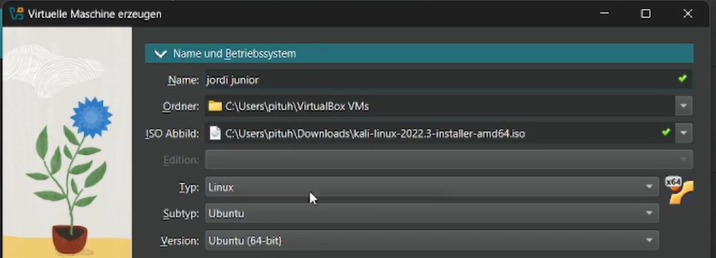
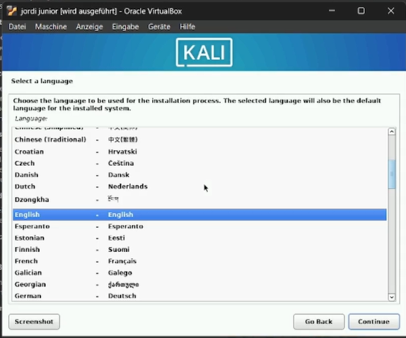
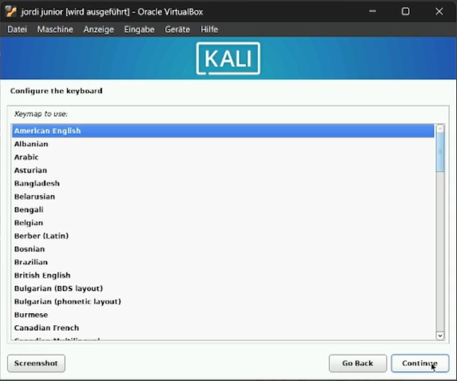
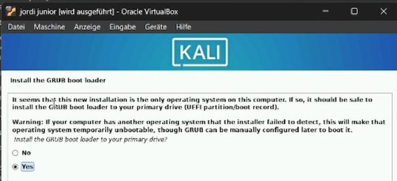
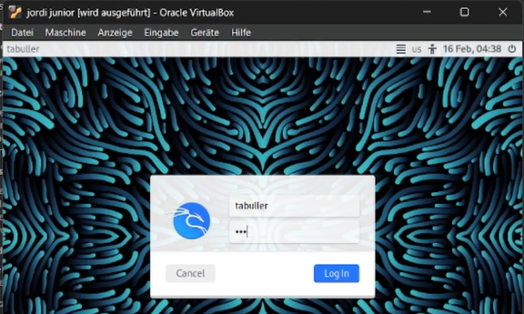

---
## Front matter
lang: ru-RU
title: Индивидуальный проект. Этап 1
subtitle: Установка Kali Linux
author:
  - Буллер Т.А.
institute:
  - Российский университет дружбы народов, Москва, Россия
date: 20 февраля 2025

## i18n babel
babel-lang: russian
babel-otherlangs: english

## Formatting pdf
toc: false
toc-title: Содержание
slide_level: 2
aspectratio: 169
section-titles: true
theme: metropolis
header-includes:
 - \metroset{progressbar=frametitle,sectionpage=progressbar,numbering=fraction}
---

# Информация

## Докладчик

  * Буллер Татьяна Александровна
  * студент направления Бизнес-информатика
  * Российский университет дружбы народов

# Вводная часть

## Объект и предмет исследования

- Операционная система linux, дисрибутив Kali
- Среда виртуализации VirtualBox

## Цели и задачи

- Приобретение практических навыков установки операционной системы на виртуальную машину
- Приобретение навыков настройки минимально необходимых для дальнейшей работы сервисов

## Материалы и методы

- Процессор `pandoc` для входного формата Markdown
- Среда виртуализации VirtualBox

# Ход работы

## Ход работы

Создание виртуальной машины дистрибутива Kali аналогично созданию машины дистрибутива Rocky, рассмотренному ранее в лабораторных работах. Первый этап - выбор названия для машины, места хранения и файла образа, с которого будет установлена операционная система.

{#fig:001 width=40%}

## Ход работы

Железа и места на диске оставим минимально рекомендуемое. Этого хватит, чтобы запустить машину и использовать ее стандартные функции; для работы с расширенным инструментарием я использую другую машину того же дистрибутива, установленную ранее самостоятельно.

## Ход работы

{#fig:002 width=40%}

{#fig:003 width=40%}

## Ход работы

Первое, что необходимо выбрать при установке - язык процесса установки и дефолтный язык системы. По умолчанию предлагается английский.

{#fig:004 width=40%}

## Ход работы

Далее установщик просит выбрать местонахождение. В дальнейшем эта информация будет использована для выбора часового пояса. Вариант по умолчанию - Соединенные Штаты.

{#fig:005 width=40%}

## Ход работы

Далее, отдельно от выбора языка системы, предлагается выбрать раскладку клавиатуры, которая будет для системы основной. 

{#fig:006 width=40%}

## Ход работы

Следующий этап - конфигурация сети. Здесь необходимо выбрать имя хоста, доменное имя и создать пользователя. Имя хоста - доменное имя второго уровня, доменное имя - домен первого уровня (\<hostname\>.\<domainname\>).

## Ход работы

{#fig:007 width=40%}

{#fig:008 width=40%}

## Ход работы

Создание пользователя так же проходит в несколько этапов. Для начала установщик просит ввести полное имя, затем - логин (который в том числе и сам предлагает на основе введенного полного имени) и пароль, который необходимо подтвердить дважды.

## Ход работы

{#fig:009 width=40%}

{#fig:010 width=40%}

## Ход работы

Выбор часовой зоны (времени в системе) строится на выбранной ранее локации и предлагает варианты, исходя из страны проживания пользователя.

{#fig:011 width=40%}

## Ход работы

Предпоследний этап установки - настройка диска и его разделов. Система предлагает использовать диск целиком или создать в дополнение к нему LVM, который может быть зашифрован по желанию. При разделении диска можно также выбрать использование целого диска, выделение /home в отдельный раздел или то же самое для трех директорий: /home, /tmp и /var.

{#fig:012 width=40%}

## Ход работы

Последний этап - выбор дополнительного ПО. Kali предлагает установить дефолтное окружение, среду рабочего стола, коллекцию наиболее часто используемых инструментов, 10 самых частоиспользуемых инструментов и рекомендованные. Далее по желанию можно установить загрузчик GRUB.

## Ход работы

{#fig:013 width=40%}

{#fig:014 width=40%}

## Ход работы

После описанных выше настроек машина готова к работе. Она автоматически перезагружается и выводит на вход.

{#fig:015 width=40%}

## Ход работы

{#fig:016 width=40%}

# Выводы

Были приобретены практические навыки установки операционной системы на виртуальную машину и настройки минимально необходимых для дальнейшей работы сервисов.
