---
## Front matter
title: "Индивидуальный проект. Этап 1"
subtitle: "Установка Kali Linux"
author: "Татьяна Александровна Буллер"

## Generic otions
lang: ru-RU
toc-title: "Содержание"

## Bibliography
bibliography: bib/cite.bib
csl: pandoc/csl/gost-r-7-0-5-2008-numeric.csl

## Pdf output format
toc: true # Table of contents
toc-depth: 2
lof: true # List of figures
lot: false # List of tables
fontsize: 12pt
linestretch: 1.5
papersize: a4
documentclass: scrreprt
## I18n polyglossia
polyglossia-lang:
  name: russian
  options:
	- spelling=modern
	- babelshorthands=true
polyglossia-otherlangs:
  name: english
## I18n babel
babel-lang: russian
babel-otherlangs: english
## Fonts
mainfont: IBM Plex Serif
romanfont: IBM Plex Serif
sansfont: IBM Plex Sans
monofont: IBM Plex Mono
mathfont: STIX Two Math
mainfontoptions: Ligatures=Common,Ligatures=TeX,Scale=0.94
romanfontoptions: Ligatures=Common,Ligatures=TeX,Scale=0.94
sansfontoptions: Ligatures=Common,Ligatures=TeX,Scale=MatchLowercase,Scale=0.94
monofontoptions: Scale=MatchLowercase,Scale=0.94,FakeStretch=0.9
mathfontoptions:
## Biblatex
biblatex: true
biblio-style: "gost-numeric"
biblatexoptions:
  - parentracker=true
  - backend=biber
  - hyperref=auto
  - language=auto
  - autolang=other*
  - citestyle=gost-numeric
## Pandoc-crossref LaTeX customization
figureTitle: "Рис."
tableTitle: "Таблица"
listingTitle: "Листинг"
lofTitle: "Список иллюстраций"
lotTitle: "Список таблиц"
lolTitle: "Листинги"
## Misc options
indent: true
header-includes:
  - \usepackage{indentfirst}
  - \usepackage{float} # keep figures where there are in the text
  - \floatplacement{figure}{H} # keep figures where there are in the text
---

# Цель работы

Приобретение практических навыков установки операционной системы на виртуальную машину, настройки минимально необходимых для дальнейшей работы сервисов.

# Ход работы 

Создание виртуальной машины дистрибутива Kali аналогично созданию машины дистрибутива Rocky, рассмотренному ранее в лабораторных работах. Первый этап - выбор названия для машины, места хранения и файла образа, с которого будет установлена операционная система.

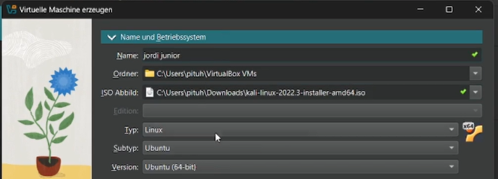{#fig:001 width=70%}

Железа и места на диске оставим минимально рекомендуемое. Этого хватит, чтобы запустить машину и использовать ее стандартные функции; для работы с расширенным инструментарием я использую другую машину того же дистрибутива, установленную ранее самостоятельно.

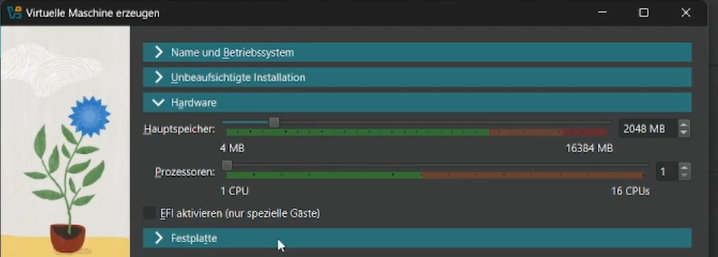{#fig:002 width=70%}

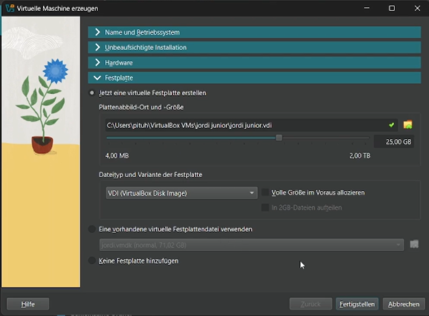{#fig:003 width=70%}

Первое, что необходимо выбрать при установке - язык процесса установки и дефолтный язык системы. По умолчанию предлагается английский.

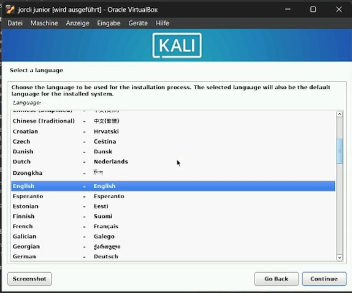{#fig:004 width=70%}

Далее установщик просит выбрать местонахождение. В дальнейшем эта информация будет использована для выбора часового пояса. Вариант по умолчанию - Соединенные Штаты.

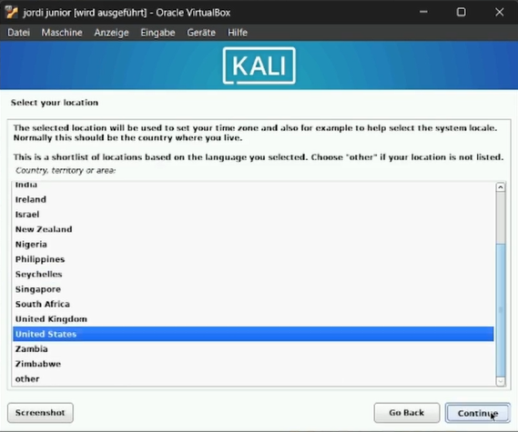{#fig:005 width=70%}

Далее, отдельно от выбора языка системы, предлагается выбрать раскладку клавиатуры, которая будет для системы основной. 

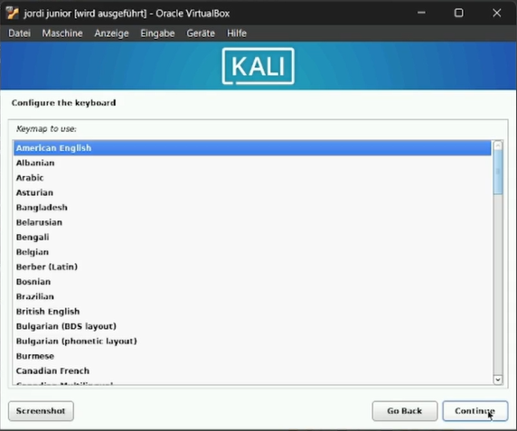{#fig:006 width=70%}

Следующий этап - конфигурация сети. Здесь необходимо выбрать имя хоста, доменное имя и создать пользователя. Имя хоста - доменное имя второго уровня, доменное имя - домен первого уровня (\<hostname\>.\<domainname\>).

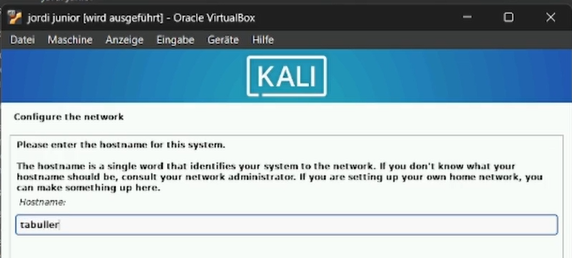{#fig:007 width=70%}

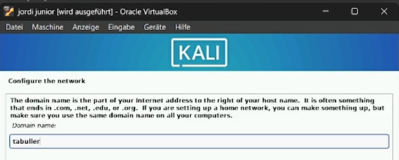{#fig:008 width=70%}

Создание пользователя так же проходит в несколько этапов. Для начала установщик просит ввести полное имя, затем - логин (который в том числе и сам предлагает на основе введенного полного имени) и пароль, который необходимо подтвердить дважды.

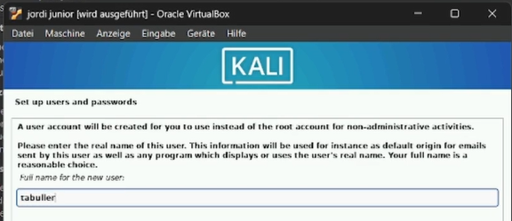{#fig:009 width=70%}

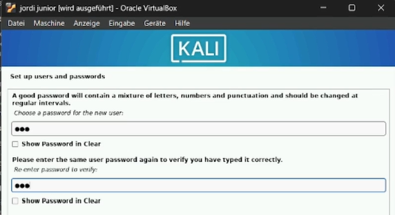{#fig:010 width=70%}

Выбор часовой зоны (времени в системе) строится на выбранной ранее локации и предлагает варианты, исходя из страны проживания пользователя.

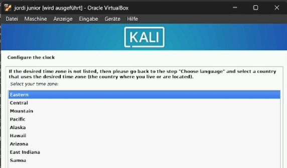{#fig:011 width=70%}

Предпоследний этап установки - настройка диска и его разделов. Система предлагает использовать диск целиком или создать в дополнение к нему LVM, который может быть зашифрован по желанию. При разделении диска можно также выбрать использование целого диска, выделение /home в отдельный раздел или то же самое для трех директорий: /home, /tmp и /var.

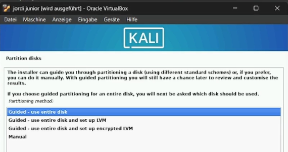{#fig:012 width=70%}

Последний этап - выбор дополнительного ПО. Kali предлагает установить дефолтное окружение, среду рабочего стола, коллекцию наиболее часто используемых инструментов, 10 самых частоиспользуемых инструментов и рекомендованные. Далее по желанию можно установить загрузчик GRUB.

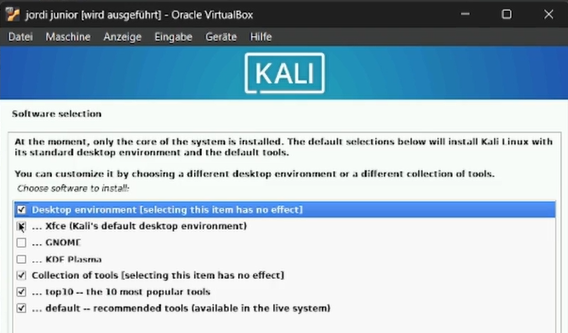{#fig:013 width=70%}

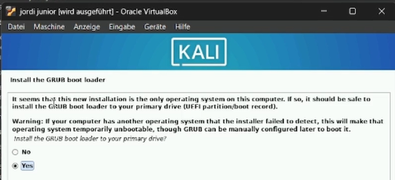{#fig:014 width=70%}

После описанных выше настроек машина готова к работе. Она автоматически перезагружается и выводит на вход.

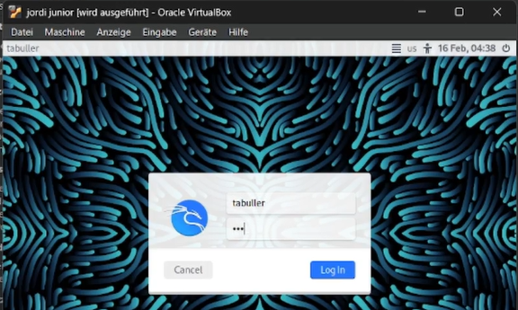{#fig:015 width=70%}

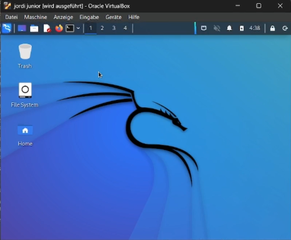{#fig:016 width=70%}

# Выводы

Были приобретены практические навыки установки операционной системы на виртуальную машину и настройки минимально необходимых для дальнейшей работы сервисов.
