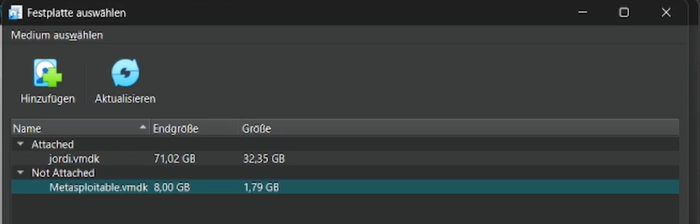
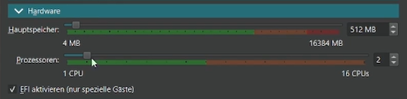
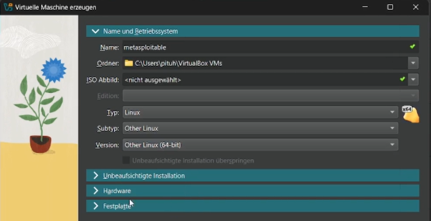
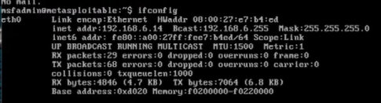
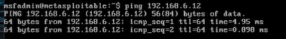
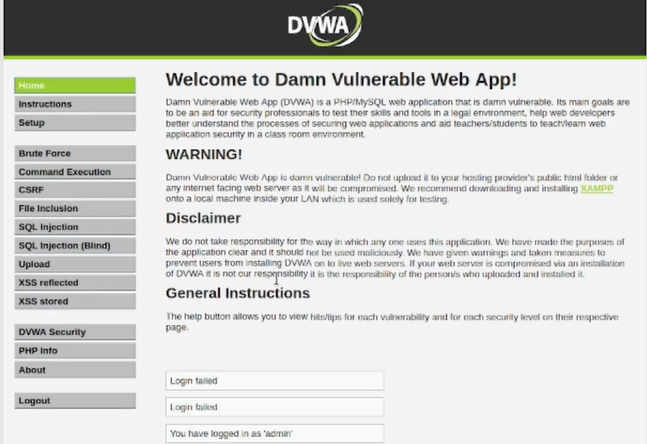
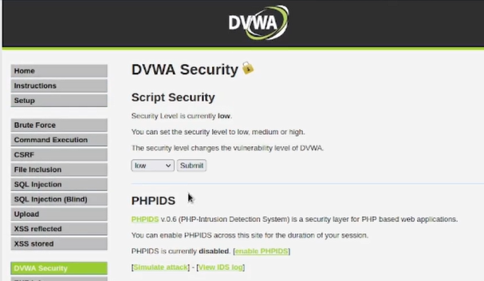

---
## Front matter
lang: ru-RU
title: Индивидуальный проект. Этап 2
subtitle: Установка DVWA
author:
  - Буллер Т.А.
institute:
  - Российский университет дружбы народов, Москва, Россия
date: 20 февраля 2025

## i18n babel
babel-lang: russian
babel-otherlangs: english

## Formatting pdf
toc: false
toc-title: Содержание
slide_level: 2
aspectratio: 169
section-titles: true
theme: metropolis
header-includes:
 - \metroset{progressbar=frametitle,sectionpage=progressbar,numbering=fraction}
---

# Информация

## Докладчик

  * Буллер Татьяна Александровна
  * студент направления Бизнес-информатика
  * Российский университет дружбы народов

# Вводная часть

## Объект и предмет исследования

- Веб-приложение DVWA в составе Metasploitable
- Виртуальная машина Kali Linux
- Среда виртуализации VirtualBox

## Цели и задачи

- Приобретение практических навыков  создания виртуальной машины и запуска веб-сервера.

## Материалы и методы

- Файлы установки Metasploitable для VMware
- Среда виртуализации VirtualBox
- Виртуальная машина Kali Linux

# Ход работы

## Ход работы

Установка DVWA в данной работе будет рассмотрена в комплексе с созданием машины Metasploitable. Metasploitable - намеренно уязвимая машина, содержащая внутри себя такие веб-приложения, как DVWA, WebDAV и Mutillidae. DVWA - намеренно уязвимое веб-приложение, написанное на PHP и MySQL.
Изначально Metasploitable создавался в расчете на совместимость с VMware, но VirtualBox также поддерживает формат виртуальных дисков .vmdk, с которого машина может быть запущена. Для этого добавим диск Metasploitable при выборе диска для машины.

## Ход работы

{#fig:001 width=40%}

{#fig:002 width=40%}

## Ход работы

Metasploitable не предназначен для использования в качестве полностью рабочей машины, ресурсов ему оставим по минимуму:  2 CPU и 512 МБ оперативной памяти.

{#fig:003 width=40%}

## Ход работы

Данные о системе в данном случае придется настраивать вручную, так как файл образа не используется. Здесь выбираем имя, место хранения, тип ОС - Линукс, подтип - другой, версия - х64.

{#fig:004 width=40%}

## Ход работы

Для того, чтобы машины видели друг друга в локальной сети, подключим Metasploitable в тот же сегмент NAT, куда уже подключена основная виртуальная машина.

{#fig:005 width=40%}

## Ход работы

Машина запускается самостоятельно без дополнительных настроек и установки. Логин и пароль по умолчанию совпадают: msfadmin:msfadmin.

{#fig:006 width=40%}

## Ход работы

Для проверки правильности настройки просмотрим адрес сетевого интерфейса машины (должен быть в сегменте 192.168.6.0/24) и попробуем пропинговать рабочую машину с адресом в той же сети 192.168.6.12. Пинг проходит, машины друг друга видят - можно продолжать работу.

## Ход работы

{#fig:007 width=40%}

{#fig:008 width=40%}

## Ход работы

На рабочей машине в адресную строку браузера введем адрес Metasploitable: 192.168.6.14. Попадаем на основную страницу, где видим предупреждение никогда не выводить эту машину в сети, которым не доверяем, контакты разработчиков и дефолтные логин и пароль; ниже - ссылки на сервисы, которые встроены в Metasploitable.

{#fig:009 width=40%}

## Ход работы

Перейдем на страницу DVWA. Там нас встречает простая форма логина, ниже - логин и пароль по умолчанию (admin:password). 

{#fig:010 width=40%}

## Ход работы

Использовав эти данные, мы успешно входим в систему. На первой странице - дисклеймер, предупреждение и общие инструкции. В меню 4 части: основная информация, страницы уязвимостей разных типов, безопасность и информация о машине, выход из системы.

{#fig:011 width=40%}

## Ход работы

Типы уязвимостей будут рассмотрены по ходу работы над проектом далее. Интересно взглянуть на страницу безопасности системы: тут можно выбрать уровень "сложности" машины. По умолчанию - низкий, доступны также средний, высокий и "невозможный". Последний должен быть примером идеального написания кода.

{#fig:012 width=40%}

## Ход работы

Полезным для исследователя является также файл phpinfo, содержащий конфигурацию php и некоторые данные о системе.

{#fig:013 width=40%}

## Ход работы

DVWA можно запустить и не используя для этого дополнительную машину, на локальном хосте. Для этого необходимо будет скачать файлы конфигурации и запустить веб-сервер apache.

# Выводы

Были приобретены практические навыки создания виртуальной машины по виртуальному диску и запуска веб-сервера.
