---
## Front matter
title: "Индивидуальный проект. Этап 2"
subtitle: "Установка DVWA"
author: "Татьяна Александровна Буллер"

## Generic otions
lang: ru-RU
toc-title: "Содержание"

## Bibliography
bibliography: bib/cite.bib
csl: pandoc/csl/gost-r-7-0-5-2008-numeric.csl

## Pdf output format
toc: true # Table of contents
toc-depth: 2
lof: true # List of figures
lot: false # List of tables
fontsize: 12pt
linestretch: 1.5
papersize: a4
documentclass: scrreprt
## I18n polyglossia
polyglossia-lang:
  name: russian
  options:
	- spelling=modern
	- babelshorthands=true
polyglossia-otherlangs:
  name: english
## I18n babel
babel-lang: russian
babel-otherlangs: english
## Fonts
mainfont: IBM Plex Serif
romanfont: IBM Plex Serif
sansfont: IBM Plex Sans
monofont: IBM Plex Mono
mathfont: STIX Two Math
mainfontoptions: Ligatures=Common,Ligatures=TeX,Scale=0.94
romanfontoptions: Ligatures=Common,Ligatures=TeX,Scale=0.94
sansfontoptions: Ligatures=Common,Ligatures=TeX,Scale=MatchLowercase,Scale=0.94
monofontoptions: Scale=MatchLowercase,Scale=0.94,FakeStretch=0.9
mathfontoptions:
## Biblatex
biblatex: true
biblio-style: "gost-numeric"
biblatexoptions:
  - parentracker=true
  - backend=biber
  - hyperref=auto
  - language=auto
  - autolang=other*
  - citestyle=gost-numeric
## Pandoc-crossref LaTeX customization
figureTitle: "Рис."
tableTitle: "Таблица"
listingTitle: "Листинг"
lofTitle: "Список иллюстраций"
lotTitle: "Список таблиц"
lolTitle: "Листинги"
## Misc options
indent: true
header-includes:
  - \usepackage{indentfirst}
  - \usepackage{float} # keep figures where there are in the text
  - \floatplacement{figure}{H} # keep figures where there are in the text
---

# Цель работы

Приобретение практических навыков  создания виртуальной машины и запуска веб-сервера.

# Ход работы 

Установка DVWA в данной работе будет рассмотрена в комплексе с созданием машины Metasploitable. Metasploitable - намеренно уязвимая машина, содержащая внутри себя такие веб-приложения, как DVWA, WebDAV и Mutillidae. DVWA - намеренно уязвимое веб-приложение, написанное на PHP и MySQL.
Изначально Metasploitable создавался в расчете на совместимость с VMware, но VirtualBox также поддерживает формат виртуальных дисков .vmdk, с которого машина может быть запущена. Для этого добавим диск Metasploitable при выборе диска для машины.

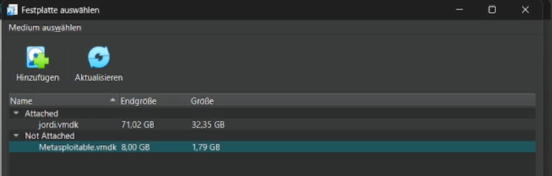{#fig:001 width=70%}

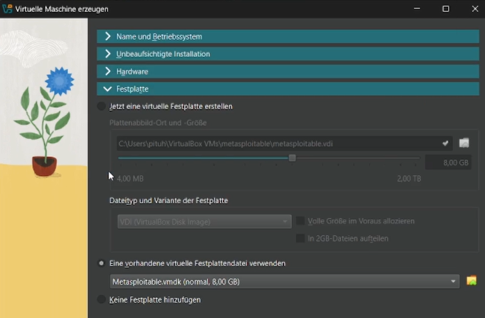{#fig:002 width=70%}

Metasploitable не предназначен для использования в качестве полностью рабочей машины, ресурсов ему оставим по минимуму:  2 CPU и 512 МБ оперативной памяти.

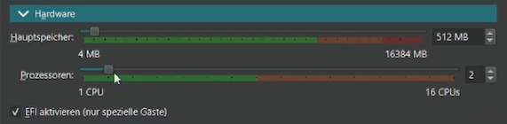{#fig:003 width=70%}

Данные о системе в данном случае придется настраивать вручную, так как файл образа не используется. Здесь выбираем имя, место хранения, тип ОС - Линукс, подтип - другой, версия - х64.

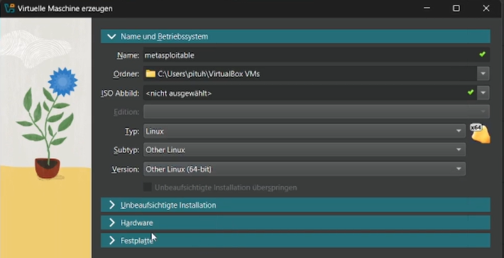{#fig:004 width=70%}

Для того, чтобы машины видели друг друга в локальной сети, подключим Metasploitable в тот же сегмент NAT, куда уже подключена основная виртуальная машина.

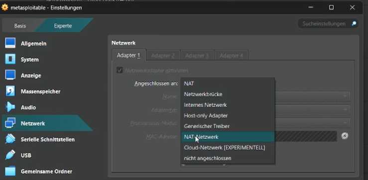{#fig:005 width=70%}

Машина запускается самостоятельно без дополнительных настроек и установки. Логин и пароль по умолчанию совпадают: msfadmin:msfadmin.

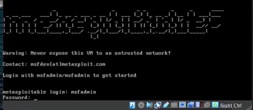{#fig:006 width=70%}

Для проверки правильности настройки просмотрим адрес сетевого интерфейса машины (должен быть в сегменте 192.168.6.0/24) и попробуем пропинговать рабочую машину с адресом в той же сети 192.168.6.12. Пинг проходит, машины друг друга видят - можно продолжать работу.

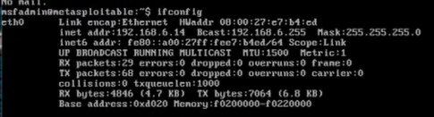{#fig:007 width=70%}

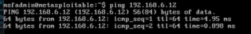{#fig:008 width=70%}

На рабочей машине в адресную строку браузера введем адрес Metasploitable: 192.168.6.14. Попадаем на основную страницу, где видим предупреждение никогда не выводить эту машину в сети, которым не доверяем, контакты разработчиков и дефолтные логин и пароль; ниже - ссылки на сервисы, которые встроены в Metasploitable.

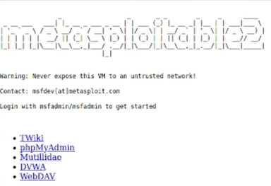{#fig:009 width=70%}

Перейдем на страницу DVWA. Там нас встречает простая форма логина, ниже - логин и пароль по умолчанию (admin:password). 

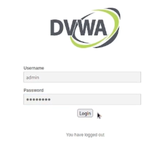{#fig:010 width=70%}

Использовав эти данные, мы успешно входим в систему. На первой странице - дисклеймер, предупреждение и общие инструкции. В меню 4 части: основная информация, страницы уязвимостей разных типов, безопасность и информация о машине, выход из системы.

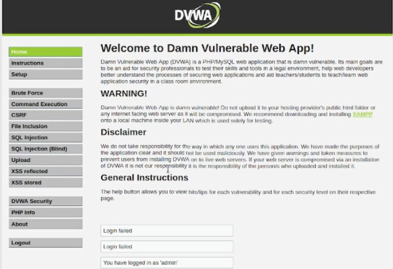{#fig:011 width=70%}

Типы уязвимостей будут рассмотрены по ходу работы над проектом далее. Интересно взглянуть на страницу безопасности системы: тут можно выбрать уровень "сложности" машины. По умолчанию - низкий, доступны также средний, высокий и "невозможный". Последний должен быть примером идеального написания кода.

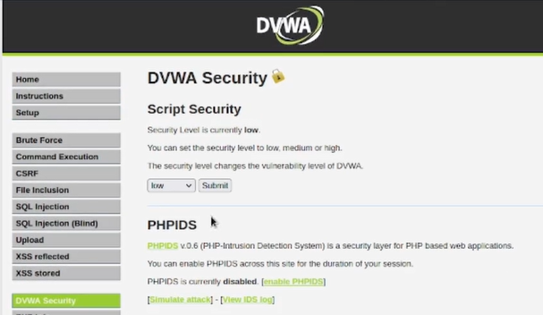{#fig:012 width=70%}

Полезным для исследователя является также файл phpinfo, содержащий конфигурацию php и некоторые данные о системе.

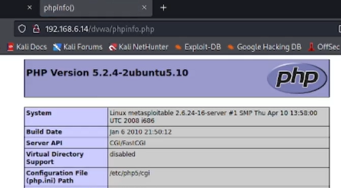{#fig:013 width=70%}

DVWA можно запустить и не используя для этого дополнительную машину, на локальном хосте. Для этого необходимо будет скачать файлы конфигурации и запустить веб-сервер apache.

# Выводы

Были приобретены практические навыки создания виртуальной машины по виртуальному диску и запуска веб-сервера.
