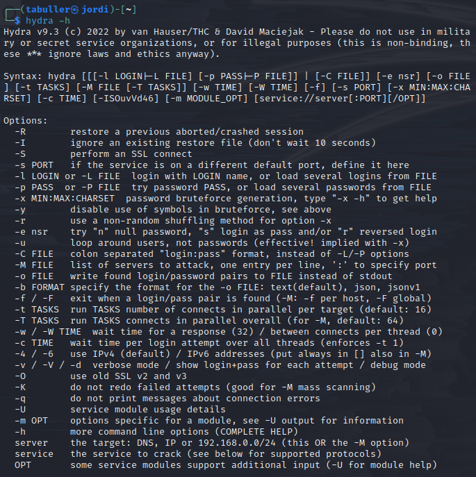
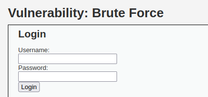
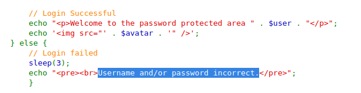
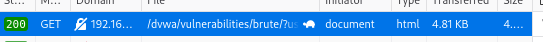
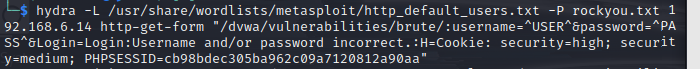
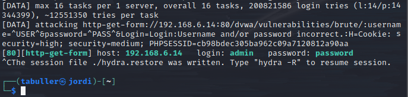
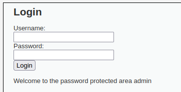

---
## Front matter
lang: ru-RU
title: Индивидуальный проект. Этап 3
subtitle: Использование Hydra
author:
  - Буллер Т.А.
institute:
  - Российский университет дружбы народов, Москва, Россия
date: 17 февраля 2025

## i18n babel
babel-lang: russian
babel-otherlangs: english

## Formatting pdf
toc: false
toc-title: Содержание
slide_level: 2
aspectratio: 169
section-titles: true
theme: metropolis
header-includes:
 - \metroset{progressbar=frametitle,sectionpage=progressbar,numbering=fraction}
---

# Информация

## Докладчик

  * Буллер Татьяна Александровна
  * студент направления Бизнес-информатика
  * Российский университет дружбы народов

# Вводная часть

## Объект и предмет исследования

- Уязвимость типа bruteforce и ее эксплуатация
- Инструмент перебора паролей Hydra
- Веб-приложение DVWA

## Цели и задачи

- Знакомство с инструментом перебора паролей Hydra и простейшим вариантом атаки грубой силы (bruteforce)

## Материалы и методы

- Среда виртуализации VirtualBox
- Виртуальная машина Kali Linux
- Инструментом перебора паролей Hydra
- Веб-приложение DVWA

# Ход работы

## Ход работы

Hydra - инструмент перебора паролей, поддерживающий работу с множеством различных приложений (не только веб-формы, но и другие сервисы, например, ssh и ftp). Используется для перебора по списку пар логин-пароль при аутентификации пользователя в той или иной системе. Такой метод известен как брутфорс - атака грубой силы.

## Ход работы

{#fig:001 width=50%}

## Ход работы

Перейдем на страницу уязвимости Brute Force в DVWA. Страница предлагает форму с двумя полями: username (имя пользователя) и password (пароль). Предположим, что заранее мы не знаем ни одного из компонентов этой пары.

## Ход работы

{#fig:002 width=50%}

## Ход работы

В DVWA мы можем просмотреть исходный код, с помощью которого реализована форма. Это позволяет наглядно видеть, как писать НЕ нужно, и определить вектор или детали осуществления атаки. В случае Brute Force видим, что различаются два варианта развития событий: успешный вход, при котором выводится строка "Welcome...", и ошибка входа, при которой форма даст ответ "Username and/or password incorrect". Эти данные пригодятся в дальнейшем для составления команды.

## Ход работы

{#fig:003 width=50%}

## Ход работы

Попробуем отправить форму со случайными данными и рассмотрим происходящее в разделе Network инструментов разработчика. Видим, что при отправке формы осуществляется GET-запрос, а введенные данные передаются в открытом виде в адресе запроса. Это делает возможным использование Hydra методом http-get-form без модификации отправляемых пакетов: изменять будем только строку запроса.

## Ход работы

{#fig:004 width=50%}

## Ход работы

Составим команду для Hydra. Первым делом передаем опцию -L  \<file\>, где \<file\> - имя файла, в котором перечислены варианты логинов. Можно использовать опцию -l: в таком случае пароли будут перебираться для одного пользователя, а логин можно задать строкой.
Следующая опция - -P \<file\>, где \<file\> - файл с паролями. Аналогично, опция -p будет пробовать только один пароль. Я использую rockyou.txt, по умолчанию включенный в Kali. rockyou.txt был создан в результате утечки базы данных rockyou, социального приложения и рекламной сети. В результате было раскрыто более 32 миллионов паролей пользователей, хранившихся в открытом виде. 

## Ход работы

В качестве аргумента передадим IP-адрес, на котором запущена DVWA. Далее уточним метод (http-get-form) и передадим строку параметров для составления запроса: "/dvwa/vulnerabilities/brute/:username=\^USER\^&password=\^PASS\^&Login=Login:Username and/or password incorrect.:H=Cookie: security=high; security=low; PHPSESSID=(...)". 
Здесь выделяем два параметра: \^USER\^ и \^PASS\^, куда Hydra будет подставлять варианты из переданных ей списков. "Username and/or password incorrect." - строка в теле ответа сайта, наличие которой говорит о том, что комбинация логин/пароль не подходит, запросы, которые дали такие ответы, Hydra будет отметать. Дополнительный параметр - кука с айди сессии и уровнем безопасности.

## Ход работы

{#fig:005 width=70%}

## Ход работы

Спустя некоторое время получаем удачную комбинацию: admin:password. Hydra будет перебирать пароли и дальше (можно задать флаг -F, чтобы после найденной удачной комбинации она закончила перебор), но нам этого результата достаточно. Проверив эту комбинацию на странице, видим, что она действительно работает.

{#fig:006 width=50%}

## Ход работы

{#fig:007 width=50%}

# Выводы

Было освноено применение инструмента Hydra для перебора паролей и осуществлена простейшая bruteforce-атака на тестовой машине DVWA.
