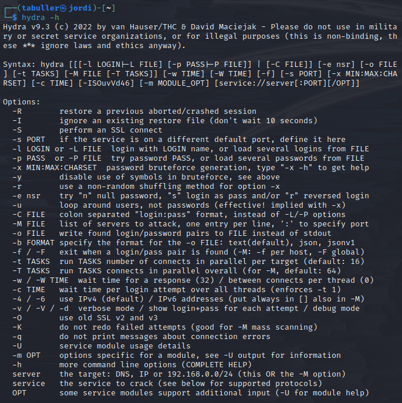
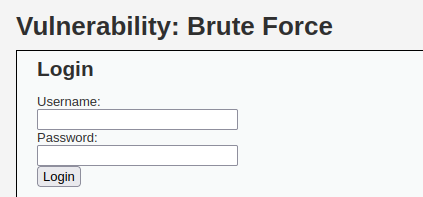
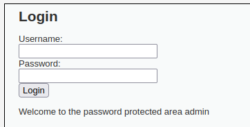

---
## Front matter
title: "Индивидуальный проект. Этап 3"
subtitle: "Использование Hydra"
author: "Татьяна Александровна Буллер"

## Generic otions
lang: ru-RU
toc-title: "Содержание"

## Bibliography
bibliography: bib/cite.bib
csl: pandoc/csl/gost-r-7-0-5-2008-numeric.csl

## Pdf output format
toc: true # Table of contents
toc-depth: 2
lof: true # List of figures
lot: false # List of tables
fontsize: 12pt
linestretch: 1.5
papersize: a4
documentclass: scrreprt
## I18n polyglossia
polyglossia-lang:
  name: russian
  options:
	- spelling=modern
	- babelshorthands=true
polyglossia-otherlangs:
  name: english
## I18n babel
babel-lang: russian
babel-otherlangs: english
## Fonts
mainfont: IBM Plex Serif
romanfont: IBM Plex Serif
sansfont: IBM Plex Sans
monofont: IBM Plex Mono
mathfont: STIX Two Math
mainfontoptions: Ligatures=Common,Ligatures=TeX,Scale=0.94
romanfontoptions: Ligatures=Common,Ligatures=TeX,Scale=0.94
sansfontoptions: Ligatures=Common,Ligatures=TeX,Scale=MatchLowercase,Scale=0.94
monofontoptions: Scale=MatchLowercase,Scale=0.94,FakeStretch=0.9
mathfontoptions:
## Biblatex
biblatex: true
biblio-style: "gost-numeric"
biblatexoptions:
  - parentracker=true
  - backend=biber
  - hyperref=auto
  - language=auto
  - autolang=other*
  - citestyle=gost-numeric
## Pandoc-crossref LaTeX customization
figureTitle: "Рис."
tableTitle: "Таблица"
listingTitle: "Листинг"
lofTitle: "Список иллюстраций"
lotTitle: "Список таблиц"
lolTitle: "Листинги"
## Misc options
indent: true
header-includes:
  - \usepackage{indentfirst}
  - \usepackage{float} # keep figures where there are in the text
  - \floatplacement{figure}{H} # keep figures where there are in the text
---

# Цель работы

Знакомство с инструментом перебора паролей Hydra и простейшим вариантом атаки грубой силы (bruteforce)

# Ход работы 

Hydra - инструмент перебора паролей, поддерживающий работу с множеством различных приложений (не только веб-формы, но и другие сервисы, например, ssh и ftp). Используется для перебора по списку пар логин-пароль при аутентификации пользователя в той или иной системе. Такой метод известен как брутфорс - атака грубой силы.

{#fig:001 width=70%}

Перейдем на страницу уязвимости Brute Force в DVWA. Страница предлагает форму с двумя полями: username (имя пользователя) и password (пароль). Предположим, что заранее мы не знаем ни одного из компонентов этой пары.

{#fig:002 width=70%}

В DVWA мы можем просмотреть исходный код, с помощью которого реализована форма. Это позволяет наглядно видеть, как писать НЕ нужно, и определить вектор или детали осуществления атаки. В случае Brute Force видим, что различаются два варианта развития событий: успешный вход, при котором выводится строка "Welcome...", и ошибка входа, при которой форма даст ответ "Username and/or password incorrect". Эти данные пригодятся в дальнейшем для составления команды.

{#fig:003 width=70%}

Попробуем отправить форму со случайными данными и рассмотрим происходящее в разделе Network инструментов разработчика. Видим, что при отправке формы осуществляется GET-запрос, а введенные данные передаются в открытом виде в адресе запроса. Это делает возможным использование Hydra методом http-get-form без модификации отправляемых пакетов: изменять будем только строку запроса.

{#fig:004 width=70%}

Составим команду для Hydra. Первым делом передаем опцию -L  \<file\>, где \<file\> - имя файла, в котором перечислены варианты логинов. Можно использовать опцию -l: в таком случае пароли будут перебираться для одного пользователя, а логин можно задать строкой.
Следующая опция - -P \<file\>, где \<file\> - файл с паролями. Аналогично, опция -p будет пробовать только один пароль. Я использую rockyou.txt, по умолчанию включенный в Kali. rockyou.txt был создан в результате утечки базы данных rockyou, социального приложения и рекламной сети. В результате было раскрыто более 32 миллионов паролей пользователей, хранившихся в открытом виде. 
В качестве аргумента передадим IP-адрес, на котором запущена DVWA. Далее уточним метод (http-get-form) и передадим строку параметров для составления запроса: "/dvwa/vulnerabilities/brute/:username=\^USER\^&password=\^PASS\^&Login=Login:Username and/or password incorrect.:H=Cookie: security=high; security=low; PHPSESSID=(...)". 
Здесь выделяем два параметра: \^USER\^ и \^PASS\^, куда Hydra будет подставлять варианты из переданных ей списков. "Username and/or password incorrect." - строка в теле ответа сайта, наличие которой говорит о том, что комбинация логин/пароль не подходит, запросы, которые дали такие ответы, Hydra будет отметать. Дополнительный параметр - кука с айди сессии и уровнем безопасности.

{#fig:005 width=70%}

Спустя некоторое время получаем удачную комбинацию: admin:password. Hydra будет перебирать пароли и дальше (можно задать флаг -F, чтобы после найденной удачной комбинации она закончила перебор), но нам этого результата достаточно. Проверив эту комбинацию на странице, видим, что она действительно работает.

{#fig:006 width=70%}

{#fig:007 width=70%}

# Выводы

Было освноено применение инструмента Hydra для перебора паролей и осуществлена простейшая bruteforce-атака на тестовой машине DVWA.
