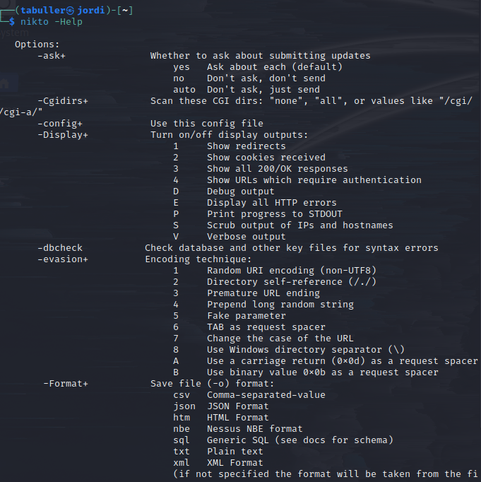
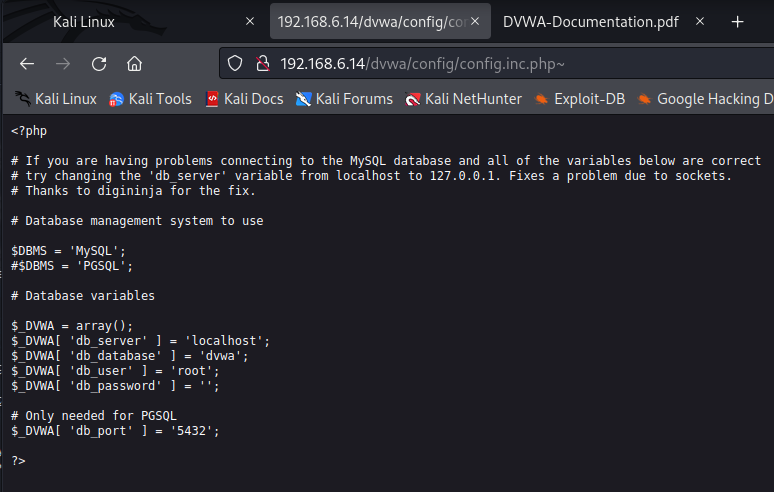

---
## Front matter
lang: ru-RU
title: Индивидуальный проект. Этап 4
subtitle: Использование nikto
author:
  - Буллер Т.А.
institute:
  - Российский университет дружбы народов, Москва, Россия
date: 17 февраля 2025

## i18n babel
babel-lang: russian
babel-otherlangs: english

## Formatting pdf
toc: false
toc-title: Содержание
slide_level: 2
aspectratio: 169
section-titles: true
theme: metropolis
header-includes:
 - \metroset{progressbar=frametitle,sectionpage=progressbar,numbering=fraction}
---

# Информация

## Докладчик

  * Буллер Татьяна Александровна
  * студент направления Бизнес-информатика
  * Российский университет дружбы народов

# Вводная часть

## Объект и предмет исследования

- Cканер уязвимостей nikto
- Веб-приложение DVWA

## Цели и задачи

- Знакомство со сканером уязвимостей nikto и тестирование его возможностей на примере DVWA.

## Материалы и методы

- Среда виртуализации VirtualBox
- Виртуальная машина Kali Linux
- Cканер уязвимостей nikto
- Веб-приложение DVWA

# Ход работы

## Ход работы 

nikto — базовый сканер безопасности веб-сервера. Он сканирует и обнаруживает уязвимости в веб-приложениях, обычно вызванные неправильной конфигурацией на самом сервере, файлами, установленными по умолчанию, и небезопасными файлами, а также устаревшими серверными приложениями.

## Ход работы 

{#fig:001 width=40%}

Основной параметр, который необходимо задать для nikto - -host, который принимает на вход адрес конкретной страницы либо машины. Для начала передадим адрес основной страницы DVWA и попробуем проанализировать вывод.

## Ход работы 

{#fig:002 width=40%}

## Ход работы 

Видим, что nikto сразу определил версию веб-сервера Apache, на котором запущена страница, используемую версию php и отсутствующие заголовки в теле запроса, отсутствие которых позволяет так или иначе манипулировать страницей. Далее по отчету видим список HTTP-методов, которые принимает страница. Сканер обнаружил также файлы конфигурации php, страницу входа, лог изменений.
Всегда следует обращать внимание на устаревшие версии тех или иных сервисов, так как нередки случаи того, что в них присутствуют доступные для эксплуатации уязвимости. Так, здесь nikto обращает внимание на устаревшую версию Apache и данные из лога изменений, из которых следует, что страница уязвима к SQLi.

## Ход работы 

Кроме этого, сканер обнаруживает директории, ссылок на которые нет на главной странице DVWA. Это, например, директория /config, содержание которой, судя по названию, может представлять интерес для исследователя.

{#fig:003 width=40%}

## Ход работы 

Эта директория содержит единственный файл и перенаправление в корень - страницу, на которой мы были до этого. Открыв файл, лежащий в этой директории, мы не увидим никакого вывода, пока не добавим в конец адреса знак тильды. Действительно, этот файл хранит некоторые детали конфигурации базы данных:

{#fig:004 width=40%}

## Ход работы 

Кроме файла конфигурации nikto нашел еще и директорию /docs, где, судя по названию, хранится некоторая документация. И действительно - внутри находим .pdf файл с документацией  DVWA.

{#fig:005 width=40%}

## Ход работы 

{#fig:006 width=40%}

## Ход работы 

Сканер также обращает внимание исследователя на то, что страница отвечает на запрос с параметром ?-s, возвращая исходный код. Это может быть крайне полезно в дальнейшем исследовании уязвимостей.

{#fig:007 width=30%}

## Ход работы 

Теперь попробуем просканировать страницу одной из уязвимостей. Кроме информации, аналогичной прошлому выводу, nikto обнаружил отдельные страницы с исходным кодом и помощью, которые, по его мнению, не должны быть доступны.

## Ход работы 

{#fig:008 width=70%}

# Выводы

Было освноено применение сканера уязвимостей nikto и протестированы его возможности на примере заведомо уязвимой страницы DVWA.
