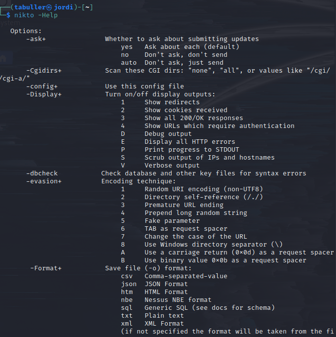
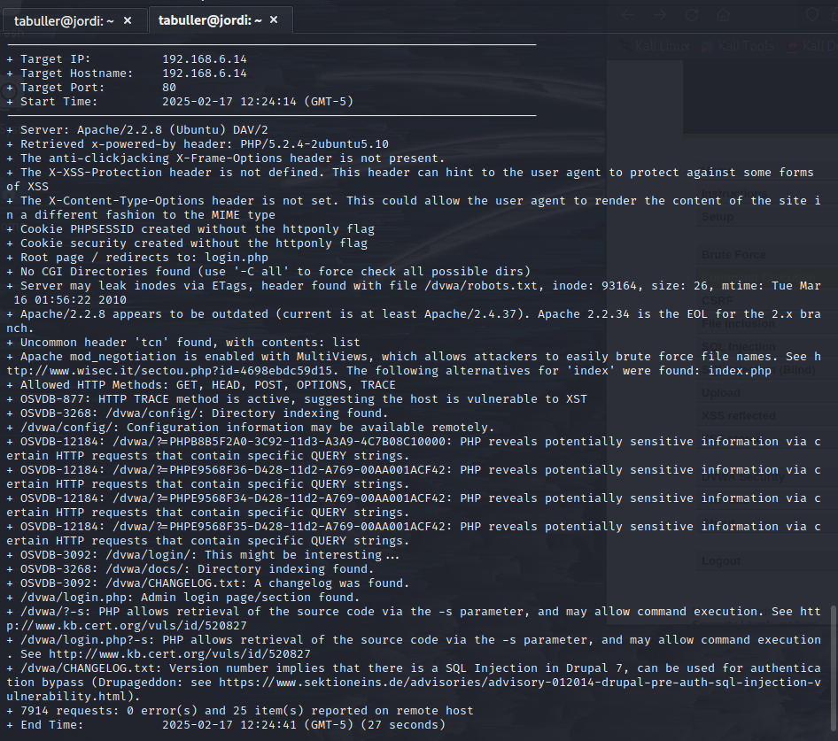
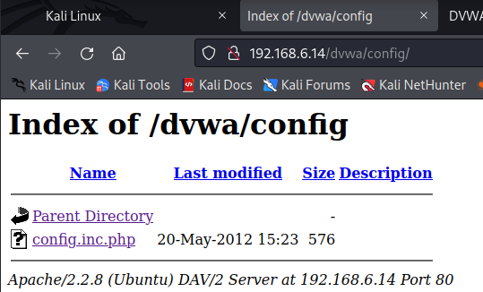
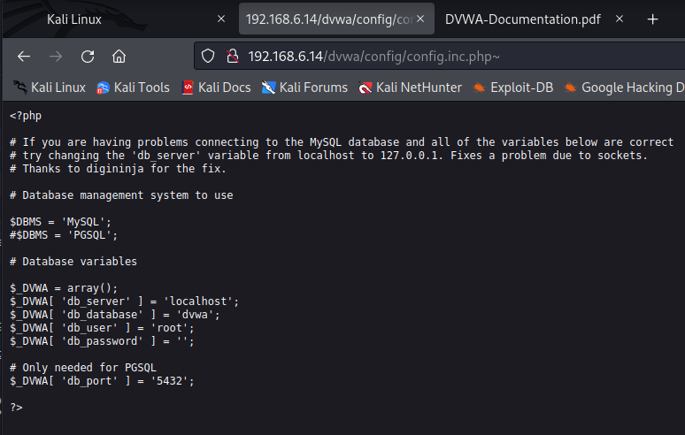
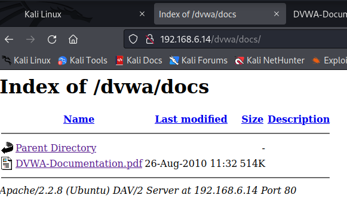
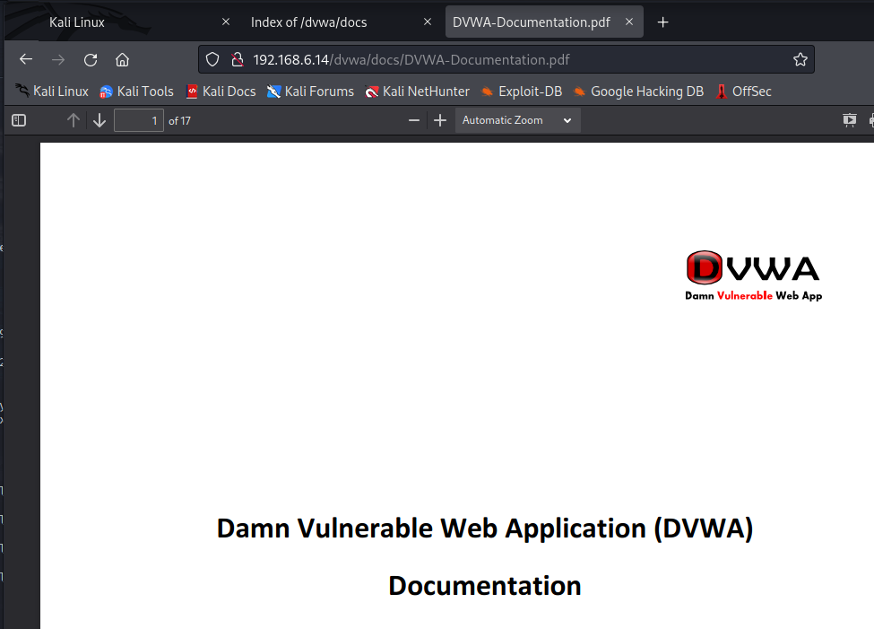
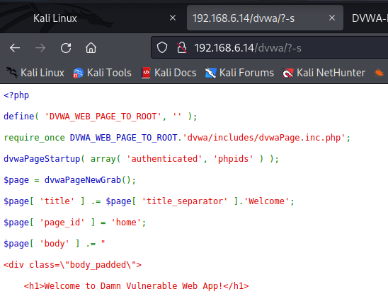
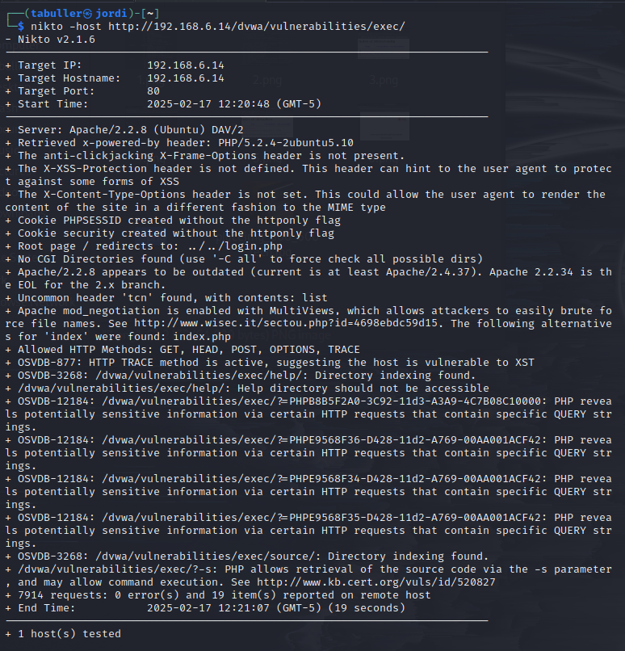

---
## Front matter
title: "Индивидуальный проект. Этап 4"
subtitle: "Использование nikto"
author: "Татьяна Александровна Буллер"

## Generic otions
lang: ru-RU
toc-title: "Содержание"

## Bibliography
bibliography: bib/cite.bib
csl: pandoc/csl/gost-r-7-0-5-2008-numeric.csl

## Pdf output format
toc: true # Table of contents
toc-depth: 2
lof: true # List of figures
lot: false # List of tables
fontsize: 12pt
linestretch: 1.5
papersize: a4
documentclass: scrreprt
## I18n polyglossia
polyglossia-lang:
  name: russian
  options:
	- spelling=modern
	- babelshorthands=true
polyglossia-otherlangs:
  name: english
## I18n babel
babel-lang: russian
babel-otherlangs: english
## Fonts
mainfont: IBM Plex Serif
romanfont: IBM Plex Serif
sansfont: IBM Plex Sans
monofont: IBM Plex Mono
mathfont: STIX Two Math
mainfontoptions: Ligatures=Common,Ligatures=TeX,Scale=0.94
romanfontoptions: Ligatures=Common,Ligatures=TeX,Scale=0.94
sansfontoptions: Ligatures=Common,Ligatures=TeX,Scale=MatchLowercase,Scale=0.94
monofontoptions: Scale=MatchLowercase,Scale=0.94,FakeStretch=0.9
mathfontoptions:
## Biblatex
biblatex: true
biblio-style: "gost-numeric"
biblatexoptions:
  - parentracker=true
  - backend=biber
  - hyperref=auto
  - language=auto
  - autolang=other*
  - citestyle=gost-numeric
## Pandoc-crossref LaTeX customization
figureTitle: "Рис."
tableTitle: "Таблица"
listingTitle: "Листинг"
lofTitle: "Список иллюстраций"
lotTitle: "Список таблиц"
lolTitle: "Листинги"
## Misc options
indent: true
header-includes:
  - \usepackage{indentfirst}
  - \usepackage{float} # keep figures where there are in the text
  - \floatplacement{figure}{H} # keep figures where there are in the text
---

# Цель работы

Знакомство со сканером уязвимостей nikto и тестирование его возможностей на примере DVWA.

# Ход работы 

nikto — базовый сканер безопасности веб-сервера. Он сканирует и обнаруживает уязвимости в веб-приложениях, обычно вызванные неправильной конфигурацией на самом сервере, файлами, установленными по умолчанию, и небезопасными файлами, а также устаревшими серверными приложениями.

{#fig:001 width=70%}

Основной параметр, который необходимо задать для nikto - -host, который принимает на вход адрес конкретной страницы либо машины. Для начала передадим адрес основной страницы DVWA и попробуем проанализировать вывод.

{#fig:002 width=70%}

Видим, что nikto сразу определил версию веб-сервера Apache, на котором запущена страница, используемую версию php и отсутствующие заголовки в теле запроса, отсутствие которых позволяет так или иначе манипулировать страницей. Далее по отчету видим список HTTP-методов, которые принимает страница. Сканер обнаружил также файлы конфигурации php, страницу входа, лог изменений.
Всегда следует обращать внимание на устаревшие версии тех или иных сервисов, так как нередки случаи того, что в них присутствуют доступные для эксплуатации уязвимости. Так, здесь nikto обращает внимание на устаревшую версию Apache и данные из лога изменений, из которых следует, что страница уязвима к SQLi.
Кроме этого, сканер обнаруживает директории, ссылок на которые нет на главной странице DVWA. Это, например, директория /config, содержание которой, судя по названию, может представлять интерес для исследователя.

{#fig:003 width=70%}

Эта директория содержит единственный файл и перенаправление в корень - страницу, на которой мы были до этого. Открыв файл, лежащий в этой директории, мы не увидим никакого вывода, пока не добавим в конец адреса знак тильды. Действительно, этот файл хранит некоторые детали конфигурации базы данных:

{#fig:004 width=70%}

Кроме файла конфигурации nikto нашел еще и директорию /docs, где, судя по названию, хранится некоторая документация. И действительно - внутри находим .pdf файл с документацией  DVWA.

{#fig:005 width=70%}

{#fig:006 width=70%}

Сканер также обращает внимание исследователя на то, что страница отвечает на запрос с параметром ?-s, возвращая исходный код. Это может быть крайне полезно в дальнейшем исследовании уязвимостей.

{#fig:007 width=70%}

Теперь попробуем просканировать страницу одной из уязвимостей. Кроме информации, аналогичной прошлому выводу, nikto обнаружил отдельные страницы с исходным кодом и помощью, которые, по его мнению, не должны быть доступны.

{#fig:008 width=70%}

# Выводы

Было освноено применение сканера уязвимостей nikto и протестированы его возможности на примере заведомо уязвимой страницы DVWA.
