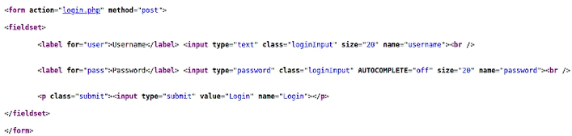

---
## Front matter
title: "Индивидуальный проект. Этап 5"
subtitle: "Использование Burp Suite. Уязвимости DVWA"
author: "Татьяна Александровна Буллер"

## Generic otions
lang: ru-RU
toc-title: "Содержание"

## Bibliography
bibliography: bib/cite.bib
csl: pandoc/csl/gost-r-7-0-5-2008-numeric.csl

## Pdf output format
toc: true # Table of contents
toc-depth: 2
lof: true # List of figures
lot: false # List of tables
fontsize: 12pt
linestretch: 1.5
papersize: a4
documentclass: scrreprt
## I18n polyglossia
polyglossia-lang:
  name: russian
  options:
	- spelling=modern
	- babelshorthands=true
polyglossia-otherlangs:
  name: english
## I18n babel
babel-lang: russian
babel-otherlangs: english
## Fonts
mainfont: IBM Plex Serif
romanfont: IBM Plex Serif
sansfont: IBM Plex Sans
monofont: IBM Plex Mono
mathfont: STIX Two Math
mainfontoptions: Ligatures=Common,Ligatures=TeX,Scale=0.94
romanfontoptions: Ligatures=Common,Ligatures=TeX,Scale=0.94
sansfontoptions: Ligatures=Common,Ligatures=TeX,Scale=MatchLowercase,Scale=0.94
monofontoptions: Scale=MatchLowercase,Scale=0.94,FakeStretch=0.9
mathfontoptions:
## Biblatex
biblatex: true
biblio-style: "gost-numeric"
biblatexoptions:
  - parentracker=true
  - backend=biber
  - hyperref=auto
  - language=auto
  - autolang=other*
  - citestyle=gost-numeric
## Pandoc-crossref LaTeX customization
figureTitle: "Рис."
tableTitle: "Таблица"
listingTitle: "Листинг"
lofTitle: "Список иллюстраций"
lotTitle: "Список таблиц"
lolTitle: "Листинги"
## Misc options
indent: true
header-includes:
  - \usepackage{indentfirst}
  - \usepackage{float} # keep figures where there are in the text
  - \floatplacement{figure}{H} # keep figures where there are in the text
---

# Цель работы

Знакомство со сканером уязвимостей набором инструментов Burp Suite и тестирование его возможностей на примере DVWA. Исследование прочих типов уязвимостей, для эксплуатации которых нет необходимости применять дополнительный инструментарий.

# Ход работы 

## Command Execution

Command Execution - тип уязвимости, позволяющий злоумышленнику запускать на сервере произвольные команды. Чаще всего встречается в приложениях, где реализована и не профильтрована должным образом передача пользовательского ввода в командную строку сервера.
Нас странице этой уязвимости в DVWA видим форму, которая позволяет осуществить команду ping. 

{#fig:001 width=70%}

Для эксплуатации данной уязвимости нам необходимо объеденить ввод для команды ping со следующей командой, которую мы хотим подать на сервер, чтобы они запустились последовательно. Сделаем это, использовав знак разделения ;, и получим вывод, которого не должны видеть по изначальной логике приложения.

{#fig:002 width=70%}

{#fig:003 width=70%}

## Cross Site Request Forgery (CSRF)

Cross Site Request Forgery (CSRF) - уязвимость, позволяющая злоумышленнику подделывать запросы, отправляемые на сайт, через свои домены. На странице этой уязвимости видим форму замены пароля.

{#fig:004 width=70%}

Открыв код страницы сочетанием клавиш Ctrl+U видим html-код этой формы. Это все, что нам нужно для эксплуатации: мы можем создать аналогичную форму на локальном сервере, скопировав код и подменив файл form action на адрес страницы, которой хотим подделать запрос.

{#fig:005 width=70%}

{#fig:006 width=70%}

Открыв файл подделанной формы на локальном сервере, введем новый пароль и нажмем кнопку "заменить". После этого нас перенаправит на страницу уязвимости, которую мы рассматривали ранее, где будет сообщено, что пароль успешно изменен. При попытке зайти со старым паролем, действительно, логин провалится, тогда как новый пароль сработает.

{#fig:007 width=70%}

{#fig:008 width=70%}

##  File Inclusion (LFI) и Burp Suite

File Inclusion - уязвимость небезопасного включения файлов с сервера. Так, на странице этой уязвимости в DVWA мы можем видеть, что страница в параметре page подключает файл include.php. Можно предположить, что мы можем подключить и какой-то другой файл. Возможно, даже тот, который находится вне данной директории. Как раз для этого используем Burp Suite.

{#fig:009 width=70%}

Для работы с Burp Suite было использовано расширение FoxyProxy. Прокси настроен на порт 8080 на локалхост. Это позволит Burp Suite перехватывать отправляемые запросы.

{#fig:010 width=70%}

Включив прокси, запустив перехват трафика в Burp и перезагрузив страницу, получим перехваченный GET-запрос к ней. Видим здесь интересующий нас параметр: имя подключаемого файла.
Далее можно пойти двумя путями. Либо перебирать варианты и отправлять запросы вручную через Repeater, либо составить (или раздобыть) список полезных нагрузок и автоматизировать процесс через Intruder. Список я дам. Поэтому выбираю второй вариант.

{#fig:011 width=70%}

Тип атаки, который будем проводить в данном (и всех последующих) случаях - Sniper. Эта атака использует один набор полезной нагрузки и подставляет его во все выделенные места. Список нагрузок возьму из стандартных словарей Kali для фаззинговой утилиты wfuzz.

{#fig:012 width=70%}

Отсортировав ответы по длине, видим, что нам удалось подключить файл /etc/passwd.

{#fig:013 width=70%}

##  SQL Injection и Blind SQL Injection

SQL - язык, используемый для написания баз данных. В случае, когда пользовательский ввод фильтруется недостаточно, пользователь может передавать команды базе данных и получать содержимое, которое он видеть не должен. Для атаки используем тот же режим Sniper в Intruder, словарь - словарь SQL-инъекций для wfuzz.

{#fig:014 width=70%}

Особенность Blind SQLi в том, что, в отличие от обычного случая, база данных не дает никакого ответа об ошибках, на которые можно было бы ориетироваться. Так, если до этого мы встречали ответы сервера абсолютно крохотной длины (460), содержащие только сообщения об ошибках, теперь все неудачные атаки дают ответ длины 4671 и на них сложно ориентироваться, пытаясь составить правильный запрос к базе.

{#fig:015 width=70%}

## File Upload

File Upload - уязвимость загрузки и исполнения произвольных пользовательских файлов на сервере. В самом простейшем ее варианте, который рассмотрим здесь, файлы, загружаемые пользователем, не проверяются вообще никак. В других случаях страницы также могут быть уязвимы к подмене MIME-type в запросе или двойным расширениям. Так, отправляя php файл, я могу перехватить запрос и заменить в теле Content-Type: application/php на image/jpeg, или отправить файл .jpeg.php, что можно так же реализовать через Burp Proxy.
Для данного примера был использован реверс-шелл pentestmonkey, по умолчанию включенный в Kali Linux. 

{#fig:016 width=70%}

{#fig:017 width=70%

Загрузив этот файл на уязвимую страницу, открываем netcat на прослушивание порта 1234, который оставили для подключения в шелле. 

{#fig:018 width=70%}

После того, как мы попытаемся перейти на страницу, куда загружен этот файл, скрипт запустится, и  netcat получит подключение от сервера. Теперь мы можем разбирать машину изнутри. 

{#fig:019 width=70%}

# Выводы

Была освоена работа с набором инструментов Burp Suite и протестированы его возможности на примере DVWA. Были исследованы прочие типы уязвимостей (CSRF, Commang injection), для эксплуатации которых нет необходимости применять дополнительный инструментарий.
