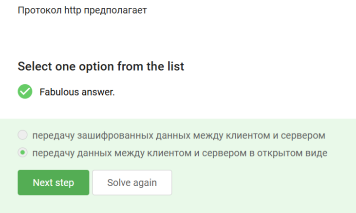
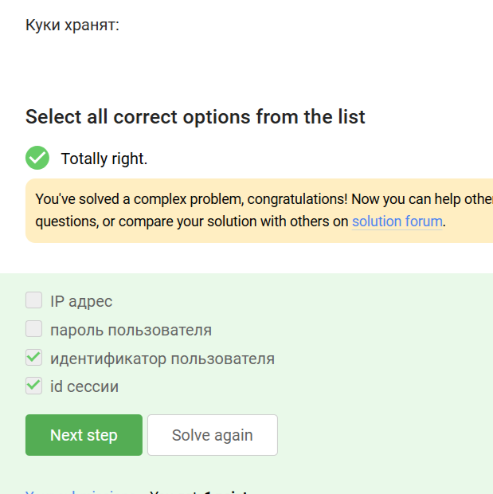
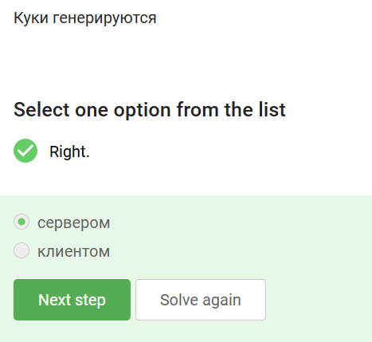
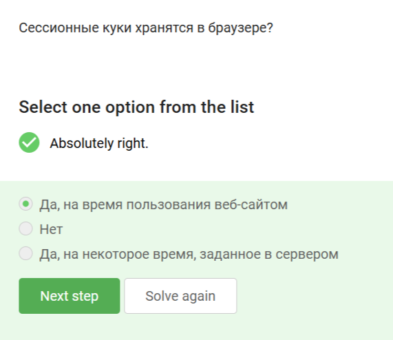
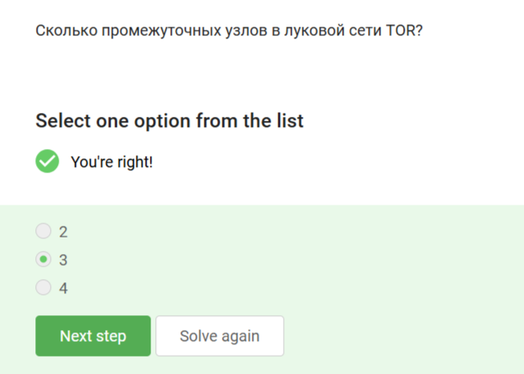
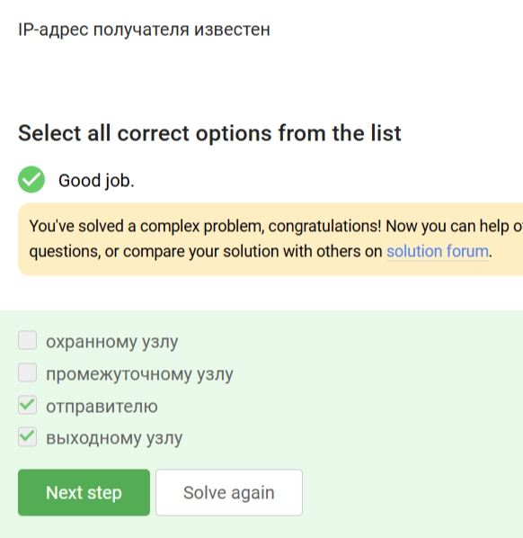
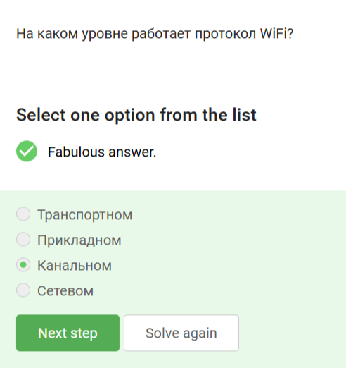

---
## Front matter
lang: ru-RU
title: Внешний курс. Этап 1
subtitle: Безопасность в сети
author:
  - Буллер Т.А.
institute:
  - Российский университет дружбы народов, Москва, Россия
date: 12 мая 2025

## i18n babel
babel-lang: russian
babel-otherlangs: english

## Formatting pdf
toc: false
toc-title: Содержание
slide_level: 2
aspectratio: 169
section-titles: true
theme: metropolis
header-includes:
 - \metroset{progressbar=frametitle,sectionpage=progressbar,numbering=fraction}
---

# Информация

## Докладчик

  * Буллер Татьяна Александровна
  * студент направления Бизнес-информатика
  * Российский университет дружбы народов

# Вводная часть

## Объект и предмет исследования

- Интернет и его протоколы
- Модель TCP/IP
- Браузер ТОР

## Цели и задачи

- Получение и закрепление на практике знаний об основных механизмах работы сети Интернет и их слабых местах.

# Выполнение контрольных заданий

## Как работает Интернет

{#fig:001 width=20%}

Протоколы TCP и UDP - протоколы транспортного уровня, IP - протокол сетевого уровня. Прикладным из перечисленных является только HTTPS. Это же рассуждение дает ответ на следующий вопрос.

{#fig:002 width=20%}

## Как работает Интернет

{#fig:003 width=20%}

Первый из адресов начинается с 421, второй содержит 256. Ни то, ни другое не может являться корректным адресом  IPv4, так как исловный максимальный адрес, который можно получить в этом стандарте - 255.255.255.255

## Как работает Интернет

{#fig:004 width=20%}

DNS (Domain Name Server) сопоставляет адрес сайта с его доменным именем и обеспечивает "навигацию" в Интернете. Он не сегментирует данные, не выбирает маршруты для пакетов и не занимается адресацией.

## Как работает Интернет

{#fig:005 width=40%}

Прикладной уровень должен быть "верхним", канальный - нижним, таким образом, корректна только последняя цепочка.

## Как работает Интернет

{#fig:006 width=40%}

HTTP не предполагает шифрования данных, поэтому считается небезопасным и устаревшим. Шифрует данные между клиентом и сервером HTTPS.

## Как работает Интернет

{#fig:007 width=40%}

HTTPS состоит из двух фаз: рукопожатия между клиентом и сервером, в результате которого устанавливаются "условия" общения, и обмена зашифрованными данными. Отсюда очевидно, что подходит только ответ 2.

## Как работает Интернет

{#fig:008 width=40%}

Версия протокола TLS определяется совместно сервером и клиентом. ни одна из сторон не может "диктовать" свои условия другой.

## Как работает Интернет

{#fig:009 width=40%}

В фазе рукопожатия не предусмотрено именно шифрования данных, так как оно выполняется после установки условий обмена данными в отдельной фазе.

## Персонализация сети

{#fig:010 width=20%}

По-хорошему куки не должны хранить конфиденциальную информацию, такую как пароль или адрес пользователя. поэтому подходят только два последних ответа: идентификатор пользователя и сессии.

## Персонализация сети

{#fig:011 width=20%}

Куки хранят информацию, но не используются для обеспечения надежности соединения самого по себе. Хотя хранение информации на стороне клиента может в общем и целом снижать загруженность сервера.

## Персонализация сети

{#fig:012 width=40%}

Куки присваиваются (генерируются) пользователю сервером и хранятся на стороне клиента.

## Персонализация сети

{#fig:013 width=20%}

Сессионные куки отвечают за хранение данных, связанных с конкретной сессией (моментом посещения и использования) сайта. Они храняется в браузере только во время использования сайта (жизни сессии).

## Браузер ТОР. Анонимизация

{#fig:014 width=40%}

В сети ТОР минимум три промежуточных узла: охранный, промежуточный и выходной.

## Браузер ТОР. Анонимизация

{#fig:015 width=20%}

Адрес получателя известен отправителю (он выбирает, кому направить сообщение) и выходному узлу (он передает сообщение, полученное от предыдущих узлов цепи, непосредственно получателю).

## Браузер ТОР. Анонимизация

{#fig:016 width=40%}

Общий секретный ключ отправитель генерирует с каждым из узлов цепи для сохранения целостности передачи.

## Браузер ТОР. Анонимизация

{#fig:017 width=40%}

Получатель не должен использовать браузер, основанный на луковой маршрутизации, так как доставка сообщения не зависит от него.

## Беспроводные сети Wi-Fi

{#fig:018 width=40%}

Wi-Fi - технология беспроводной сети; работает не только со смартфонами или компьютерами и описана в стандартве 802.11

## Беспроводные сети Wi-Fi

{#fig:019 width=20%}

Wi-Fi - канал передачи данных, и работает, соответственно, на канальном уровне. На сетевом работает IP, на прикладном - HTTP/HTTPS, на транспортном - TCP/UDP.

## Беспроводные сети Wi-Fi

{#fig:020 width=40%}

Наименее безопасен из перечисленных WEP, так как длина ключа в этом протоколе не могла превышать 40 бит.

## Беспроводные сети Wi-Fi

{#fig:021 width=40%}

Данные между хостом и роутером передаются только после аутентификации устройства в сети в зашифрованном виде, поэтому все ответы, кроме 2, неверны.

## Беспроводные сети Wi-Fi

{#fig:022 width=40%}

Энтерпрайс - решение для бизнеса. Для организации домашних сетей оно не используется.

# Выводы

Получены и закреплены на практике знания об основных механизмах работы сети Интернет и их слабых местах.
