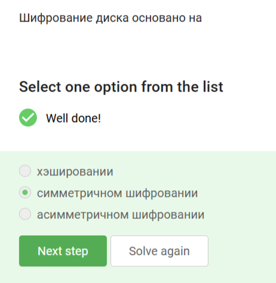
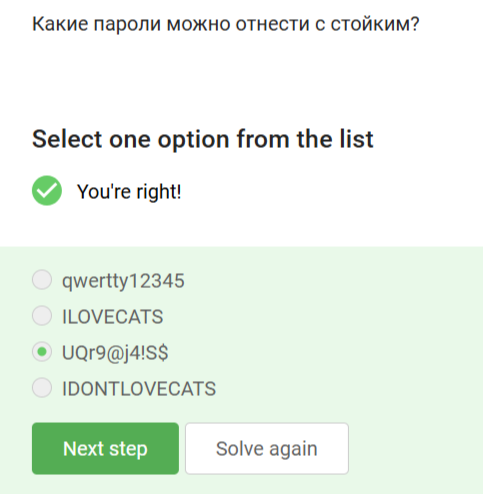
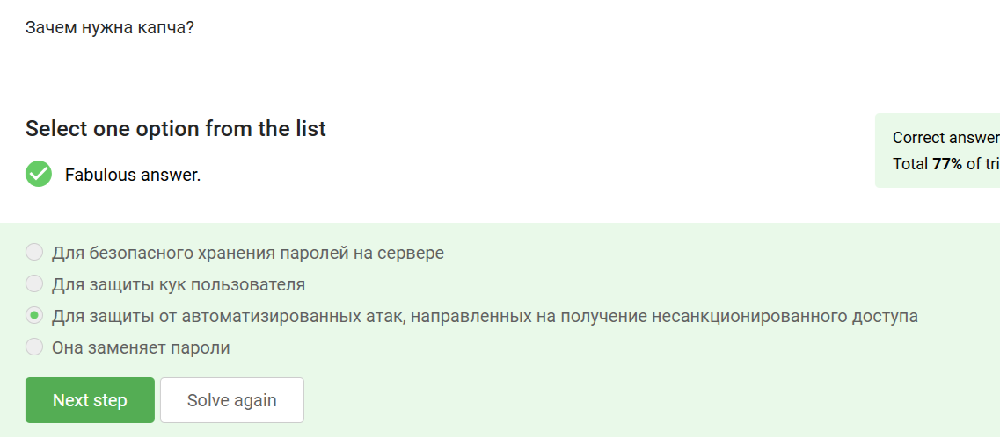
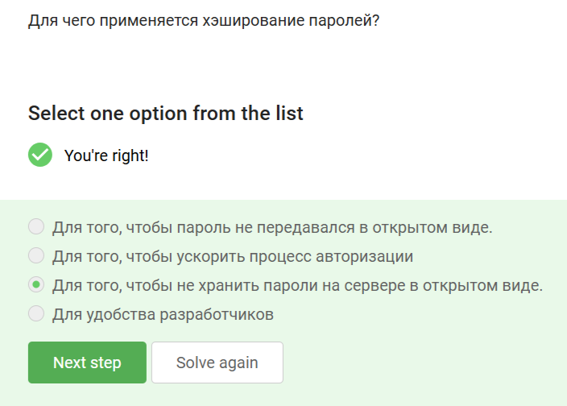
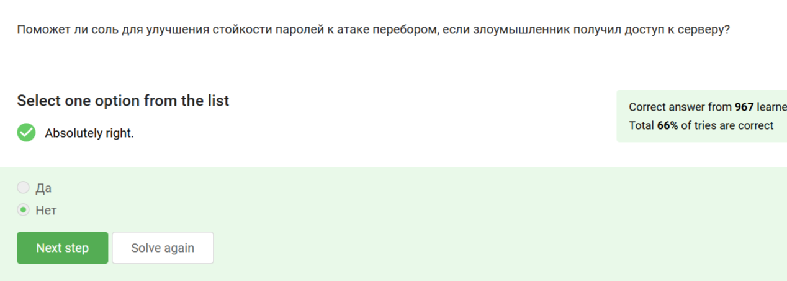
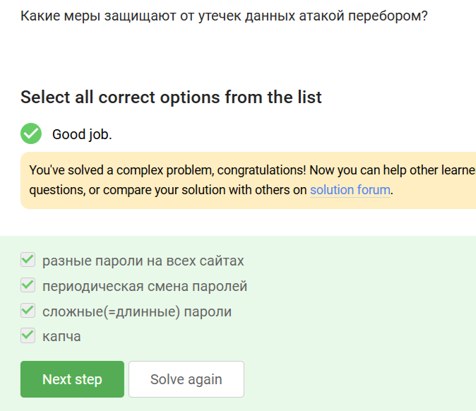
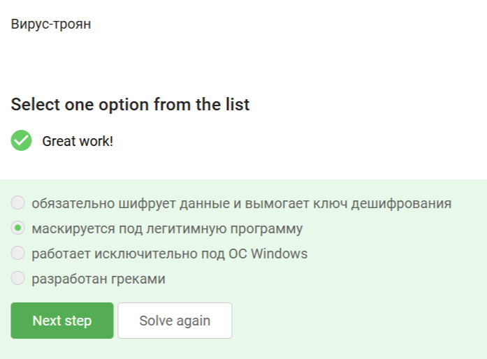

---
## Front matter
lang: ru-RU
title: Внешний курс. Этап 2
subtitle: Защита ПК/телефона
author:
  - Буллер Т.А.
institute:
  - Российский университет дружбы народов, Москва, Россия
date: 13 мая 2025

## i18n babel
babel-lang: russian
babel-otherlangs: english

## Formatting pdf
toc: false
toc-title: Содержание
slide_level: 2
aspectratio: 169
section-titles: true
theme: metropolis
header-includes:
 - \metroset{progressbar=frametitle,sectionpage=progressbar,numbering=fraction}
---

# Информация

## Докладчик

  * Буллер Татьяна Александровна
  * студент направления Бизнес-информатика
  * Российский университет дружбы народов

# Вводная часть

## Объект и предмет исследования

- Инструменты и методы шифрования дисков
- Пароли и методы их защиты
- Вредоносные программы различных типов

## Цели и задачи

- Получение и закрепление на практике знаний о базовых мерах обеспечения безопасности электронных устройств и основных ошибках пользователей.

# Выполнение контрольных заданий

## Шифрование диска

{#fig:001 width=20%}

Зашифровать можно любой раздел диска, в том числе загрузочный, чем нередко пользуются злоумышленники.

## Шифрование диска

{#fig:002 width=20%}

Шифрование диска основано на симметричном шифровании с использованием постоянного ключа: пароля.

## Шифрование диска

{#fig:003 width=20%}

Wireshark - инструмент анализа сетевого трафика, Disk Utility - утилита для работы с дисками, но не для их шифрования. Наиболее популярные инструменты для шифрования дисков - VeraCrypt и BitLocker.

## Пароли

{#fig:004 width=20%}

Пароли 1, 2 и 4 не содержат специальных символов и представляют собой достаточно предсказуемые фразы в одном регистре, что делает их уязвимыми даже к перебору без словаря. Наиболее безопасен из представленных третий пароль.

## Пароли

{#fig:005 width=20%}

Пароли должны храниться в специализированных приложениях, но не в местах, где к ним может получить доступ третье лицо.

## Пароли

{#fig:006 width=20%}

Капча - "проверка на человека", защищает от автоматизированных атак.

## Пароли

{#fig:007 width=20%}

Хэширование паролей применяется для шифрования паролей и усложнения получения доступа к учетным записям конкретных пользователей, если злоумышленник получил доступ к базе данных сервера.

## Пароли

{#fig:008 width=20%}

## Пароли

{#fig:009 width=20%}

Все перечисленное (как длинные/сложные пароли, так и регулярное их обновление, разные пароли на всех сайтах и капча) защитят пользователя в случае, если сервер подвергнется атаке перебором. Длинные пароли подобрать сложнее, регулярное обновление и разные пароли на сайтах позволяют избежать совпадения со слитыми базами, капча - убедиться, что войти пытается человек, а не брутфорс-скрипт.

## Фишинг

{#fig:010 width=20%}

Фишинговыми являются 2 и 4 ссылки, так как сайт, под который они пытаются мимикрировать, является доменом не второго, а третьего уровня (основными являются соответственно wix.ru и ucoz.ru).

## Фишинг

{#fig:011 width=20%}

Фишинговое письмо может прийти со знакомого адреса, если владелец аккаунта был взломан.

## Вирусы. Примеры

{#fig:012 width=20%}

Спуфингом называется подмена адреса. Атака перебора паролей - брутфорс, протоколов электронной почты имеется великое множество, точно как и методов предотвращения фишинга.

## Вирусы. Примеры

{#fig:013 width=20%}

Троян - вирус, маскирующийся под легитимную программу. Название идет от легенды о троянском коне, однако вирус вовсе не обязательно работает только с отдельной операционной системой или разработан греками.

## Безопасность мессенджеров

{#fig:014 width=20%}

## Безопасность мессенджеров

{#fig:015 width=20%}

Суть сквозного шифрования состоит в том, что сообщение не расшифровывается на сервере и недоступно в открытом виде никому, кроме отправителя и получателя.

# Выводы

Получены и закреплены на практике знания о базовых мерах обеспечения безопасности электронных устройств и основных ошибках пользователей.
