---
## Front matter
title: "Внешний курс. Этап 2"
subtitle: "Защита ПК/телефона"
author: "Татьяна Александровна Буллер"

## Generic otions
lang: ru-RU
toc-title: "Содержание"

## Bibliography
bibliography: bib/cite.bib
csl: pandoc/csl/gost-r-7-0-5-2008-numeric.csl

## Pdf output format
toc: true # Table of contents
toc-depth: 2
lof: true # List of figures
lot: true # List of tables
fontsize: 12pt
linestretch: 1.5
papersize: a4
documentclass: scrreprt
## I18n polyglossia
polyglossia-lang:
  name: russian
  options:
	- spelling=modern
	- babelshorthands=true
polyglossia-otherlangs:
  name: english
## I18n babel
babel-lang: russian
babel-otherlangs: english
## Fonts
mainfont: IBM Plex Serif
romanfont: IBM Plex Serif
sansfont: IBM Plex Sans
monofont: IBM Plex Mono
mathfont: STIX Two Math
mainfontoptions: Ligatures=Common,Ligatures=TeX,Scale=0.94
romanfontoptions: Ligatures=Common,Ligatures=TeX,Scale=0.94
sansfontoptions: Ligatures=Common,Ligatures=TeX,Scale=MatchLowercase,Scale=0.94
monofontoptions: Scale=MatchLowercase,Scale=0.94,FakeStretch=0.9
mathfontoptions:
## Biblatex
biblatex: true
biblio-style: "gost-numeric"
biblatexoptions:
  - parentracker=true
  - backend=biber
  - hyperref=auto
  - language=auto
  - autolang=other*
  - citestyle=gost-numeric
## Pandoc-crossref LaTeX customization
figureTitle: "Рис."
tableTitle: "Таблица"
listingTitle: "Листинг"
lofTitle: "Список иллюстраций"
lotTitle: "Список таблиц"
lolTitle: "Листинги"
## Misc options
indent: true
header-includes:
  - \usepackage{indentfirst}
  - \usepackage{float} # keep figures where there are in the text
  - \floatplacement{figure}{H} # keep figures where there are in the text
---

# Цель работы

Получение и закрепление на практике знаний о базовых мерах обеспечения безопасности электронных устройств и основных ошибках пользователей.

# Выполнение контрольных заданий

## Шифрование диска

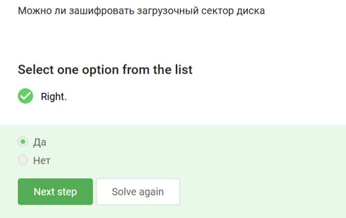{#fig:001 width=70%}

Зашифровать можно любой раздел диска, в том числе загрузочный, чем нередко пользуются злоумышленники.

{#fig:002 width=70%}

Шифрование диска основано на симметричном шифровании с использованием постоянного ключа: пароля.

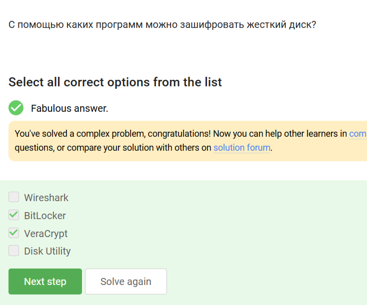{#fig:003 width=70%}

Wireshark - инструмент анализа сетевого трафика, Disk Utility - утилита для работы с дисками, но не для их шифрования. Наиболее популярные инструменты для шифрования дисков - VeraCrypt и BitLocker.

## Пароли

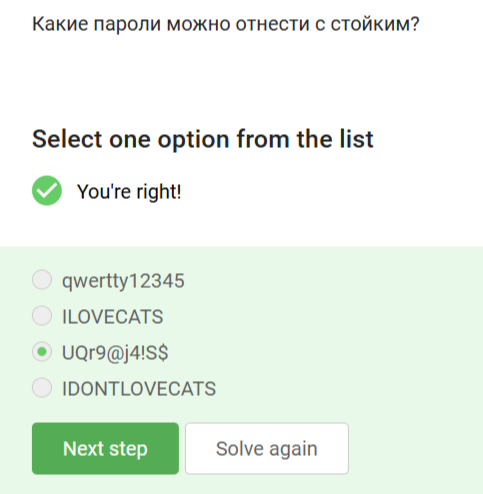{#fig:004 width=70%}

Пароли 1, 2 и 4 не содержат специальных символов и представляют собой достаточно предсказуемые фразы в одном регистре, что делает их уязвимыми даже к перебору без словаря. Наиболее безопасен из представленных третий пароль.

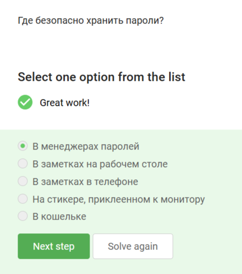{#fig:005 width=70%}

Пароли должны храниться в специализированных приложениях, но не в местах, где к ним может получить доступ третье лицо.

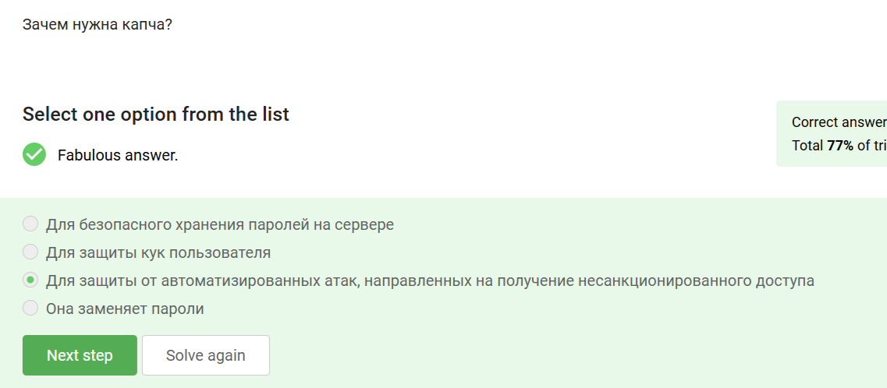{#fig:006 width=70%}

Капча - "проверка на человека", защищает от автоматизированных атак.

{#fig:007 width=70%}

Хэширование паролей применяется для шифрования паролей и усложнения получения доступа к учетным записям конкретных пользователей, если злоумышленник получил доступ к базе данных сервера.

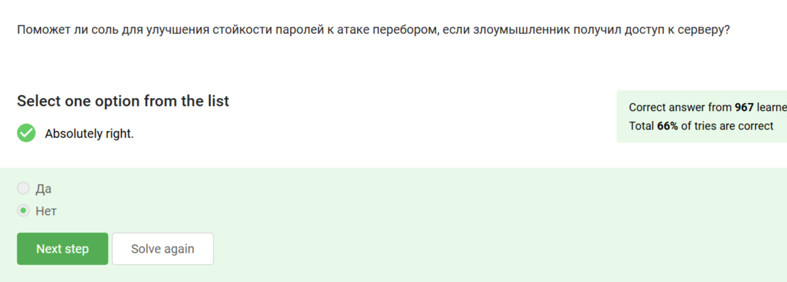{#fig:008 width=70%}

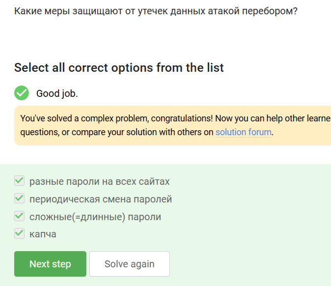{#fig:009 width=70%}

Все перечисленное (как длинные/сложные пароли, так и регулярное их обновление, разные пароли на всех сайтах и капча) защитят пользователя в случае, если сервер подвергнется атаке перебором. Длинные пароли подобрать сложнее, регулярное обновление и разные пароли на сайтах позволяют избежать совпадения со слитыми базами, капча - убедиться, что войти пытается человек, а не брутфорс-скрипт.

## Фишинг

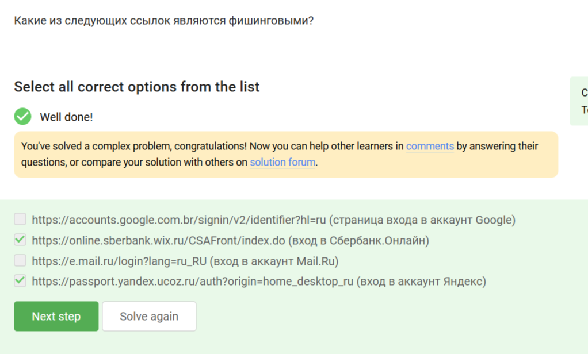{#fig:010 width=70%}

Фишинговыми являются 2 и 4 ссылки, так как сайт, под который они пытаются мимикрировать, является доменом не второго, а третьего уровня (основными являются соответственно wix.ru и ucoz.ru).

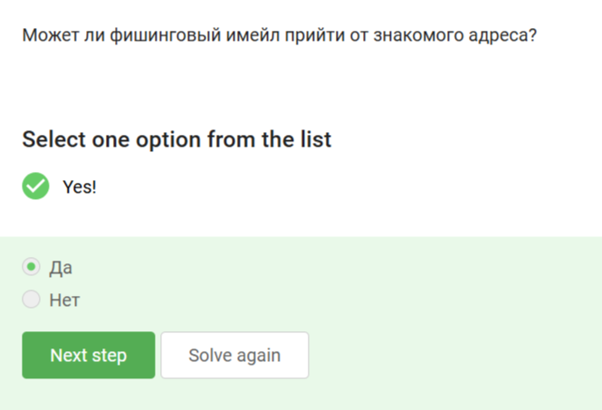{#fig:011 width=70%}

Фишинговое письмо может прийти со знакомого адреса, если владелец аккаунта был взломан.

## Вирусы. Примеры

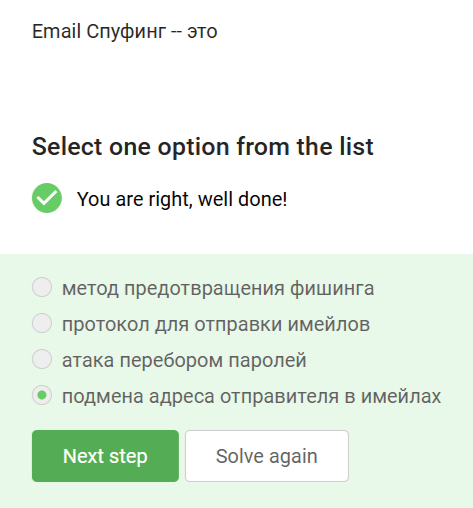{#fig:012 width=70%}

Спуфингом называется подмена адреса. Атака перебора паролей - брутфорс, протоколов электронной почты имеется великое множество, точно как и методов предотвращения фишинга.

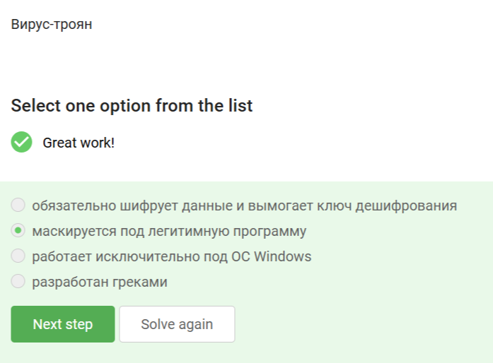{#fig:013 width=70%}

Троян - вирус, маскирующийся под легитимную программу. Название идет от легенды о троянском коне, однако вирус вовсе не обязательно работает только с отдельной операционной системой или разработан греками.

## Безопасность мессенджеров

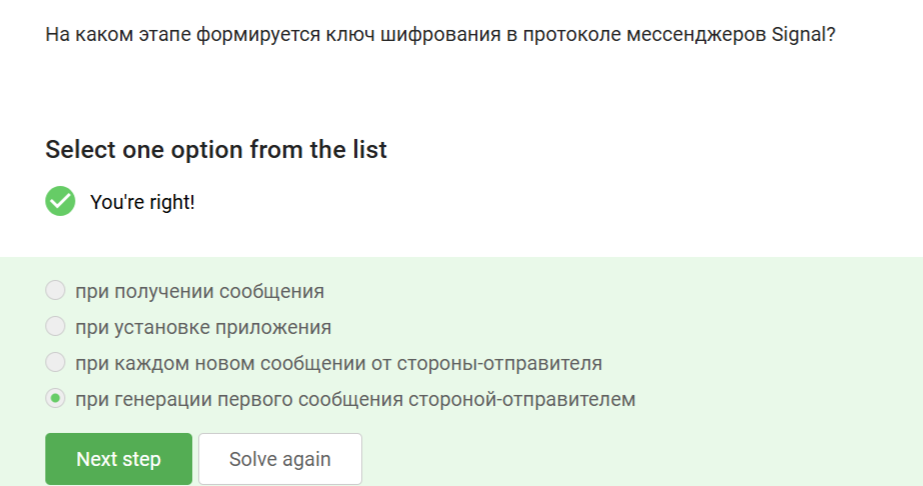{#fig:014 width=70%}

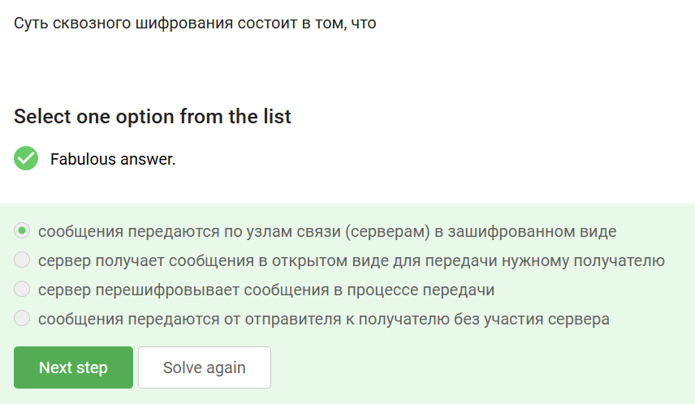{#fig:015 width=70%}

Суть сквозного шифрования состоит в том, что сообщение не расшифровывается на сервере и недоступно в открытом виде никому, кроме отправителя и получателя.

# Выводы

Получены и закреплены на практике знания о базовых мерах обеспечения безопасности электронных устройств и основных ошибках пользователей.
