---
## Front matter
lang: ru-RU
title: Внешний курс. Этап 3
subtitle: Криптография на практике
author:
  - Буллер Т.А.
institute:
  - Российский университет дружбы народов, Москва, Россия
date: 13 мая 2025

## i18n babel
babel-lang: russian
babel-otherlangs: english

## Formatting pdf
toc: false
toc-title: Содержание
slide_level: 2
aspectratio: 169
section-titles: true
theme: metropolis
header-includes:
 - \metroset{progressbar=frametitle,sectionpage=progressbar,numbering=fraction}
---

# Информация

## Докладчик

  * Буллер Татьяна Александровна
  * студент направления Бизнес-информатика
  * Российский университет дружбы народов

# Вводная часть

## Объект и предмет исследования

- Криптографические примитивы
- Блокчейн-системы

## Цели и задачи

- Получение и закрепление на практике знаний о криптографических примитивах и областях их применения.

# Выполнение контрольных заданий

## Введение в криптографию

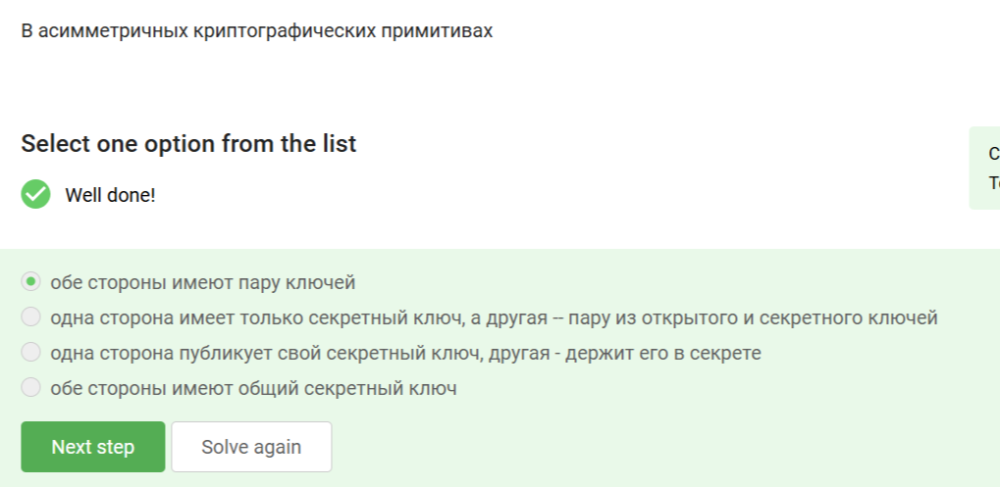{#fig:001 width=20%}

В ассиметричных примитивах обе стороны имеют пару ключей: секретный (частный) и открытый. Секретный ключ не публикуется ни в коем случае, общий ключ стороны имеют в симметричных примитивах.

## Введение в криптографию

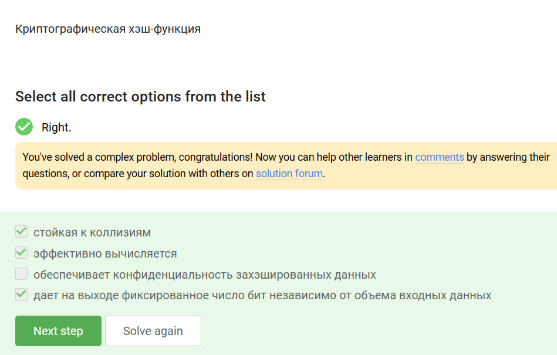{#fig:002 width=20%}

Хорошая хэш-функция должна выдавать стойкие к коллизиям результаты, что, однако, не всегда соответствует правде на практике. На выходе, вне зависимости от объема входных данных, она дает фиксированное число бит, но не обеспечивает конфиденциальность данных.

## Введение в криптографию

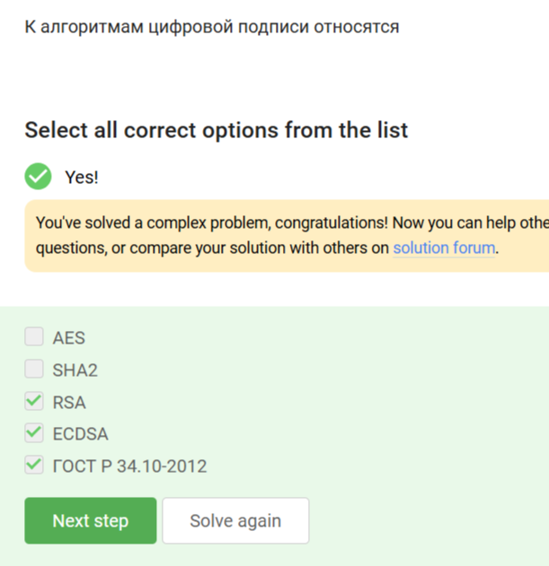{#fig:003 width=20%}

Из представленных в списке AES - алгоритм симметричного шифрования, SHA2 - хэш-функция. Остальные как раз являются алгоритмами, применимыми для создания цифровой подписи.

## Введение в криптографию

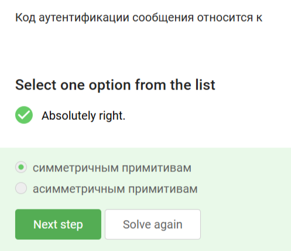{#fig:004 width=20%}

Код аутентификации сообщения - симметричный примитив, представляющий собой общий для сторон секретный ключ.

## Введение в криптографию

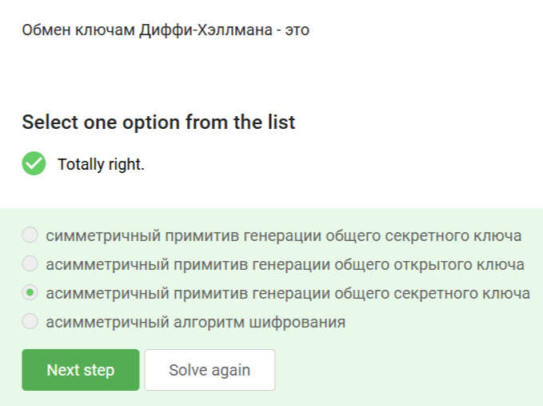{#fig:005 width=20%}

Алгоритм обмена ключами DH - ассиметричный алгоритм генерации общего секретного ключа, где стороны получают общик ключ из собственного секрета и открытого ключа на основе общего секрета, переданного другой стороной.

## Цифровая подпись

{#fig:006 width=20%}

Протоколы ЭЦП относятся к протоколам с открытым ключом, где секретный ключ используется для непосредственно подписания документа, открытый - для проверки подлинности подписи.

## Цифровая подпись

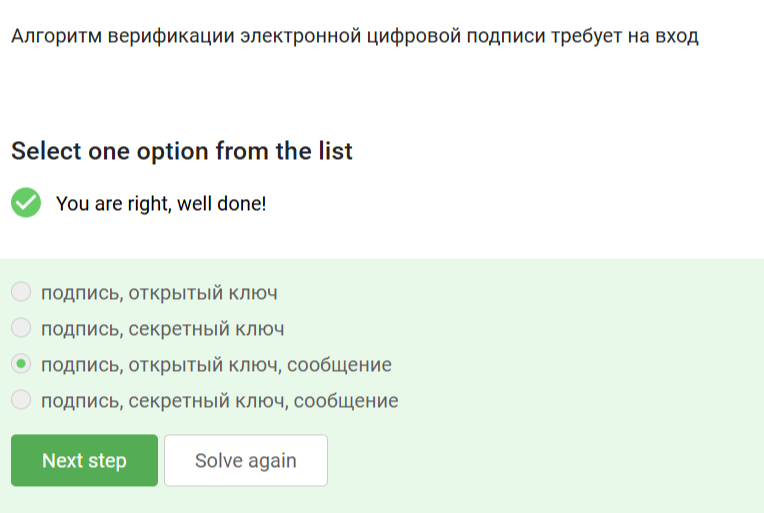{#fig:007 width=20%}

Алгоритм верификации требует на вход подпись, сообщение, которое было ею подписано, и открытый ключ.

## Цифровая подпись

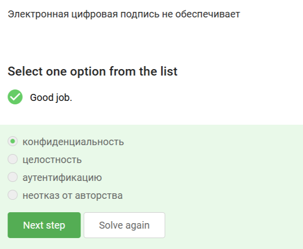{#fig:008 width=20%}

ЭЦП не обеспечивает конфиденциальности, скорее, наоборот - она обеспечивает подтверждение личности отправителя документа.

## Цифровая подпись

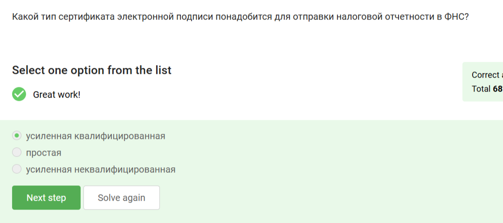{#fig:009 width=20%}

Для отправки налоговой отчетности ЭЦП должна быть подтверждена, поэтому подойдет только усиленная квалифицированная подпись.

## Цифровая подпись

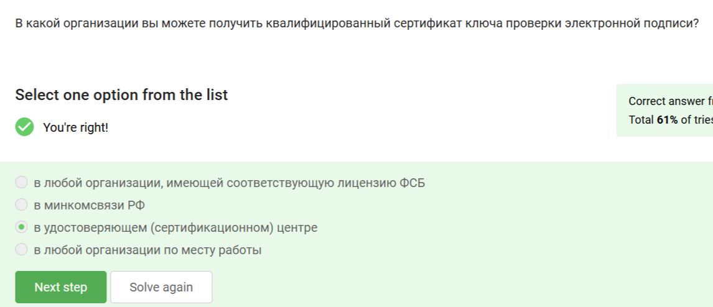{#fig:010 width=20%}

Квалифицированный сертификат проверки можно получить только в специализированных сертификационных центрах. Минкомсвязи непосредственно этим не занимаются.

## Электронные платежи

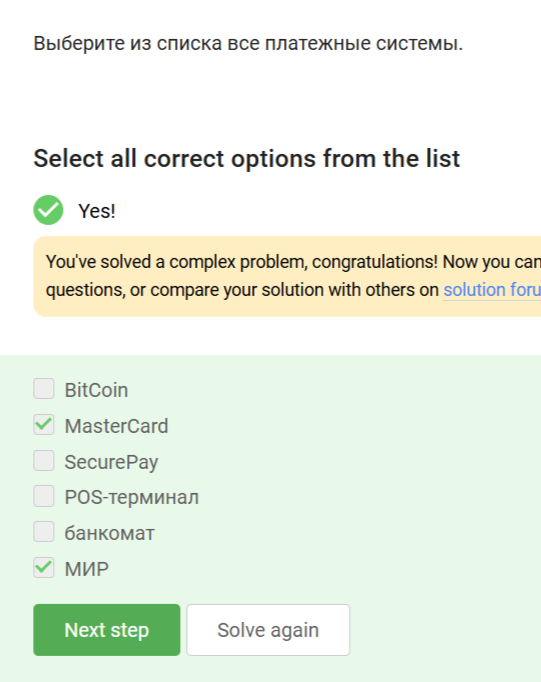{#fig:011 width=20%}

Платежными системы из перечисленных являются только МИР и мастеркард. Биткоин - криптовалюта, ПОС-терминал и банкомат - технические средства проведения банковских операций.

## Электронные платежи

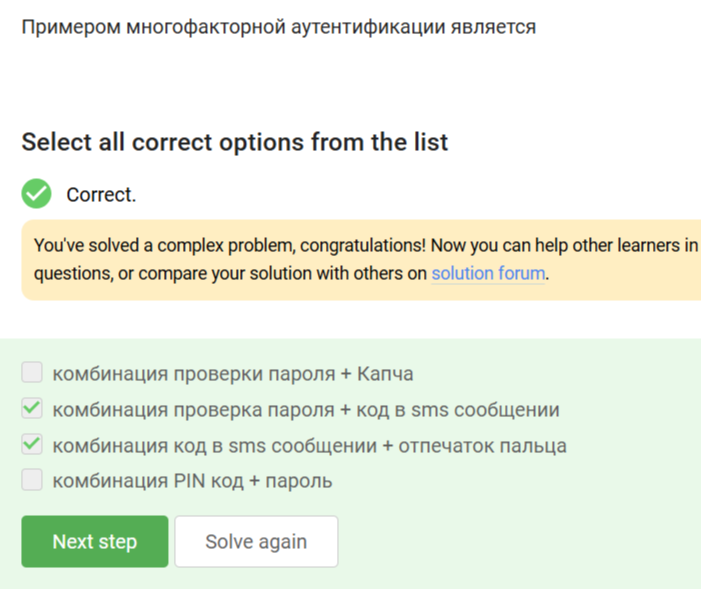{#fig:012 width=20%}

Многофакторная аутентификация сочетает "то, что я знаю" и "то, что у меня есть". Комбинации ПИН + пароль и пароль + капча не удовлетворяют этому критерию.

## Электронные платежи

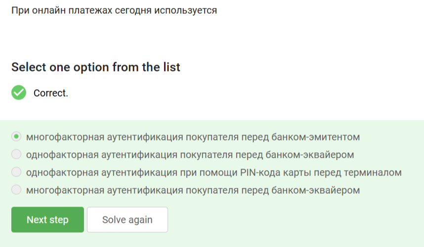{#fig:013 width=20%}

При онлайн-платежах используется многофакторная аутентификация перед банком-эмитентом, так как только он обладает данными о конкретном плательщике и обязан удостовериться, что платеж проводится легитимным клиентом.

## Блокчейн

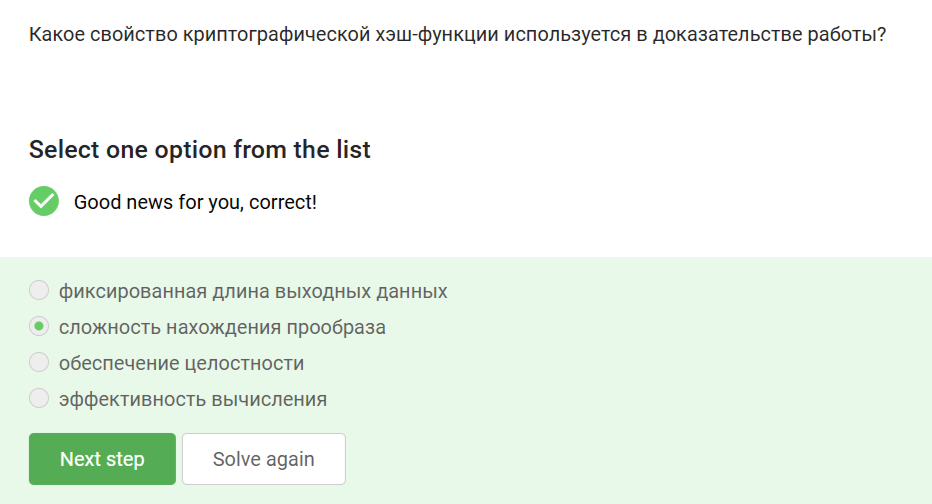{#fig:014 width=20%}

В доказательстве работы используется свойство сложности нахождения прообраза (нарочно не придумаешь), остальные не обеспечивают доказательства как такового.

## Блокчейн

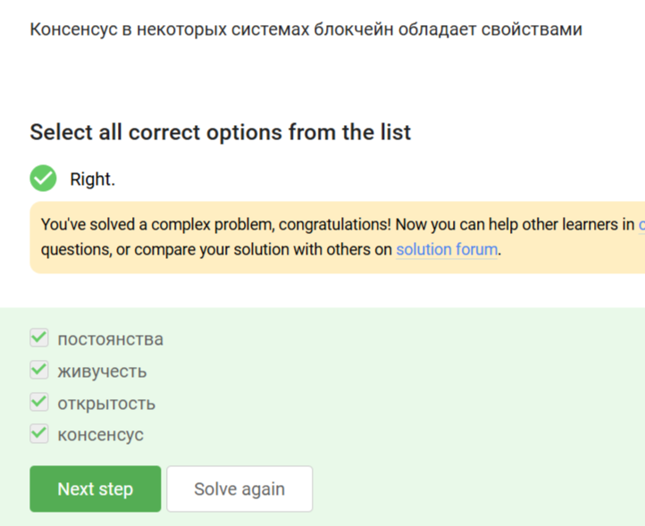{#fig:015 width=20%}

## Блокчейн

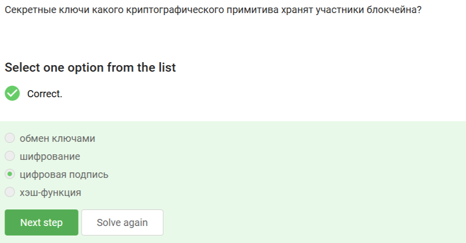{#fig:016 width=20%}

Участники блокчейна хранят секретные ключи цифровой подписи. Обмен ключами и шифрование осуществляются независимо от них.

# Выводы

Получены и закреплены на практике знания о криптографических примитивах и областях их применения.
