---
## Front matter
title: "Внешний курс. Этап 3"
subtitle: "Криптография на практике"
author: "Татьяна Александровна Буллер"

## Generic otions
lang: ru-RU
toc-title: "Содержание"

## Bibliography
bibliography: bib/cite.bib
csl: pandoc/csl/gost-r-7-0-5-2008-numeric.csl

## Pdf output format
toc: true # Table of contents
toc-depth: 2
lof: true # List of figures
lot: true # List of tables
fontsize: 12pt
linestretch: 1.5
papersize: a4
documentclass: scrreprt
## I18n polyglossia
polyglossia-lang:
  name: russian
  options:
	- spelling=modern
	- babelshorthands=true
polyglossia-otherlangs:
  name: english
## I18n babel
babel-lang: russian
babel-otherlangs: english
## Fonts
mainfont: IBM Plex Serif
romanfont: IBM Plex Serif
sansfont: IBM Plex Sans
monofont: IBM Plex Mono
mathfont: STIX Two Math
mainfontoptions: Ligatures=Common,Ligatures=TeX,Scale=0.94
romanfontoptions: Ligatures=Common,Ligatures=TeX,Scale=0.94
sansfontoptions: Ligatures=Common,Ligatures=TeX,Scale=MatchLowercase,Scale=0.94
monofontoptions: Scale=MatchLowercase,Scale=0.94,FakeStretch=0.9
mathfontoptions:
## Biblatex
biblatex: true
biblio-style: "gost-numeric"
biblatexoptions:
  - parentracker=true
  - backend=biber
  - hyperref=auto
  - language=auto
  - autolang=other*
  - citestyle=gost-numeric
## Pandoc-crossref LaTeX customization
figureTitle: "Рис."
tableTitle: "Таблица"
listingTitle: "Листинг"
lofTitle: "Список иллюстраций"
lotTitle: "Список таблиц"
lolTitle: "Листинги"
## Misc options
indent: true
header-includes:
  - \usepackage{indentfirst}
  - \usepackage{float} # keep figures where there are in the text
  - \floatplacement{figure}{H} # keep figures where there are in the text
---

# Цель работы

Получение и закрепление на практике знаний о криптографических примитивах и областях их применения.

# Выполнение контрольных заданий

## Введение в криптографию

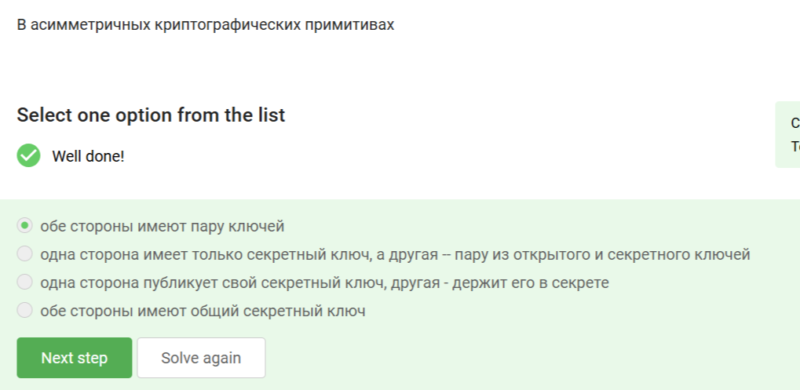{#fig:001 width=70%}

В ассиметричных примитивах обе стороны имеют пару ключей: секретный (частный) и открытый. Секретный ключ не публикуется ни в коем случае, общий ключ стороны имеют в симметричных примитивах.

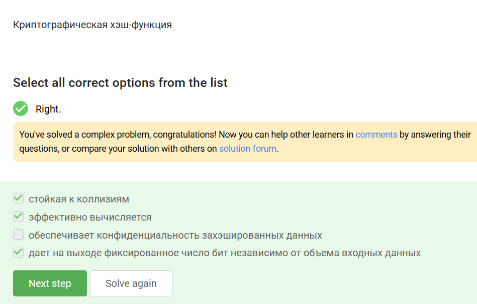{#fig:002 width=70%}

Хорошая хэш-функция должна выдавать стойкие к коллизиям результаты, что, однако, не всегда соответствует правде на практике. На выходе, вне зависимости от объема входных данных, она дает фиксированное число бит, но не обеспечивает конфиденциальность данных.

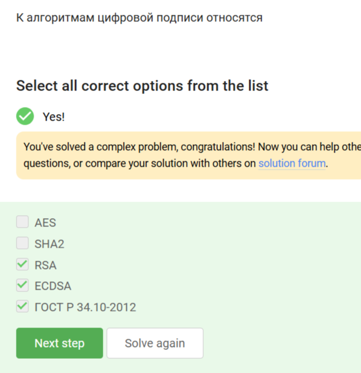{#fig:003 width=70%}

Из представленных в списке AES - алгоритм симметричного шифрования, SHA2 - хэш-функция. Остальные как раз являются алгоритмами, применимыми для создания цифровой подписи.

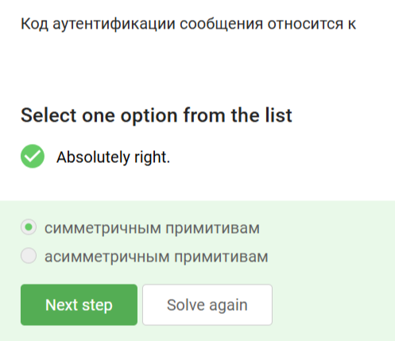{#fig:004 width=70%}

Код аутентификации сообщения - симметричный примитив, представляющий собой общий для сторон секретный ключ.

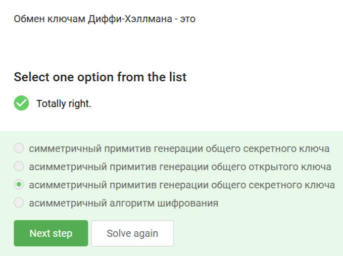{#fig:005 width=70%}

Алгоритм обмена ключами DH - ассиметричный алгоритм генерации общего секретного ключа, где стороны получают общик ключ из собственного секрета и открытого ключа на основе общего секрета, переданного другой стороной.

## Цифровая подпись

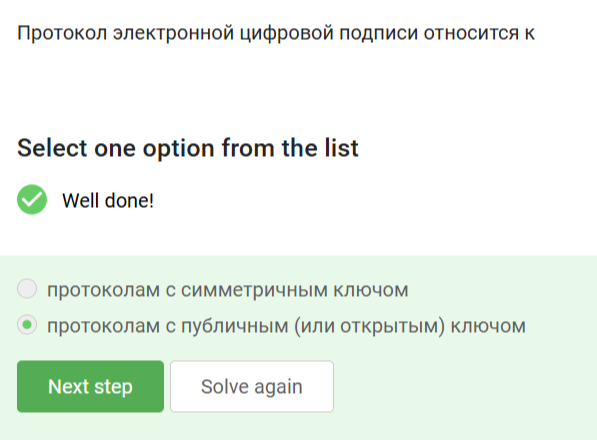{#fig:006 width=70%}

Протоколы ЭЦП относятся к протоколам с открытым ключом, где секретный ключ используется для непосредственно подписания документа, открытый - для проверки подлинности подписи.

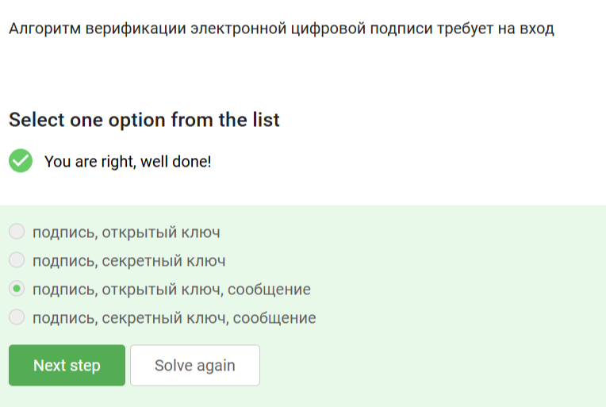{#fig:007 width=70%}

Алгоритм верификации требует на вход подпись, сообщение, которое было ею подписано, и открытый ключ.

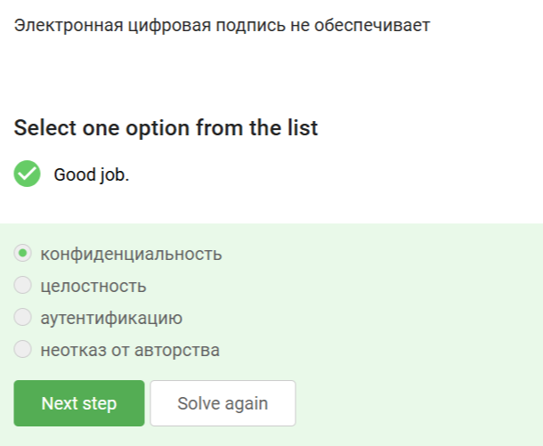{#fig:008 width=70%}

ЭЦП не обеспечивает конфиденциальности, скорее, наоборот - она обеспечивает подтверждение личности отправителя документа.

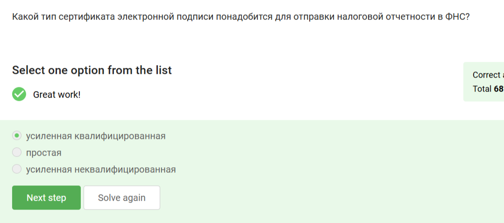{#fig:009 width=70%}

Для отправки налоговой отчетности ЭЦП должна быть подтверждена, поэтому подойдет только усиленная квалифицированная подпись.

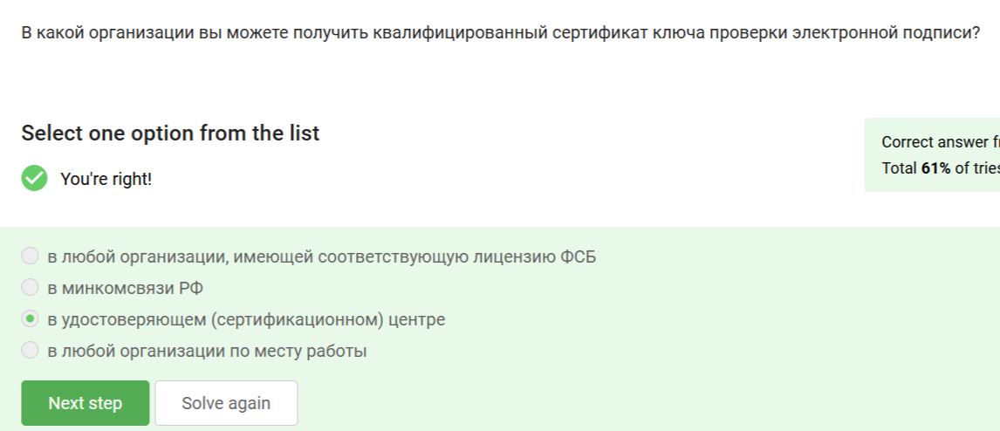{#fig:010 width=70%}

Квалифицированный сертификат проверки можно получить только в специализированных сертификационных центрах. Минкомсвязи непосредственно этим не занимаются.

## Электронные платежи

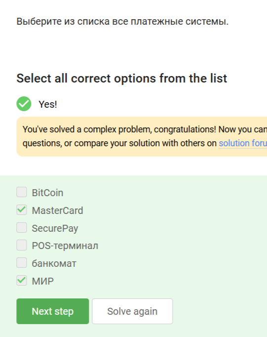{#fig:011 width=70%}

Платежными системы из перечисленных являются только МИР и мастеркард. Биткоин - криптовалюта, ПОС-терминал и банкомат - технические средства проведения банковских операций.

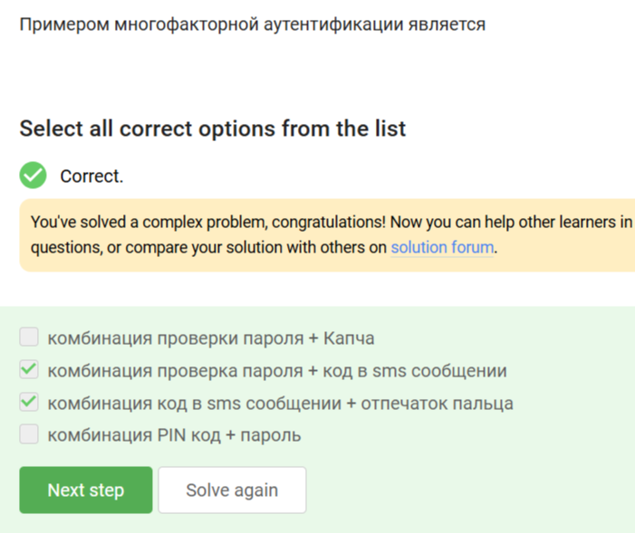{#fig:012 width=70%}

Многофакторная аутентификация сочетает "то, что я знаю" и "то, что у меня есть". Комбинации ПИН + пароль и пароль + капча не удовлетворяют этому критерию.

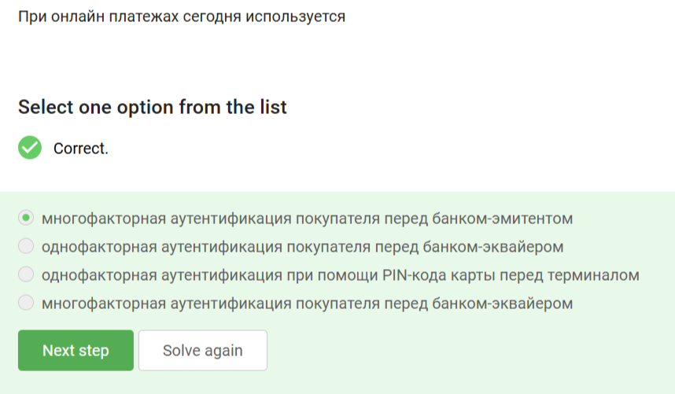{#fig:013 width=70%}

При онлайн-платежах используется многофакторная аутентификация перед банком-эмитентом, так как только он обладает данными о конкретном плательщике и обязан удостовериться, что платеж проводится легитимным клиентом.

## Блокчейн

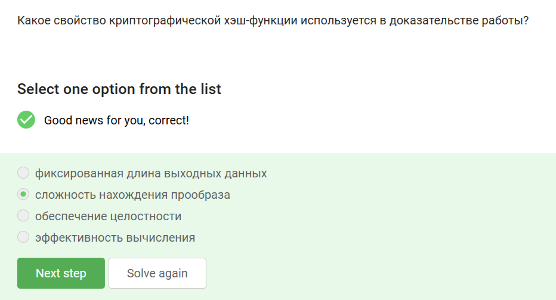{#fig:014 width=70%}

В доказательстве работы используется свойство сложности нахождения прообраза (нарочно не придумаешь), остальные не обеспечивают доказательства как такового.

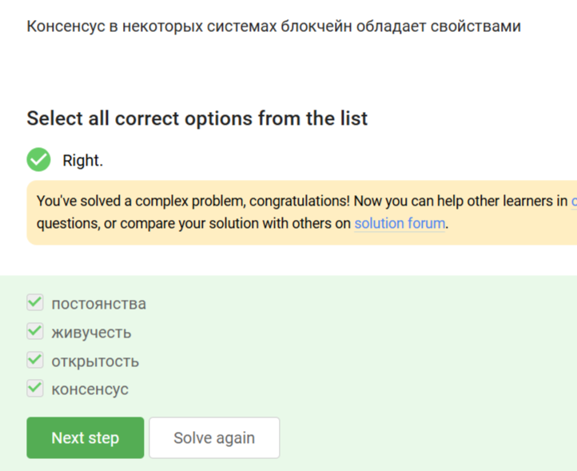{#fig:015 width=70%}

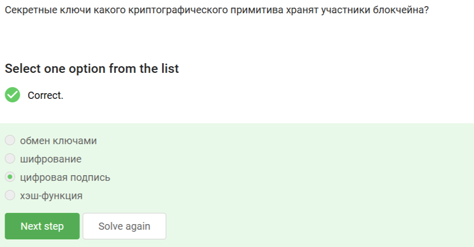{#fig:016 width=70%}

Участники блокчейна хранят секретные ключи цифровой подписи. Обмен ключами и шифрование осуществляются независимо от них.

# Выводы

Получены и закреплены на практике знания о криптографических примитивах и областях их применения.
